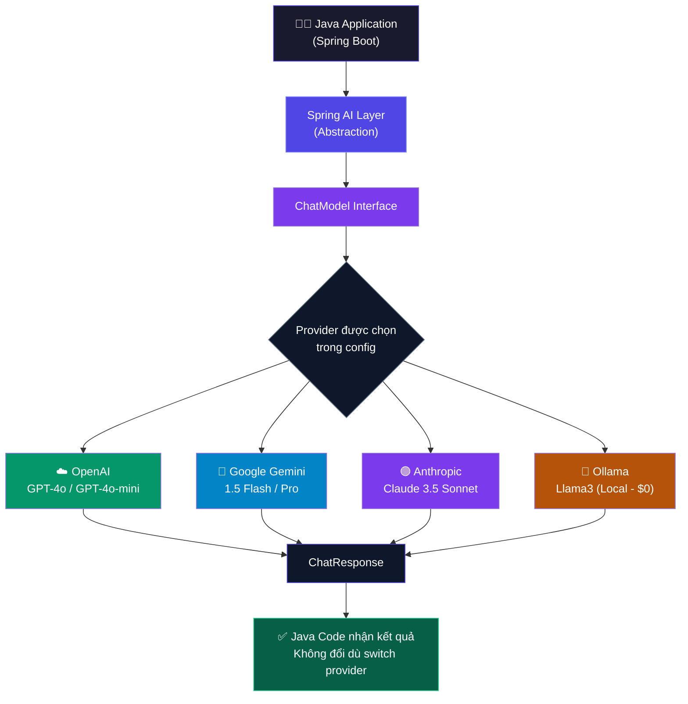
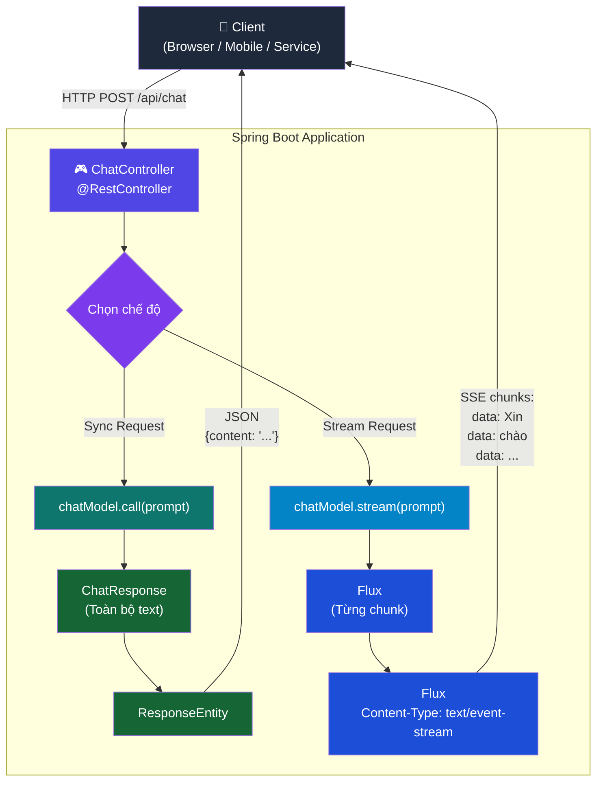
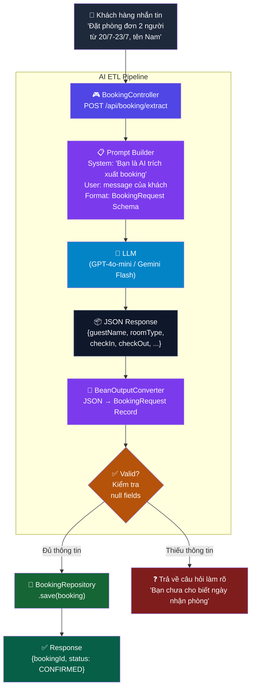

# 📚 SESSION 02: Tích hợp LLM & Chuẩn hóa dữ liệu với Spring AI
> **Môn học:** AI Integrated in Action | **Loại:** Lý thuyết + Demo  
> **Đối tượng:** Lập trình viên Java biết Spring Boot cơ bản  
> **Mục tiêu session:** Xây dựng được hệ thống Java tích hợp LLM, streaming, chuẩn hóa output và trích xuất dữ liệu tự động

---

# 🔵 LESSON 01 — Kiến trúc Spring AI & Loosely Coupled Design

## I. LÝ THUYẾT

### 1.1 Spring AI là gì?

Spring AI là một framework thuộc hệ sinh thái Spring giúp lập trình viên Java tích hợp các mô hình AI (LLM) vào ứng dụng một cách **chuẩn hóa, linh hoạt, testable** — tuân theo triết lý Spring quen thuộc.

> 💡 **Tương tự:** Spring Data JPA đứng giữa Java và Database → Spring AI đứng giữa Java và AI Model Provider.

**Spring AI hỗ trợ các Provider:**
| Provider | Model | Ghi chú |
|---------|-------|---------|
| OpenAI | GPT-4o, GPT-4o-mini | Phổ biến nhất |
| Google Vertex AI | Gemini 1.5 Pro/Flash | Free tier hấp dẫn |
| Anthropic | Claude 3.5 Sonnet | Reasoning tốt |
| Mistral AI | Mistral Large | Giá thấp |
| Ollama | Llama3, Mistral (local) | $0 hoàn toàn |

---

### 1.2 Tokenization — Token là gì?

Token là **đơn vị xử lý nhỏ nhất** của LLM. Không phải từ, không phải ký tự — mà là "mảnh văn bản" được model học thuộc.

**Quy tắc ước lượng:**
- ~4 ký tự tiếng Anh ≈ 1 token
- 1 từ tiếng Anh trung bình ≈ 1.3 token  
- Tiếng Việt tốn **gấp 2-3 lần** tiếng Anh do ký tự đặc biệt
- 1,000 tokens ≈ 750 từ tiếng Anh

**Ví dụ thực tế:**
```
"Xin chào thế giới!" → khoảng 8 tokens (tiếng Việt tốn nhiều hơn)
"Hello World!"       → khoảng 3 tokens
```

---

### 1.3 Context Window

Context Window là **giới hạn tổng số token** mà LLM có thể xử lý trong **một lần gọi API**, bao gồm tất cả:

```
[System Prompt] + [Lịch sử hội thoại] + [User Message] + [AI Response]
        ↑___________________________↑________________________↑
                  Tất cả phải nằm trong Context Window
```

| Model | Context Window | Tương đương |
|-------|---------------|------------|
| GPT-3.5 Turbo | 16,385 tokens | ~12,000 từ |
| GPT-4o | 128,000 tokens | ~96,000 từ (~200 trang) |
| Gemini 1.5 Pro | 1,000,000 tokens | ~750,000 từ (~1,500 trang) |
| Claude 3.5 Sonnet | 200,000 tokens | ~150,000 từ (~300 trang) |

> ⚠️ **Cạm bẫy:** Khi hội thoại dài, context window đầy → model "quên" lịch sử đầu → cần chiến lược quản lý memory!

---

### 1.4 Hyperparameters — Tham số điều chỉnh AI

| Tham số | Khoảng giá trị | Ý nghĩa thực tế |
|---------|----------------|----------------|
| **Temperature** | 0.0 – 2.0 | **0** = chính xác, xác định (giống máy tính) / **2** = sáng tạo, ngẫu nhiên (giống nghệ sĩ) |
| **Top-P** | 0.0 – 1.0 | **1.0** = xét tất cả token có thể / **0.1** = chỉ xét 10% token xác suất cao nhất |
| **Max Tokens** | Số nguyên dương | Giới hạn độ dài response (kiểm soát chi phí) |
| **Frequency Penalty** | -2.0 – 2.0 | Phạt khi lặp từ (tránh AI nói lặp) |

**Gợi ý thực tế theo use case:**
| Use case | Temperature | Top-P |
|----------|------------|-------|
| Trích xuất data (ETL) | 0.0 | 0.1 |
| Phân loại, classification | 0.0 – 0.3 | 0.1 |
| Chatbot hỗ trợ khách hàng | 0.3 – 0.7 | 0.9 |
| Viết content marketing | 1.0 – 1.5 | 1.0 |
| Brainstorming sáng tạo | 1.5 – 2.0 | 1.0 |

---

### 1.5 Tính toán chi phí AI

**Công thức:**
```
Chi phí = (Số Input Tokens × Đơn giá Input) + (Số Output Tokens × Đơn giá Output)
```

**Đơn giá tham khảo (2024, tính per 1M tokens):**
| Model | Input | Output |
|-------|-------|--------|
| GPT-4o | $2.50 | $10.00 |
| GPT-4o-mini | $0.15 | $0.60 |
| Gemini 1.5 Flash | $0.075 | $0.30 |
| Gemini 1.5 Pro | $1.25 | $5.00 |

**Ví dụ tính chi phí hệ thống chatbot:**
```
Scenario: 10,000 request/ngày
Mỗi request: 500 token input + 200 token output
Dùng GPT-4o-mini:

Input:  10,000 × 500 = 5,000,000 tokens → 5 × $0.15 = $0.75/ngày
Output: 10,000 × 200 = 2,000,000 tokens → 2 × $0.60 = $1.20/ngày
Tổng: ~$1.95/ngày ≈ ~$58.50/tháng ← Rất hợp lý!
```

---

### 1.6 Spring AI Abstraction Layer

Spring AI cung cấp 3 abstraction chính:

```java
// 1. ChatModel — Interface giao tiếp với LLM (không phụ thuộc provider)
public interface ChatModel {
    ChatResponse call(Prompt prompt);
    Flux<ChatResponse> stream(Prompt prompt); // streaming
}

// 2. Prompt — Đóng gói nội dung + cấu hình gửi đến LLM
new Prompt(
    List.of(new SystemMessage("Bạn là trợ lý AI..."), new UserMessage("Câu hỏi...")),
    OpenAiChatOptions.builder().withTemperature(0.7).build()
);

// 3. ChatResponse — Kết quả trả về từ LLM
ChatResponse response = chatModel.call(prompt);
String content = response.getResult().getOutput().getContent();
Usage usage = response.getMetadata().getUsage(); // token count
```

---

### 1.7 Triết lý Loosely Coupled

**❌ Vấn đề (Tightly Coupled):**
```java
// Phụ thuộc trực tiếp vào OpenAI SDK
// Đổi sang Gemini → phải sửa tất cả code business logic
OpenAiChatClient openAiClient = new OpenAiChatClient(apiKey);
String result = openAiClient.generateText(prompt); // ← Tied to OpenAI!
```

**✅ Giải pháp với Spring AI (Loosely Coupled):**
```java
@Service
public class BookingChatService {
    
    // Chỉ phụ thuộc vào interface — không biết provider cụ thể
    private final ChatModel chatModel;
    
    public BookingChatService(ChatModel chatModel) {
        this.chatModel = chatModel; // Spring inject provider phù hợp
    }
    
    public String answerQuestion(String question) {
        return chatModel.call(new Prompt(question))
                        .getResult().getOutput().getContent();
    }
}
```

**Kết quả:** Chỉ cần đổi `application.yml` + `pom.xml` dependency → Switch từ OpenAI sang Gemini mà **không sửa một dòng code business logic nào!**

---

## II. WORKFLOW DIAGRAM



**📸 IMAGE PROMPT — Loosely Coupled Architecture:**
```
An isometric illustration of kiến trúc Loosely Coupled trong Spring AI.
Một sơ đồ tầng 3 lớp: lớp trên cùng là khối "Ứng dụng Java (Business Logic)" màu xanh lá, lớp giữa là khối lớn "Spring AI — Tầng Trừu tượng" với interface ChatModel màu xanh neon nổi bật, lớp dưới cùng là 4 khối nhỏ song song gồm "OpenAI", "Google Gemini", "Anthropic Claude", "Ollama (Local)" — các mũi tên kết nối từ lớp giữa xuống 4 provider, kèm nhãn tiếng Việt "Chỉ đổi config — không sửa code" với dấu tích xanh lá lớn ở góc phải.
Corporate technology style,
clean line art,
neon blue and white accents,
soft holographic lighting,
ultra detailed,
8k resolution,
white background,
presentation slide illustration.
```

---

## III. THỰC HÀNH

### 3.1 Khởi tạo project

```xml
<!-- pom.xml -->
<parent>
    <groupId>org.springframework.boot</groupId>
    <artifactId>spring-boot-starter-parent</artifactId>
    <version>3.3.0</version>
</parent>

<dependencyManagement>
    <dependencies>
        <dependency>
            <groupId>org.springframework.ai</groupId>
            <artifactId>spring-ai-bom</artifactId>
            <version>1.0.0</version>
            <type>pom</type>
            <scope>import</scope>
        </dependency>
    </dependencies>
</dependencyManagement>

<dependencies>
    <dependency>
        <groupId>org.springframework.boot</groupId>
        <artifactId>spring-boot-starter-web</artifactId>
    </dependency>

    <!-- CHỌN 1 TRONG 2 PROVIDER BÊN DƯỚI -->

    <!-- Option A: OpenAI -->
    <dependency>
        <groupId>org.springframework.ai</groupId>
        <artifactId>spring-ai-openai-spring-boot-starter</artifactId>
    </dependency>

    <!-- Option B: Gemini (free tier) -->
    <!--
    <dependency>
        <groupId>org.springframework.ai</groupId>
        <artifactId>spring-ai-vertex-ai-gemini-spring-boot-starter</artifactId>
    </dependency>
    -->
</dependencies>
```

### 3.2 application.yml

```yaml
# ---- Dùng OpenAI ----
spring:
  ai:
    openai:
      api-key: ${OPENAI_API_KEY}   # Set biến môi trường, không hardcode!
      chat:
        options:
          model: gpt-4o-mini
          temperature: 0.7

# ---- Hoặc dùng Gemini (comment OpenAI, uncomment đây) ----
# spring:
#   ai:
#     vertex:
#       ai:
#         gemini:
#           project-id: ${GCP_PROJECT_ID}
#           location: us-central1
#           chat:
#             options:
#               model: gemini-1.5-flash
```

### 3.3 ChatService — Loosely Coupled

```java
package com.example.aiservice.service;

import org.springframework.ai.chat.model.ChatModel;
import org.springframework.ai.chat.model.ChatResponse;
import org.springframework.ai.chat.prompt.Prompt;
import org.springframework.ai.chat.messages.SystemMessage;
import org.springframework.ai.chat.messages.UserMessage;
import org.springframework.stereotype.Service;

import java.util.List;
import java.util.Map;

@Service
public class ChatService {

    private final ChatModel chatModel;

    // Constructor injection — ChatModel được Spring inject tự động
    // Spring sẽ inject OpenAI hoặc Gemini tùy theo provider trong pom.xml + config
    public ChatService(ChatModel chatModel) {
        this.chatModel = chatModel;
    }

    /**
     * Chat cơ bản với 1 message
     */
    public String simpleChat(String userMessage) {
        Prompt prompt = new Prompt(userMessage);
        ChatResponse response = chatModel.call(prompt);
        return response.getResult().getOutput().getContent();
    }

    /**
     * Chat với System Prompt tùy chỉnh
     */
    public String chatWithRole(String systemPrompt, String userMessage) {
        List<org.springframework.ai.chat.messages.Message> messages = List.of(
            new SystemMessage(systemPrompt),
            new UserMessage(userMessage)
        );
        Prompt prompt = new Prompt(messages);
        ChatResponse response = chatModel.call(prompt);
        return response.getResult().getOutput().getContent();
    }

    /**
     * Chat + thống kê token sử dụng (quan trọng để kiểm soát chi phí)
     */
    public Map<String, Object> chatWithUsageTracking(String userMessage) {
        ChatResponse response = chatModel.call(new Prompt(userMessage));

        var usage = response.getMetadata().getUsage();

        return Map.of(
            "content",       response.getResult().getOutput().getContent(),
            "inputTokens",   usage.getPromptTokens(),
            "outputTokens",  usage.getGenerationTokens(),
            "totalTokens",   usage.getTotalTokens()
        );
    }
}
```

### 3.4 Kết quả kiểm thử Loosely Coupled

```
✅ Chạy với OpenAI  → ChatService.simpleChat("Xin chào") → "Xin chào! Tôi có thể giúp gì cho bạn?"
✅ Đổi sang Gemini  → ChatService.simpleChat("Xin chào") → "Xin chào! Tôi là Gemini, tôi có thể..."

→ Không sửa một dòng code nào trong ChatService!
```

---

## IV. 🎬 NOTEBOOKLM VIDEO PROMPT — Lesson 01

```
=== STYLE PROMPT ===
Giọng thuyết trình: Tự nhiên, thân thiện như đang ngồi pair-programming cùng người xem.
Nhịp điệu: Vừa phải, dừng lại sau mỗi concept quan trọng để cho người xem "thấm".
Tone: Từ đơn giản → phức tạp, dùng analogy quen thuộc (so sánh Spring AI với Spring Data JPA).
Ngôn ngữ: Tiếng Việt là chính, giữ nguyên các từ kỹ thuật tiếng Anh (Token, Context Window, Loosely Coupled, ChatModel...).

=== VIDEO FOCUS ===
Mở đầu bằng câu hỏi gây tò mò:
→ "Nếu hôm nay bạn code dùng OpenAI, ngày mai muốn đổi sang Gemini — bạn có phải sửa toàn bộ business logic không?"
→ "Câu trả lời là KHÔNG — nếu bạn dùng Spring AI đúng cách."

Highlight 3 điểm chính:
1. Token là "tiền tệ" của AI — cần hiểu để kiểm soát chi phí
2. Context Window là giới hạn "bộ nhớ ngắn hạn" của LLM
3. Loosely Coupled = code một lần, dùng mọi LLM

Kết thúc bằng Demo:
→ Chạy app với OpenAI → Show kết quả
→ Chỉ đổi config → Chạy lại với Gemini → Cùng kết quả
→ "Đó là sức mạnh của Spring AI Abstraction"

=== NỘI DUNG AUDIO ===
[00:00] Hook: "Bạn đã bao giờ viết xong một tính năng AI rồi sếp nói đổi sang model khác chưa? Hôm nay chúng ta sẽ học cách KHÔNG bao giờ phải sợ câu đó nữa."

[01:30] Giới thiệu Spring AI: "Spring AI là người phiên dịch đứng giữa code Java của bạn và tất cả các nhà cung cấp AI. Giống như Spring Data JPA — bạn viết code một lần, chạy được với MySQL, PostgreSQL, hay MongoDB."

[03:00] Token & Chi phí: "Token là đơn vị AI tính tiền. Tiếng Việt tốn nhiều token hơn tiếng Anh — vì vậy khi viết system prompt cho dự án Việt Nam, hãy cân nhắc dùng tiếng Anh để tiết kiệm chi phí."

[06:00] Context Window: "Hãy tưởng tượng LLM là một người chỉ có thể nhớ N từ cuối cùng trong cuộc trò chuyện. Khi vượt quá giới hạn đó — nó quên. Đây là lý do chatbot đôi khi hỏi lại thông tin bạn đã nói."

[09:00] Hyperparameters: "Temperature = 0 cho công việc trích xuất data — bạn cần kết quả chính xác, không cần sáng tạo. Temperature = 1.5 cho viết content — bạn cần sự đa dạng, không cần nhất quán."

[12:00] Live Demo Loosely Coupled: [Màn hình chạy code] "Nhìn xem — cùng một câu hỏi, cùng một ChatService, nhưng tôi chỉ đổi 3 dòng trong application.yml — model chuyển từ GPT-4o-mini sang Gemini Flash. Business logic? Không sửa gì cả."

[15:00] Recap + Preview: "Bài tiếp theo chúng ta sẽ expose ChatService này ra thành REST API và xây dựng tính năng Streaming — để response AI hiện ra từng chữ như ChatGPT thay vì phải đợi cả đoạn."
```

---

## V. 📊 GOOGLE SLIDES PROMPT — Lesson 01

```
=== PHONG CÁCH TỔNG THỂ ===
Theme: Dark tech — nền #0a0f1e (deep navy), accent màu tím điện #7c3aed và xanh lá #34d399
Font tiêu đề: Space Grotesk Bold / Inter Bold
Font nội dung: Inter Regular / JetBrains Mono cho code
Layout: Widescreen 16:9
Hiệu ứng: Minimal animation — fade in từng bullet point

=== SLIDE 1 — Title Slide ===
Layout: Full-screen hero
Tiêu đề lớn: "Kiến trúc Spring AI"
Phụ đề: "Loosely Coupled Design & LLM Fundamentals"
Tag nhỏ bên dưới: "Lesson 01 · Session 02 · AI Integrated in Action"
Background: Animated particle network màu tím trên nền navy
Logo Spring (màu xanh lá) ở góc trái + Logo AI model icons (OpenAI, Gemini) ở góc phải
CTA nhỏ: "Học xong bài này: Switch LLM không sửa code"

=== SLIDE 2 — Hook / Problem Statement ===
Layout: 2 cột
Cột trái (60%): Câu hỏi lớn màu trắng: "Nếu sếp bảo đổi từ OpenAI sang Gemini ngày mai — bạn sẽ sửa bao nhiêu file?"
Cột phải (40%): Ảnh GIF developer hoảng loạn
Icon cảnh báo màu đỏ với text: "Tightly Coupled = Nightmare"
Transition: Slide tiếp theo xuất hiện với text: "Có cách tốt hơn..."

=== SLIDE 3 — Token là gì? ===
Layout: Infographic style
Tiêu đề: "🪙 Token — Đơn vị tiền tệ của AI"
Phần chính: Thanh trực quan chia văn bản thành các token:
  - Box màu khác nhau cho mỗi token trong câu "Xin chào thế giới"
  - So sánh: tiếng Anh vs tiếng Việt cùng nghĩa → số token khác nhau
Bảng nhỏ bên phải: "4 ký tự ≈ 1 token EN | 2 ký tự ≈ 1 token VI"
Highlight màu vàng: "Tiếng Việt tốn 2-3x token so với tiếng Anh!"

=== SLIDE 4 — Context Window ===
Layout: Visual metaphor
Tiêu đề: "🪟 Context Window — Trí nhớ ngắn hạn của LLM"
Hình ảnh: Thanh memory bar (như RAM indicator) với các section màu:
  - Xanh dương: System Prompt
  - Tím: Lịch sử hội thoại
  - Xanh lá: User Message hiện tại
  - Đỏ: Giới hạn — khi đầy, model "quên"
Bảng so sánh các model: GPT-4o (128K) | Gemini 1.5 Pro (1M) | Claude (200K)
Warning box đỏ: "Khi context đầy → AI quên lịch sử → trải nghiệm xấu"

=== SLIDE 5 — Hyperparameters ===
Layout: Interactive dial visualization
Tiêu đề: "🎛️ Hyperparameters — Điều khiển hành vi AI"
Visual chính: 2 thanh trượt (slider) lớn
  - Temperature: từ 0 (🤖 Robot chính xác) → 2.0 (🎨 Nghệ sĩ tự do)
  - Top-P: từ 0.1 (Chắc chắn) → 1.0 (Đa dạng)
Bảng use case bên dưới:
  | Use case | Temperature | Top-P |
  | Trích xuất data | 0.0 | 0.1 |
  | Chatbot | 0.5 | 0.9 |
  | Sáng tác | 1.5 | 1.0 |

=== SLIDE 6 — Tính toán Chi phí ===
Layout: Calculator visual
Tiêu đề: "💰 Kiểm soát Chi phí AI"
Công thức nổi bật (màu vàng): Chi phí = (Input Tokens × Giá) + (Output Tokens × Giá)
Mini calculator bên dưới với example:
  - 10,000 requests/ngày × 500 tokens = X$
  - Dùng GPT-4o-mini: ~$58.50/tháng (highlight xanh lá = OK)
  - Dùng GPT-4o: ~$975/tháng (highlight đỏ = cần cân nhắc)
CTA: "Chọn model phù hợp với bài toán thực tế"

=== SLIDE 7 — Spring AI Abstraction ===
Layout: Architecture diagram
Tiêu đề: "🏗️ Spring AI Abstraction Layer"
Diagram 3 tầng:
  Tầng 1 (xanh lá): "Ứng dụng Java của bạn (Business Logic)"
  Tầng 2 (tím, lớn hơn): "Spring AI — ChatModel | Prompt | ChatResponse"
  Tầng 3 (nhiều box màu): OpenAI | Gemini | Claude | Ollama
Mũi tên 2 chiều giữa các tầng
Highlight: "Business Logic chỉ nói chuyện với Tầng 2, không biết Tầng 3"

=== SLIDE 8 — Loosely Coupled Demo ===
Layout: Code comparison side-by-side
Tiêu đề: "❌ vs ✅ — Tight vs Loose Coupling"
Cột trái (nền đỏ nhạt):
  Label: "❌ Tightly Coupled"
  Code snippet: OpenAiClient client = new OpenAiClient(...)
  Warning: "Đổi model = Sửa code everywhere"
Cột phải (nền xanh lá nhạt):
  Label: "✅ Loosely Coupled (Spring AI)"
  Code snippet: private final ChatModel chatModel; // interface!
  Success: "Đổi model = Chỉ đổi config"
Transition animation: File count "~50 files to change" vs "0 files to change"

=== SLIDE 9 — Live Demo Slide ===
Layout: Full-screen terminal style
Tiêu đề: "🚀 Demo — Switch LLM Không Sửa Code"
Bước 1: Show application.yml với OpenAI → Run → Kết quả
Bước 2: Comment OpenAI, uncomment Gemini → Run → Cùng kết quả
Footer: "ChatService.java — Not changed. Not a single line."
Background: Matrix-style code rain nhẹ

=== SLIDE 10 — Recap & Preview ===
Layout: Summary card style
Tiêu đề: "✅ Bạn vừa học được..."
3 card màu tím gradient:
  Card 1: 🪙 Token & Chi phí → "Biết cách ước lượng và kiểm soát"
  Card 2: 🏗️ Spring AI Abstraction → "ChatModel, Prompt, ChatResponse"
  Card 3: 🔗 Loosely Coupled → "Switch model không sửa code"
Preview lesson tiếp: "Lesson 02: Expose AI ra REST API + Streaming như ChatGPT →"
```

---
---

# 🟢 LESSON 02 — REST Controller & Stream API

## I. LÝ THUYẾT

### 1.1 Tại sao cần REST Controller cho AI?

Trong thực tế, AI không chỉ dùng nội bộ — cần expose ra cho:
- Frontend (React, Vue, mobile app) gọi
- Microservice khác sử dụng
- Third-party integration

**2 chế độ response:**
| Mode | Cách hoạt động | UX |
|------|---------------|-----|
| **Synchronous** | Đợi AI xử lý xong → trả toàn bộ | Người dùng nhìn màn hình trắng rồi text xuất hiện 1 lần |
| **Streaming (SSE)** | AI trả từng phần ngay khi có | Người dùng thấy text xuất hiện từng từ như ChatGPT |

> 💡 **Bài học kinh nghiệm:** Với response > 2 giây, Streaming UX tốt hơn 10x. Người dùng cảm thấy hệ thống đang hoạt động thay vì "đơ".

---

### 1.2 Server-Sent Events (SSE) là gì?

SSE là giao thức HTTP cho phép server **đẩy dữ liệu về client liên tục** qua một kết nối HTTP duy nhất.

**So sánh SSE vs WebSocket:**
| | SSE | WebSocket |
|--|-----|-----------|
| Hướng | Server → Client (1 chiều) | 2 chiều |
| Protocol | HTTP/HTTPS | WS/WSS |
| Reconnect | Tự động | Phải tự code |
| Độ phức tạp | Thấp | Cao hơn |
| Phù hợp với AI | ✅ **Hoàn hảo** | Overkill cho streaming text |

**SSE trong Spring Boot:**
- Trả về `Flux<String>` hoặc `SseEmitter`
- Content-Type: `text/event-stream`
- Spring WebFlux hoặc Spring MVC đều hỗ trợ

---

### 1.3 ChatOptions — Tinh chỉnh AI qua API

`ChatOptions` cho phép mỗi request ghi đè cấu hình mặc định trong `application.yml`:

```java
// OpenAI specific options
OpenAiChatOptions options = OpenAiChatOptions.builder()
    .withModel("gpt-4o-mini")
    .withTemperature(0.3f)   // Override: chính xác hơn cho request này
    .withMaxTokens(500)       // Override: giới hạn độ dài
    .withTopP(0.9f)
    .build();
```

---

## II. WORKFLOW DIAGRAM



**📸 IMAGE PROMPT — Streaming vs Sync Flow:**
```
An isometric illustration of so sánh Đồng bộ (Sync) và Streaming (SSE) trong Spring AI.
Màn hình chia đôi: bên trái nhãn "Đồng bộ (Sync)" — một vòng tròn loading quay 5 giây rồi toàn bộ text xuất hiện cùng lúc, phía trên có icon đồng hồ màu đỏ và chú thích "Người dùng chờ đợi"; bên phải nhãn "Streaming (SSE)" — text tiếng Việt xuất hiện từng từ với cursor nhấp nháy, bên dưới là các hộp nhỏ neon xanh ghi "data: Xin", "data: chào", "data: bạn" chạy từ server xuống client qua mũi tên HTTP, phía trên có dấu tích xanh lá và chú thích "Trải nghiệm như ChatGPT".
Corporate technology style,
clean line art,
neon blue and white accents,
soft holographic lighting,
ultra detailed,
8k resolution,
white background,
presentation slide illustration.
```

---

## III. THỰC HÀNH

### 3.1 ChatController — Synchronous

```java
package com.example.aiservice.controller;

import com.example.aiservice.service.ChatService;
import org.springframework.http.ResponseEntity;
import org.springframework.web.bind.annotation.*;

import java.util.Map;

@RestController
@RequestMapping("/api/chat")
@CrossOrigin(origins = "*") // Cho phép gọi từ frontend
public class ChatController {

    private final ChatService chatService;

    public ChatController(ChatService chatService) {
        this.chatService = chatService;
    }

    /**
     * POST /api/chat
     * Body: { "message": "Xin chào!" }
     * Response: { "content": "Xin chào! Tôi có thể giúp gì?", "tokens": 25 }
     */
    @PostMapping
    public ResponseEntity<Map<String, Object>> chat(@RequestBody Map<String, String> request) {
        String userMessage = request.get("message");

        if (userMessage == null || userMessage.isBlank()) {
            return ResponseEntity.badRequest().body(Map.of("error", "Message không được trống"));
        }

        Map<String, Object> result = chatService.chatWithUsageTracking(userMessage);
        return ResponseEntity.ok(result);
    }

    /**
     * POST /api/chat/custom
     * Body: { "message": "...", "systemPrompt": "Bạn là...", "temperature": 0.5 }
     * Cho phép client tùy chỉnh behavior
     */
    @PostMapping("/custom")
    public ResponseEntity<String> customChat(@RequestBody ChatRequest request) {
        String response = chatService.chatWithRole(
            request.systemPrompt(),
            request.message()
        );
        return ResponseEntity.ok(response);
    }

    // DTO dùng Java Record
    record ChatRequest(String message, String systemPrompt, float temperature) {}
}
```

### 3.2 StreamingChatController — SSE

```java
package com.example.aiservice.controller;

import org.springframework.ai.chat.model.ChatModel;
import org.springframework.ai.chat.prompt.Prompt;
import org.springframework.ai.openai.OpenAiChatOptions;
import org.springframework.http.MediaType;
import org.springframework.web.bind.annotation.*;
import reactor.core.publisher.Flux;

@RestController
@RequestMapping("/api/chat/stream")
@CrossOrigin(origins = "*")
public class StreamingChatController {

    private final ChatModel chatModel;

    public StreamingChatController(ChatModel chatModel) {
        this.chatModel = chatModel;
    }

    /**
     * GET /api/chat/stream?message=Xin chào
     * Content-Type: text/event-stream
     * → Response từng chunk text như ChatGPT
     */
    @GetMapping(produces = MediaType.TEXT_EVENT_STREAM_VALUE)
    public Flux<String> streamChat(@RequestParam String message) {
        
        // Tạo ChatOptions với Temperature thấp cho câu trả lời nhất quán
        var options = OpenAiChatOptions.builder()
            .withTemperature(0.7f)
            .withMaxTokens(1000)
            .build();

        Prompt prompt = new Prompt(message, options);

        // .stream() trả về Flux — mỗi phần tử là 1 chunk text từ AI
        return chatModel.stream(prompt)
            .map(response -> response.getResult().getOutput().getContent())
            .filter(content -> content != null && !content.isEmpty());
    }

    /**
     * POST /api/chat/stream
     * Body: { "message": "...", "systemPrompt": "...", "temperature": 0.7 }
     */
    @PostMapping(produces = MediaType.TEXT_EVENT_STREAM_VALUE)
    public Flux<String> streamChatWithOptions(@RequestBody StreamRequest request) {

        var options = OpenAiChatOptions.builder()
            .withTemperature(request.temperature())
            .withMaxTokens(request.maxTokens() > 0 ? request.maxTokens() : 1000)
            .build();

        var messages = new java.util.ArrayList<org.springframework.ai.chat.messages.Message>();
        if (request.systemPrompt() != null && !request.systemPrompt().isBlank()) {
            messages.add(new org.springframework.ai.chat.messages.SystemMessage(request.systemPrompt()));
        }
        messages.add(new org.springframework.ai.chat.messages.UserMessage(request.message()));

        Prompt prompt = new Prompt(messages, options);

        return chatModel.stream(prompt)
            .map(response -> response.getResult().getOutput().getContent())
            .filter(content -> content != null && !content.isEmpty());
    }

    record StreamRequest(
        String message,
        String systemPrompt,
        float temperature,
        int maxTokens
    ) {}
}
```

### 3.3 Test với curl

```bash
# Test Sync
curl -X POST http://localhost:8080/api/chat \
  -H "Content-Type: application/json" \
  -d '{"message": "Giải thích token trong AI là gì?"}'

# Test Streaming — nhìn text xuất hiện từng dòng
curl -N http://localhost:8080/api/chat/stream?message=Xin+chao

# Test Streaming với options
curl -X POST http://localhost:8080/api/chat/stream \
  -H "Content-Type: application/json" \
  -d '{
    "message": "Viết 1 bài thơ về lập trình",
    "systemPrompt": "Bạn là nhà thơ sáng tác về công nghệ",
    "temperature": 1.2,
    "maxTokens": 500
  }'
```

### 3.4 Test Streaming từ JavaScript (Frontend)

```javascript
// Dùng EventSource API của browser để nhận SSE
const eventSource = new EventSource(
  `http://localhost:8080/api/chat/stream?message=Xin chào`
);

let fullResponse = '';

eventSource.onmessage = (event) => {
  fullResponse += event.data;
  document.getElementById('response').textContent = fullResponse;
};

eventSource.onerror = () => {
  eventSource.close();
  console.log('Stream kết thúc');
};
```

---

## IV. 🎬 NOTEBOOKLM VIDEO PROMPT — Lesson 02

```
=== STYLE PROMPT ===
Giọng thuyết trình: Năng động, demo-focused. Tỷ lệ lý thuyết:demo = 30:70.
Nhịp điệu: Nhanh hơn Lesson 01 — học viên đã có nền, tập trung vào "thấy ngay kết quả".
Tone: "Coder đang live coding" — nói khi gõ, giải thích từng dòng khi viết.
Ngôn ngữ: Tiếng Việt chính, giữ các từ: REST Controller, Streaming, SSE, Flux, Endpoint, Sync, Async.

=== VIDEO FOCUS ===
Mở đầu bằng so sánh UX trực quan:
→ Demo Sync: Gọi API → màn hình trắng 5 giây → text xuất hiện đột ngột
→ Demo Stream: Gọi API → text xuất hiện từng chữ ngay lập tức
→ "Người dùng thích cái nào? Rõ ràng rồi — cùng build cái thứ 2!"

3 milestone demo rõ ràng:
1. POST /api/chat → Response JSON đầy đủ
2. GET /api/chat/stream → Response text/event-stream từng chunk
3. Frontend JS nhận SSE → Hiển thị real-time như ChatGPT

Giải thích ChatOptions trong khi code:
→ "Dòng này quan trọng — đây là nơi bạn override temperature cho từng request cụ thể"

=== NỘI DUNG AUDIO ===
[00:00] "Hôm nay chúng ta sẽ làm cho AI biết nói chuyện với thế giới bên ngoài — thông qua REST API. Và đặc biệt — chúng ta sẽ làm cho nó 'gõ phím từng chữ' như ChatGPT."

[01:00] [Demo sync] "Nhìn xem — tôi gọi API, màn hình trắng... trắng... trắng... rồi BAM toàn bộ text xuất hiện. Trải nghiệm này tệ. Giờ nhìn streaming..."

[02:00] [Demo stream] "Cùng câu hỏi đó — và bây giờ text xuất hiện ngay lập tức, từng từ một. Người dùng biết hệ thống đang làm việc."

[03:30] "SSE — Server-Sent Events — là công nghệ đứng sau điều này. Nó cho phép server đẩy data về client liên tục qua 1 kết nối HTTP duy nhất. Không cần WebSocket phức tạp."

[05:00] [Live coding ChatController] "Tôi viết endpoint sync trước — đơn giản, nhận message, gọi chatModel.call(), trả về JSON."

[08:00] [Live coding StreamController] "Bây giờ phần hay — thay vì .call() tôi dùng .stream() — nó trả về Flux. Spring WebFlux sẽ tự động stream từng chunk về client."

[11:00] "ChatOptions — đây là nơi bạn tinh chỉnh AI per-request. Nhìn dòng này: withTemperature(0.3f) — request này cần câu trả lời chính xác, tôi override temperature thấp ngay tại đây, không cần đổi config toàn hệ thống."

[14:00] [Frontend demo] "Và đây — 10 dòng JavaScript dùng EventSource API — là đủ để hiển thị streaming response trên browser như ChatGPT. Không cần library gì thêm."

[16:00] "Tổng kết: sync cho data extraction, streaming cho UX tốt. Lesson tiếp theo — làm sao bắt AI trả về đúng cấu trúc Java Record thay vì text lộn xộn."
```

---

## V. 📊 GOOGLE SLIDES PROMPT — Lesson 02

```
=== SLIDE 1 — Title Slide ===
Tiêu đề: "REST Controller & Stream API"
Phụ đề: "Kết nối AI với thế giới bên ngoài"
Tag: "Lesson 02 · Session 02"
Visual: Animated connection lines từ browser icon → Spring logo → OpenAI/Gemini logo
Background: Dark navy, circuit board pattern nhẹ

=== SLIDE 2 — UX Comparison Hook ===
Layout: Split screen dramatic
Tiêu đề: "Người dùng của bạn trải nghiệm gì?"
Cột trái (màu xám): 
  - Header: "Synchronous Response ❌"
  - GIF: Loading spinner 5 giây → text xuất hiện 1 lần
  - Label: "Người dùng nghĩ hệ thống bị đơ"
Cột phải (màu xanh lá sáng):
  - Header: "Streaming Response ✅"
  - GIF: Text xuất hiện từng chữ như ChatGPT
  - Label: "Người dùng thấy hệ thống đang suy nghĩ"
Footer: "Cùng AI, cùng kết quả — trải nghiệm khác nhau hoàn toàn"

=== SLIDE 3 — SSE Concept ===
Layout: Network flow diagram
Tiêu đề: "Server-Sent Events (SSE) — Cơ chế Streaming"
Diagram trực quan:
  Browser → [HTTP Request] → Spring Boot → [SSE Connection mở] → Nhiều chunk nhỏ flowing back
  Mỗi chunk: hộp nhỏ màu xanh với text "data: Xin | data: chào | data: bạn..."
So sánh table nhỏ: SSE vs WebSocket (SSE wins cho AI use case)
Code nhỏ: produces = MediaType.TEXT_EVENT_STREAM_VALUE

=== SLIDE 4 — ChatOptions Config ===
Layout: Settings panel mockup
Tiêu đề: "🎛️ ChatOptions — Tinh chỉnh AI Per-Request"
Visual: Settings panel với sliders
  Temperature: [====|----] 0.3 → "Chính xác (ETL, Data)"
  MaxTokens: [=======|---] 1000 → "Tiết kiệm chi phí"
Code snippet bên phải:
  OpenAiChatOptions.builder()
    .withTemperature(0.3f)
    .withMaxTokens(500)
    .build()
Note: "Override application.yml cho từng request cụ thể"

=== SLIDE 5 — Architecture Flow ===
Layout: Full-width flow diagram
Tiêu đề: "🏗️ Luồng hoạt động REST AI Controller"
Flow diagram với icon đẹp (dùng Mermaid style):
  Client → HTTP POST → ChatController → ChatService → ChatModel → LLM API
                                           ↓
  Client ← SSE chunks ← Flux<String> ← stream() ← LLM streaming response
Highlight 2 path khác nhau màu khác nhau

=== SLIDE 6 — Code Deep Dive: Sync ===
Layout: Code spotlight
Tiêu đề: "📝 Sync Controller — Cơ bản"
Code block lớn với syntax highlight:
  @PostMapping
  public ResponseEntity<Map<String, Object>> chat(@RequestBody Map<String, String> request) {
      // Highlighted line: chatService.chatWithUsageTracking(userMessage)
  }
Callout boxes trỏ vào từng phần:
  → "@PostMapping" — "HTTP POST endpoint"
  → "@RequestBody" — "Nhận JSON từ client"
  → "chatWithUsageTracking" — "Trả về cả content + token count"

=== SLIDE 7 — Code Deep Dive: Streaming ===
Layout: Code spotlight dark
Tiêu đề: "🌊 Streaming Controller — Magic Line"
Code block với highlight đặc biệt dòng .stream():
  return chatModel.stream(prompt)
      .map(response -> response.getResult().getOutput().getContent())
      .filter(content -> content != null && !content.isEmpty());
Callout lớn màu điện: "1 chữ thay đổi: .call() → .stream() = Streaming!"
Giải thích Flux: "Flux = luồng dữ liệu bất đồng bộ — Spring tự stream về client"

=== SLIDE 8 — Frontend Integration ===
Layout: Browser mockup + code
Tiêu đề: "🖥️ Kết nối Frontend — 10 dòng JavaScript"
Bên trái: Browser window showing text appearing word by word
Bên phải: JavaScript code EventSource
  const es = new EventSource('/api/chat/stream?message=...')
  es.onmessage = (e) => display(e.data)
Highlight: "Trình duyệt có sẵn EventSource API — không cần library"

=== SLIDE 9 — curl Demo Slide ===
Layout: Terminal style full screen
Tiêu đề: "🧪 Test ngay — Không cần Frontend"
Background: Terminal đen thực sự
3 command với output:
  1. curl POST /api/chat → JSON response
  2. curl -N GET /api/chat/stream → text xuất hiện dần
  3. curl POST /stream với options JSON → streaming với temperature custom
Font: JetBrains Mono, syntax highlight màu terminal

=== SLIDE 10 — Summary + Next ===
Layout: Card grid
3 takeaway cards:
  🔌 REST Endpoint → "Expose AI ra thế giới"
  🌊 Streaming SSE → "UX như ChatGPT"
  🎛️ ChatOptions → "Tinh chỉnh per-request"
Preview: "Lesson 03: AI trả về lộn xộn? → Bắt nó trả về Java Record đúng cấu trúc →"
```

---
---

# 🟡 LESSON 03 — Chuẩn hóa Output với Structured Output API

## I. LÝ THUYẾT

### 1.1 Vấn đề của Raw Text Response

Khi gọi LLM và nhận text tự do, bạn gặp vấn đề:

```
User: "Trích xuất tên và tuổi từ: 'Nguyễn Văn A, sinh năm 1995'"

AI (raw): "Tên của người đó là Nguyễn Văn A và anh ấy sinh năm 1995, 
           nên hiện tại anh ấy khoảng 29 tuổi."

→ Bạn phải tự parse chuỗi này → fragile, error-prone!
```

**Giải pháp:** Yêu cầu AI trả về **JSON đúng cấu trúc** và parse thành Java Object.

---

### 1.2 Spring AI Structured Output

Spring AI cung cấp `OutputConverter` hierarchy:

```
OutputConverter (interface)
    ├── BeanOutputConverter<T>     ← Dùng nhiều nhất: text → Java Record/POJO
    ├── ListOutputConverter        ← text → List<String>
    └── MapOutputConverter         ← text → Map<String, Object>
```

### 1.3 BeanOutputConverter — Cơ chế hoạt động

```
1. Bạn khai báo Java Record (PersonInfo)
         ↓
2. BeanOutputConverter tự sinh ra JSON Schema từ Record
         ↓
3. Thêm schema + instruction vào System Prompt:
   "Trả về JSON theo schema sau: { name: string, age: integer, ... }"
         ↓
4. LLM đọc instruction → tạo JSON đúng schema
         ↓
5. BeanOutputConverter parse JSON → Java Record (type-safe!)
```

---

## II. WORKFLOW DIAGRAM

```mermaid
graph TD
    A["📝 Developer khai báo\nJava Record PersonInfo"] --> B

    subgraph "Spring AI Structured Output Pipeline"
        B["BeanOutputConverter<PersonInfo>\n.getFormat() → JSON Schema"] --> C
        C["📋 System Prompt được tạo:\n'Trả về JSON theo schema:\n{name: string, age: int}'"] --> D
        D["LLM nhận Prompt\n+ Schema instruction"] --> E
        E["🤖 LLM tạo JSON:\n{\"name\":\"Nguyễn Văn A\",\n\"age\":29}"] --> F
        F["BeanOutputConverter\n.convert(jsonString)"] --> G
    end

    G["✅ PersonInfo record\n(type-safe Java object)"] --> H["💾 Lưu DB / Xử lý tiếp"]

    style A fill:#1e293b,color:#fff
    style B fill:#7c3aed,color:#fff
    style C fill:#4f46e5,color:#fff
    style D fill:#0f172a,color:#fff,stroke:#64748b
    style E fill:#0284c7,color:#fff
    style F fill:#7c3aed,color:#fff
    style G fill:#065f46,color:#fff,stroke:#34d399
    style H fill:#166534,color:#fff
```

**📸 IMAGE PROMPT — Structured Output Pipeline:**
```
An isometric illustration of quy trình BeanOutputConverter chuyển text thô thành Java Record.
Bốn khối nối tiếp từ trái sang phải: khối 1 màu vàng cam nhãn "Văn bản tự nhiên" chứa text tiếng Việt "Nguyễn Văn A, sinh năm 1995"; mũi tên neon chỉ sang khối 2 màu tím điện nhãn "BeanOutputConverter" với icon bánh răng đang quay và chú thích "Tự sinh JSON Schema"; mũi tên tiếp theo chỉ sang khối 3 màu xanh dương nhãn "JSON Response" hiển thị {"name":"Nguyễn Văn A", "age":29}; cuối cùng mũi tên chỉ sang khối 4 màu xanh lá nhãn "Java Record (Type-safe)" với biểu tượng dấu tích lớn và chú thích "Không cần parse thủ công".
Corporate technology style,
clean line art,
neon blue and white accents,
soft holographic lighting,
ultra detailed,
8k resolution,
white background,
presentation slide illustration.
```

---

## III. THỰC HÀNH

### 3.1 Khai báo Java Record

```java
package com.example.aiservice.model;

// Java Record — immutable, type-safe, tự generate equals/hashCode/toString
public record PersonInfo(
    String name,       // Tên đầy đủ
    int age,           // Tuổi
    String email,      // Email (nếu có)
    String phone       // Số điện thoại (nếu có)
) {}

// Record phức tạp hơn
public record ProductExtraction(
    String productName,
    String category,
    double price,
    int quantity,
    String currency,
    boolean inStock
) {}
```

### 3.2 StructuredOutputService

```java
package com.example.aiservice.service;

import com.example.aiservice.model.PersonInfo;
import org.springframework.ai.chat.model.ChatModel;
import org.springframework.ai.chat.prompt.Prompt;
import org.springframework.ai.chat.prompt.PromptTemplate;
import org.springframework.ai.converter.BeanOutputConverter;
import org.springframework.stereotype.Service;

@Service
public class StructuredOutputService {

    private final ChatModel chatModel;

    public StructuredOutputService(ChatModel chatModel) {
        this.chatModel = chatModel;
    }

    /**
     * Trích xuất thông tin cá nhân từ văn bản tự nhiên
     * Input: "Tên tôi là Nguyễn Văn A, 29 tuổi, email: a@gmail.com"
     * Output: PersonInfo(name="Nguyễn Văn A", age=29, email="a@gmail.com", phone=null)
     */
    public PersonInfo extractPersonInfo(String rawText) {
        
        // 1. Tạo converter — tự động sinh JSON Schema từ PersonInfo record
        BeanOutputConverter<PersonInfo> converter = new BeanOutputConverter<>(PersonInfo.class);

        // 2. Lấy format instruction (JSON Schema + instruction cho LLM)
        String formatInstruction = converter.getFormat();
        // formatInstruction trông như sau:
        // "Your response should be in JSON format.
        //  The data structure for the JSON should match this Java class:
        //  { name: string, age: integer, email: string, phone: string }"

        // 3. Tạo Prompt với instruction
        String promptText = """
            Hãy trích xuất thông tin từ đoạn văn bản sau và trả về theo đúng cấu trúc yêu cầu.
            Nếu thông tin nào không có trong văn bản, hãy trả về null.
            
            Văn bản: {text}
            
            {format}
            """;

        PromptTemplate promptTemplate = new PromptTemplate(promptText);
        Prompt prompt = promptTemplate.create(
            java.util.Map.of("text", rawText, "format", formatInstruction)
        );

        // 4. Gọi LLM
        String rawResponse = chatModel.call(prompt).getResult().getOutput().getContent();

        // 5. Convert JSON string → Java Record
        return converter.convert(rawResponse);
    }

    /**
     * Trích xuất danh sách sản phẩm từ đơn hàng tự nhiên
     */
    public java.util.List<ProductExtraction> extractProducts(String orderText) {
        // Dùng List wrapper
        var converter = new BeanOutputConverter<>(
            new org.springframework.core.ParameterizedTypeReference<java.util.List<ProductExtraction>>() {}
        );

        String prompt = """
            Trích xuất danh sách sản phẩm từ đơn hàng sau.
            Trả về danh sách JSON theo cấu trúc yêu cầu.
            
            Đơn hàng: %s
            
            %s
            """.formatted(orderText, converter.getFormat());

        String rawResponse = chatModel.call(new Prompt(prompt))
                                      .getResult().getOutput().getContent();
        return converter.convert(rawResponse);
    }
}
```

### 3.3 StructuredOutputController

```java
@RestController
@RequestMapping("/api/extract")
public class StructuredOutputController {

    private final StructuredOutputService service;

    public StructuredOutputController(StructuredOutputService service) {
        this.service = service;
    }

    // POST /api/extract/person
    // Body: { "text": "Tên tôi là Nguyễn Văn A, 29 tuổi..." }
    @PostMapping("/person")
    public ResponseEntity<PersonInfo> extractPerson(@RequestBody Map<String, String> body) {
        PersonInfo result = service.extractPersonInfo(body.get("text"));
        return ResponseEntity.ok(result);
    }
}
```

### 3.4 Kết quả

```json
// Request
POST /api/extract/person
{ "text": "Chào, tôi là Trần Thị B, 25 tuổi. Liên hệ qua email tran.b@company.com hoặc 0901234567" }

// Response (Type-safe Java Record đã được serialize)
{
  "name": "Trần Thị B",
  "age": 25,
  "email": "tran.b@company.com",
  "phone": "0901234567"
}
```

---

## IV. 🎬 NOTEBOOKLM VIDEO PROMPT — Lesson 03

```
=== STYLE PROMPT ===
Giọng thuyết trình: Giải quyết vấn đề — bắt đầu từ "nỗi đau" của developer, sau đó giới thiệu giải pháp.
Nhịp điệu: Trung bình, nhiều "aha moment" khi giới thiệu BeanOutputConverter.
Tone: "Developer chia sẻ trick hay" — giọng hào hứng khi demo kết quả.
Ngôn ngữ: Tiếng Việt, giữ: BeanOutputConverter, JSON Schema, Record, POJO, type-safe, Structured Output.

=== VIDEO FOCUS ===
Mở đầu bằng "nỗi đau" thực tế:
→ Demo gọi AI nhận text lộn xộn → "Giờ tôi phải parse chuỗi này bằng gì? Regex? String split? Nightmare!"
→ "Có cách tốt hơn — bắt AI tự trả về JSON đúng format mình muốn."

2 milestone chính:
1. Demo trước (không dùng Structured Output): Raw text → parse thủ công → fragile
2. Demo sau (dùng BeanOutputConverter): Text → Java Record tự động → clean, type-safe

Focus vào "magic moment":
→ Khai báo Java Record đơn giản
→ BeanOutputConverter tự sinh schema
→ AI nhận schema → trả về JSON đúng
→ Parse về Java Object — done!

=== NỘI DUNG AUDIO ===
[00:00] "Bạn đã bao giờ nhận câu trả lời từ AI rồi phải viết code parse text dài hàng chục dòng chưa? Hôm nay tôi sẽ cho bạn thấy cách làm cho AI tự nói chuyện bằng ngôn ngữ Java — thẳng vào Java Record, không qua regex, không qua string parsing."

[02:00] "Vấn đề: AI trả về text tự nhiên. Chúng ta cần data có cấu trúc. Giải pháp: BeanOutputConverter."

[04:00] "Bước 1: Khai báo Java Record PersonInfo. Chỉ vậy thôi — 5 dòng code."

[05:30] "Bước 2: BeanOutputConverter nhận class này, tự động tạo ra JSON Schema. Hãy xem log — schema này được inject vào System Prompt, nói cho AI biết phải trả về gì."

[08:00] "Bước 3: Gọi AI. AI đọc schema trong prompt → trả về JSON đúng chuẩn."

[09:30] "Bước 4: converter.convert(rawResponse) — 1 dòng này biến JSON string thành Java Record. Và đây — PersonInfo với name, age, email, phone — đầy đủ, type-safe."

[12:00] "Demo ngược — nếu AI trả về JSON sai schema? Spring sẽ throw exception. Đây là bảo vệ tốt — bạn biết ngay có vấn đề thay vì nhận data sai format."

[14:00] "Lesson tiếp theo: Chúng ta kết hợp tất cả — REST Controller + Structured Output + Database → xây dựng module ETL hoàn chỉnh trích xuất thông tin đặt phòng từ ngôn ngữ tự nhiên."
```

---

## V. 📊 GOOGLE SLIDES PROMPT — Lesson 03

```
=== SLIDE 1 — Title Slide ===
Tiêu đề: "Structured Output API"
Phụ đề: "Bắt AI nói chuyện bằng ngôn ngữ Java"
Tag: "Lesson 03 · Session 02"
Visual: Transformation arrow từ messy text → clean JSON → Java Record icon
Background: Dark navy, code particles nhẹ

=== SLIDE 2 — Problem Statement ===
Layout: Before/After horror story
Tiêu đề: "😱 Vấn đề: AI trả về gì thì trả về"
Ví dụ thực tế:
  Input: "Nguyễn Văn A, 29 tuổi, email a@gmail.com"
  AI output (raw text): "Tên người này là Nguyễn Văn A, hiện 29 tuổi, có thể liên hệ qua a@gmail.com"
Code đau đớn:
  String name = text.substring(text.indexOf("là") + 3, text.indexOf(","))
  // 50 dòng regex hell...
Red warning: "Fragile · Maintenance nightmare · Break khi AI thay đổi format"

=== SLIDE 3 — Solution Overview ===
Layout: Clean transformation visual
Tiêu đề: "✅ Giải pháp: BeanOutputConverter"
Flow: Raw Text → 🔮 BeanOutputConverter → Java Record ✅
Tagline lớn: "AI nói JSON. Java hiểu Java. Bạn không code gì thêm."
3 lợi ích:
  ✅ Type-safe (compile-time check)
  ✅ Tự động (không parse thủ công)
  ✅ Maintainable (đổi Record → schema tự cập nhật)

=== SLIDE 4 — Java Record ===
Layout: Code anatomy
Tiêu đề: "📋 Bước 1: Khai báo Java Record"
Code lớn với highlight:
  public record PersonInfo(
      String name,    // ← LLM sẽ fill
      int age,        // ← Type-safe integer!
      String email,   // ← null nếu không có
      String phone    // ← null nếu không có
  ) {}
Callout: "5 dòng code → Spring tự sinh JSON Schema"
Note: "Record = immutable POJO hiện đại của Java 16+"

=== SLIDE 5 — How It Works ===
Layout: Step-by-step process
Tiêu đề: "⚙️ BeanOutputConverter — Bên trong cỗ máy"
4 bước với icon:
  1️⃣ Bạn khai báo Record
  2️⃣ Converter sinh JSON Schema
  3️⃣ Schema inject vào System Prompt
  4️⃣ AI tuân thủ schema → trả JSON
  5️⃣ converter.convert() → Java Object ✅
Highlight dòng prompt được inject: màu vàng sáng

=== SLIDE 6 — Code Walkthrough ===
Layout: Split code view
Tiêu đề: "💻 Code thực tế"
Phần trên: Khởi tạo converter + lấy format
  BeanOutputConverter<PersonInfo> converter = new BeanOutputConverter<>(PersonInfo.class)
  String schema = converter.getFormat() // ← Schema tự động!
Phần dưới: Gọi AI và convert
  String raw = chatModel.call(prompt).getResult().getOutput().getContent()
  PersonInfo result = converter.convert(raw) // ← Type-safe!
Arrow giữa: "AI xử lý theo schema"

=== SLIDE 7 — Live Demo Result ===
Layout: Terminal + JSON split
Tiêu đề: "🎯 Kết quả thực tế"
Input text (màu vàng): "Chào, tôi là Trần Thị B, 25 tuổi. Email: tran.b@company.com, SĐT: 0901234567"
Output JSON (màu xanh lá):
  {
    "name": "Trần Thị B",
    "age": 25,
    "email": "tran.b@company.com",
    "phone": "0901234567"
  }
Java Object (màu tím): PersonInfo(name="Trần Thị B", age=25, ...)
3 checkmark: Type-safe ✅ | Auto-parsed ✅ | DB-ready ✅

=== SLIDE 8 — Error Handling ===
Layout: Warning card
Tiêu đề: "⚠️ Khi AI trả về sai schema"
Scenario: AI không tuân thủ → JSON sai → Exception
Giải pháp tốt:
  try {
    PersonInfo info = converter.convert(raw)
  } catch (Exception e) {
    // Retry với prompt rõ ràng hơn
    // Hoặc fallback về manual parsing
  }
Tip: "Với Temperature = 0, AI hiếm khi sai schema"

=== SLIDE 9 — Comparison Table ===
Layout: Feature matrix
Tiêu đề: "📊 So sánh các cách parse AI response"
Table:
  | Phương pháp | Độ phức tạp | Type-safe | Maintainable |
  | Regex/String parse | Cao 😰 | ❌ | ❌ |
  | JSON.parse thủ công | Trung bình | ❌ | ❌ |
  | BeanOutputConverter | Thấp ✅ | ✅ | ✅ |
Highlight row BeanOutputConverter màu xanh lá

=== SLIDE 10 — Recap + Next ===
Layout: Bridge slide
Lesson 03 recap: "BeanOutputConverter → AI nói Java"
Bridge: "Bây giờ chúng ta có đủ pieces... Lesson 04: Kết hợp tất cả thành ETL pipeline hoàn chỉnh"
Preview diagram: Client → Controller → AI → BeanOutputConverter → DB
```

---
---

# 🔴 LESSON 04 — Module Trích xuất Dữ liệu (ETL với AI)

## I. LÝ THUYẾT

### 1.1 ETL truyền thống vs ETL với AI

**ETL truyền thống (Extract-Transform-Load):**
- Extract: Đọc data từ nguồn (CSV, DB, API)
- Transform: Code rule cứng để xử lý
- Load: Lưu vào đích

**ETL với AI:**
- Extract: Nhận **ngôn ngữ tự nhiên** từ người dùng
- Transform: **LLM hiểu ý định** + `BeanOutputConverter` chuẩn hóa
- Load: Lưu thẳng vào Database

**Ứng dụng thực tế:**
- Đặt phòng khách sạn qua chat → AI trích xuất thông tin → lưu DB
- Ghi nhanh đơn hàng qua voice/text → AI parse → lưu Order
- Nhận email yêu cầu hỗ trợ → AI phân loại + trích xuất → tạo ticket

### 1.2 BookingRequest — Use Case thực tế

Khách hàng nhắn: *"Tôi muốn đặt phòng đơn cho 2 người từ ngày 20/7 đến 23/7, cần có điều hòa và wifi, tên tôi là Nguyễn Hoàng Nam"*

System cần trích xuất:
```java
public record BookingRequest(
    String guestName,       // "Nguyễn Hoàng Nam"
    String roomType,        // "phòng đơn" 
    int numberOfGuests,     // 2
    LocalDate checkInDate,  // 2024-07-20
    LocalDate checkOutDate, // 2024-07-23
    List<String> amenities, // ["điều hòa", "wifi"]
    String specialRequest   // null
) {}
```

---

## II. WORKFLOW DIAGRAM



**📸 IMAGE PROMPT — ETL AI Pipeline:**
```
An isometric illustration of pipeline ETL tự động từ tin nhắn tiếng Việt đến Database.
Sơ đồ dọc 4 tầng từ trên xuống: tầng 1 là bong bóng chat tiếng Việt "Đặt phòng cho 2 người từ 20/7 đến 23/7, tên Nguyễn Nam" với icon điện thoại; mũi tên neon chỉ xuống tầng 2 là khối xử lý nhãn "LLM + BeanOutputConverter" với icon não AI phát sáng và chú thích "Hiểu ngôn ngữ tự nhiên, trích xuất thông tin"; mũi tên tiếp theo chỉ xuống tầng 3 là thẻ dữ liệu nhãn "BookingRequest" liệt kê các trường: guestName, checkIn, checkOut, roomType, amenities với icon dấu tích xanh; cuối cùng mũi tên chỉ xuống tầng 4 là biểu tượng Database hình trụ nhãn "Lưu vào Database" với thông báo "CONFIRMED".
Corporate technology style,
clean line art,
neon blue and white accents,
soft holographic lighting,
ultra detailed,
8k resolution,
white background,
presentation slide illustration.
```

---

## III. THỰC HÀNH

### 3.1 BookingRequest Record

```java
package com.example.aiservice.model;

import java.time.LocalDate;
import java.util.List;

/**
 * Data Transfer Object cho thông tin đặt phòng được trích xuất từ AI
 */
public record BookingRequest(
    String guestName,           // Tên khách hàng
    String roomType,            // Loại phòng: đơn, đôi, suite
    int numberOfGuests,         // Số người
    LocalDate checkInDate,      // Ngày nhận phòng (yyyy-MM-dd)
    LocalDate checkOutDate,     // Ngày trả phòng (yyyy-MM-dd)
    List<String> amenities,     // Tiện nghi yêu cầu
    String specialRequest       // Yêu cầu đặc biệt (nullable)
) {
    // Custom validation method
    public boolean isComplete() {
        return guestName != null && !guestName.isBlank()
            && roomType != null
            && checkInDate != null
            && checkOutDate != null
            && numberOfGuests > 0;
    }

    // Tính số đêm
    public long numberOfNights() {
        if (checkInDate == null || checkOutDate == null) return 0;
        return java.time.temporal.ChronoUnit.DAYS.between(checkInDate, checkOutDate);
    }
}
```

### 3.2 System Prompt cho Booking Extraction

```java
// BookingPrompts.java — Quản lý prompt tập trung
public class BookingPrompts {

    public static final String BOOKING_EXTRACTION_SYSTEM = """
        Bạn là hệ thống AI chuyên trích xuất thông tin đặt phòng khách sạn từ tin nhắn của khách hàng.
        
        QUY TẮC:
        1. Trích xuất chính xác các thông tin được đề cập
        2. Nếu thông tin không có trong tin nhắn, trả về null (không đoán mò)
        3. Ngày phải theo định dạng yyyy-MM-dd
        4. Số người phải là số nguyên dương
        5. roomType chỉ nhận: "đơn", "đôi", "suite", "deluxe"
        6. Trả về chính xác theo JSON schema được cung cấp
        """;
}
```

### 3.3 BookingExtractionService

```java
package com.example.aiservice.service;

import com.example.aiservice.model.BookingRequest;
import com.example.aiservice.model.BookingPrompts;
import org.springframework.ai.chat.model.ChatModel;
import org.springframework.ai.chat.messages.SystemMessage;
import org.springframework.ai.chat.messages.UserMessage;
import org.springframework.ai.chat.prompt.Prompt;
import org.springframework.ai.converter.BeanOutputConverter;
import org.springframework.ai.openai.OpenAiChatOptions;
import org.springframework.stereotype.Service;

import java.util.List;

@Service
public class BookingExtractionService {

    private final ChatModel chatModel;

    public BookingExtractionService(ChatModel chatModel) {
        this.chatModel = chatModel;
    }

    /**
     * Trích xuất thông tin đặt phòng từ tin nhắn tự nhiên của khách
     *
     * @param customerMessage Tin nhắn raw từ khách hàng
     * @return BookingRequest đã được parse, hoặc null nếu AI không trích xuất được
     */
    public BookingRequest extractBookingInfo(String customerMessage) {
        
        // 1. Tạo converter với Temperature = 0 để đảm bảo output nhất quán
        BeanOutputConverter<BookingRequest> converter = new BeanOutputConverter<>(BookingRequest.class);

        // 2. Build prompt
        String userPromptText = """
            Tin nhắn của khách hàng:
            "%s"
            
            Hãy trích xuất thông tin đặt phòng và trả về theo đúng định dạng sau:
            %s
            """.formatted(customerMessage, converter.getFormat());

        // 3. Tạo messages với System Prompt chuyên biệt
        var messages = List.of(
            new SystemMessage(BookingPrompts.BOOKING_EXTRACTION_SYSTEM),
            new UserMessage(userPromptText)
        );

        // 4. Options: Temperature = 0 cho trích xuất data
        var options = OpenAiChatOptions.builder()
            .withTemperature(0.0f)   // QUAN TRỌNG: 0 để AI nhất quán
            .withMaxTokens(500)       // Đủ để trả về JSON
            .build();

        Prompt prompt = new Prompt(messages, options);

        // 5. Gọi AI và parse kết quả
        String rawResponse = chatModel.call(prompt).getResult().getOutput().getContent();
        
        return converter.convert(rawResponse);
    }
}
```

### 3.4 BookingController (REST API hoàn chỉnh)

```java
package com.example.aiservice.controller;

import com.example.aiservice.model.BookingRequest;
import com.example.aiservice.service.BookingExtractionService;
import org.springframework.http.ResponseEntity;
import org.springframework.web.bind.annotation.*;

import java.util.Map;

@RestController
@RequestMapping("/api/booking")
@CrossOrigin(origins = "*")
public class BookingController {

    private final BookingExtractionService extractionService;
    // Trong project thực: inject BookingRepository để lưu DB
    // private final BookingRepository bookingRepository;

    public BookingController(BookingExtractionService extractionService) {
        this.extractionService = extractionService;
    }

    /**
     * POST /api/booking/extract
     * Body: { "message": "Tôi muốn đặt phòng đơn từ 20/7 đến 23/7, tên Nam" }
     * 
     * Response nếu đủ thông tin: { status: "CONFIRMED", booking: {...}, nights: 3 }
     * Response nếu thiếu thông tin: { status: "INCOMPLETE", missing: ["checkInDate"] }
     */
    @PostMapping("/extract")
    public ResponseEntity<Map<String, Object>> extractAndBook(@RequestBody Map<String, String> request) {
        
        String customerMessage = request.get("message");
        
        if (customerMessage == null || customerMessage.isBlank()) {
            return ResponseEntity.badRequest()
                .body(Map.of("error", "Tin nhắn không được trống"));
        }

        // Gọi AI để trích xuất
        BookingRequest booking = extractionService.extractBookingInfo(customerMessage);

        if (booking == null) {
            return ResponseEntity.internalServerError()
                .body(Map.of("error", "AI không thể xử lý tin nhắn"));
        }

        // Kiểm tra thông tin đầy đủ
        if (!booking.isComplete()) {
            return ResponseEntity.ok(Map.of(
                "status", "INCOMPLETE",
                "message", "Vui lòng cung cấp thêm thông tin để hoàn tất đặt phòng",
                "extracted", booking
                // Trong thực tế: tính toán field nào còn thiếu
            ));
        }

        // Trong thực tế: lưu vào Database
        // Booking savedBooking = bookingRepository.save(toEntity(booking));

        return ResponseEntity.ok(Map.of(
            "status", "CONFIRMED",
            "booking", booking,
            "nights", booking.numberOfNights(),
            "message", "Đặt phòng thành công! Chúng tôi sẽ liên hệ xác nhận sớm."
            // "bookingId", savedBooking.getId()
        ));
    }

    /**
     * POST /api/booking/preview
     * Chỉ trích xuất, không lưu DB (dùng để preview trước khi confirm)
     */
    @PostMapping("/preview")
    public ResponseEntity<BookingRequest> previewExtraction(@RequestBody Map<String, String> request) {
        BookingRequest booking = extractionService.extractBookingInfo(request.get("message"));
        return ResponseEntity.ok(booking);
    }
}
```

### 3.5 Test thực tế

```bash
# Test 1: Tin nhắn đầy đủ thông tin
curl -X POST http://localhost:8080/api/booking/extract \
  -H "Content-Type: application/json" \
  -d '{
    "message": "Tôi muốn đặt 1 phòng đôi cho 2 người, từ ngày 15 tháng 8 đến 18 tháng 8 năm 2024. Tên tôi là Lê Thị Hoa, cần có điều hòa và minibar."
  }'

# Expected Response:
# {
#   "status": "CONFIRMED",
#   "booking": {
#     "guestName": "Lê Thị Hoa",
#     "roomType": "đôi",
#     "numberOfGuests": 2,
#     "checkInDate": "2024-08-15",
#     "checkOutDate": "2024-08-18",
#     "amenities": ["điều hòa", "minibar"],
#     "specialRequest": null
#   },
#   "nights": 3
# }

# Test 2: Tin nhắn thiếu ngày
curl -X POST http://localhost:8080/api/booking/extract \
  -H "Content-Type: application/json" \
  -d '{"message": "Tôi muốn đặt phòng suite, tên tôi là Phạm Văn C"}'

# Expected Response:
# { "status": "INCOMPLETE", "message": "Vui lòng cung cấp thêm thông tin..." }
```

---

## IV. 🎬 NOTEBOOKLM VIDEO PROMPT — Lesson 04

```
=== STYLE PROMPT ===
Giọng thuyết trình: Build-up storytelling — xây dựng từng lớp, mỗi bước hoàn thành làm sản phẩm hoạt động được ngay.
Nhịp điệu: Chậm rãi ở phần architecture, nhanh dần khi live demo để tạo hứng khởi.
Tone: "Chúng ta đang xây thứ này có thể dùng trong production" — tự hào, thực chiến.
Ngôn ngữ: Tiếng Việt, giữ: ETL, Pipeline, Record, BeanOutputConverter, Temperature, REST API.

=== VIDEO FOCUS ===
Mở đầu bằng use case thực tế hấp dẫn:
→ "Hôm nay chúng ta xây dựng thứ mà các startup Việt Nam đang trả hàng trăm triệu cho developer làm: hệ thống nhận tin nhắn tiếng Việt tự nhiên từ khách hàng và tự động tạo booking trong database — không cần form, không cần parse thủ công."

3 milestone demo:
1. Gửi tin nhắn tiếng Việt tự nhiên về đặt phòng
2. AI trích xuất → show BookingRequest object
3. Phần mở rộng: Lưu vào DB + response xác nhận

Giải thích Temperature = 0 quan trọng:
→ "Đây là điểm hay — khi extract data, tôi set Temperature = 0. AI sẽ trả về kết quả nhất quán, không sáng tạo, không đoán thêm. Đây là nguyên tắc quan trọng cho ETL."

Kết thúc bằng mở rộng tư duy:
→ "Cùng pattern này — bạn có thể dùng cho đặt vé, ghi đơn hàng, phân loại email support, điền form tự động từ tài liệu. Lesson tiếp theo chúng ta sẽ tăng level — Agent nhớ ngữ cảnh qua nhiều tin nhắn."

=== NỘI DUNG AUDIO ===
[00:00] "Một khách hàng nhắn vào chatbot: 'Tôi muốn đặt phòng đôi cho 2 người từ 20 tháng 7, ở 3 đêm, tên tôi là Nguyễn Nam.' Trong 3 giây, hệ thống tự động tạo booking trong database. Không form, không developer parse text. Hôm nay chúng ta xây thứ đó."

[02:30] "Đây là ETL với AI. Extract từ ngôn ngữ tự nhiên, Transform qua LLM + BeanOutputConverter, Load vào database. Khác với ETL truyền thống — input là con người viết tự do, không phải CSV file."

[04:00] "BookingRequest — Java Record đơn giản nhưng powerful. 7 fields. Mỗi field có kiểu dữ liệu rõ ràng — LocalDate cho ngày, List cho amenities. BeanOutputConverter sẽ bảo AI phải trả về đúng format này."

[07:00] "System Prompt — đây là não bộ của extraction. Tôi viết rõ: 'Nếu không có thông tin thì null, không đoán mò'. Đây là nguyên tắc quan trọng — AI giỏi suy đoán, nhưng trong ETL, chúng ta cần fact, không cần guess."

[09:30] "Temperature = 0 — đây là điểm quan trọng nhất của bài. Khi extract data, bạn muốn AI nhất quán, không sáng tạo. Mỗi lần gọi với cùng input phải ra cùng output. Temperature 0 đảm bảo điều đó."

[12:00] [Live demo] "Tôi gửi tin nhắn: 'Đặt phòng suite cho 3 người từ 1/9 đến 5/9, cần có bồn tắm, tên Trần Minh Khôi.' Và đây... BookingRequest với đầy đủ thông tin, type-safe, sẵn sàng lưu DB."

[14:00] [Demo thiếu thông tin] "Giờ tôi gửi tin nhắn thiếu ngày. Hệ thống trả về status INCOMPLETE — không cố gắng đoán. Trong thực tế, bạn sẽ hỏi lại khách: 'Bạn muốn nhận phòng ngày nào?'"

[16:00] "Chúng ta vừa xây xong Session 02 — từ Spring AI cơ bản đến ETL pipeline hoàn chỉnh. Session tiếp theo: AI Agent với Chat Memory — AI nhớ hội thoại, tự gọi function, tự đặt phòng mà không cần bạn hỏi từng bước."
```

---

## V. 📊 GOOGLE SLIDES PROMPT — Lesson 04

```
=== SLIDE 1 — Title Slide ===
Tiêu đề: "ETL với AI"
Phụ đề: "Từ ngôn ngữ tự nhiên đến Database — tự động"
Tag: "Lesson 04 · Session 02 · Capstone"
Visual: Tin nhắn tiếng Việt → glowing AI → database rows
Background: Dark navy, data stream particles

=== SLIDE 2 — Use Case Hook ===
Layout: Conversation bubble + DB visual
Tiêu đề: "🎯 Bài toán thực tế"
Chat bubble (màu xanh dương, style Messenger):
  "Đặt phòng đôi cho 2 người từ 20/7 đến 23/7, tên tôi là Nguyễn Nam, cần điều hòa"
Arrow to the right: "3 giây xử lý"
Database record (màu xanh lá):
  | guest_name | room_type | check_in   | check_out  |
  | Nguyễn Nam | Đôi       | 2024-07-20 | 2024-07-23 |
Bottom: "Không form. Không manual parse. 100% tự động."

=== SLIDE 3 — ETL Comparison ===
Layout: 2 column comparison
Tiêu đề: "🔄 ETL Truyền thống vs ETL với AI"
Cột trái:
  "ETL Truyền thống"
  Extract: Đọc CSV/DB có cấu trúc
  Transform: Rule cứng (if/else)
  Load: Lưu DB
Cột phải (highlight):
  "ETL với AI ✨"
  Extract: Đọc ngôn ngữ TỰ NHIÊN
  Transform: LLM hiểu ý định + BeanOutputConverter
  Load: Lưu DB
Highlight dưới: "Input thay đổi — AI thích nghi. Rule cứng — cần sửa code."

=== SLIDE 4 — BookingRequest Record ===
Layout: Code with annotations
Tiêu đề: "📋 BookingRequest — Trái tim của hệ thống"
Code lớn với color coding mỗi field:
  public record BookingRequest(
    String guestName,       // 🟡 Text → String
    String roomType,        // 🟡 "đơn/đôi/suite" → String
    int numberOfGuests,     // 🔵 Số → integer
    LocalDate checkInDate,  // 🟢 "20 tháng 7" → LocalDate!
    LocalDate checkOutDate, // 🟢 AI tự hiểu ngày tháng
    List<String> amenities, // 🟣 Danh sách → List<String>
    String specialRequest   // ⚫ Nullable
  )
Callout đặc biệt: "LLM tự convert '20 tháng 7' → LocalDate(2024-07-20)"

=== SLIDE 5 — System Prompt Design ===
Layout: Prompt anatomy
Tiêu đề: "📝 System Prompt — Thiết kế quan trọng"
Prompt box với highlight từng phần:
  [Vai trò] Bạn là hệ thống trích xuất booking
  [Quy tắc 1] Chỉ trích xuất những gì có trong tin nhắn
  [Quy tắc 2] Không có → null, không đoán mò
  [Quy tắc 3] Ngày theo format yyyy-MM-dd
  [Schema] {BeanOutputConverter.getFormat()}
Tip box: "Temperature = 0 + Quy tắc rõ ràng = Kết quả nhất quán"

=== SLIDE 6 — Complete Pipeline Diagram ===
Layout: Full architecture
Tiêu đề: "🏗️ ETL Pipeline hoàn chỉnh"
Diagram đẹp:
  [Khách chat] → POST /api/booking/extract
  → [BookingController] → [BookingExtractionService]
  → [Prompt Builder] → [LLM API] → [JSON response]
  → [BeanOutputConverter] → [BookingRequest]
  → [Validate isComplete()?]
  ↓ Yes → [BookingRepository.save()] → [201 CONFIRMED]
  ↓ No  → [200 INCOMPLETE + câu hỏi làm rõ]

=== SLIDE 7 — Temperature = 0 Explained ===
Layout: Science visual
Tiêu đề: "🌡️ Tại sao Temperature = 0 cho ETL?"
Visual: 2 thanh trượt
  ETL: Temperature [0|----------] → "Nhất quán, fact-based, không đoán"
  Chatbot: Temperature [------0.7|--] → "Tự nhiên, đa dạng"
  Creative: Temperature [-----------2] → "Sáng tạo, unpredictable"
Rule đóng khung màu vàng: "Trích xuất data = Temperature 0. Không exception."

=== SLIDE 8 — Live Demo Results ===
Layout: Terminal style
Tiêu đề: "🎯 Demo — 3 scenario thực tế"
Scenario 1 (Xanh lá): Tin nhắn đầy đủ → CONFIRMED + booking object
Scenario 2 (Vàng): Thiếu ngày → INCOMPLETE + hướng dẫn
Scenario 3 (Tím): Tin nhắn mơ hồ → null fields → INCOMPLETE
Font terminal: JetBrains Mono

=== SLIDE 9 — Extend This Pattern ===
Layout: Mind map / use cases
Tiêu đề: "🚀 Dùng pattern này cho..."
5 use case cards:
  🏨 Booking System (bài học này)
  🛒 E-commerce Order từ chat
  📧 Auto-classify Support Email
  📋 Form tự động từ PDF/tài liệu
  🎫 Đặt vé / Appointment qua voice
Footer: "Cùng 1 pattern — BeanOutputConverter — N bài toán"

=== SLIDE 10 — Session 02 Complete Recap ===
Layout: Journey timeline
Tiêu đề: "✅ Session 02 — Hoàn thành!"
Timeline 4 điểm:
  L01: ⚙️ Spring AI + Loosely Coupled → "Switch LLM không sửa code"
  L02: 🌊 REST API + Streaming → "AI nói chuyện với thế giới"
  L03: 📋 Structured Output → "AI nói Java Record"
  L04: 🔄 ETL Pipeline → "Ngôn ngữ tự nhiên → Database"
Preview Session 04: "Tiếp theo: AI Agent tự gọi function, tự nhớ hội thoại →"
```

---

# 📎 PHỤ LỤC — Tài liệu tham khảo

## Dependencies & Versions

```xml
<!-- Spring Boot BOM -->
<spring-boot.version>3.3.0</spring-boot.version>
<spring-ai.version>1.0.0</spring-ai.version>
```

## Biến môi trường cần thiết

```bash
# .env hoặc OS environment variables
OPENAI_API_KEY=sk-...           # OpenAI API Key
# Hoặc cho Gemini:
GOOGLE_APPLICATION_CREDENTIALS=/path/to/service-account.json
GCP_PROJECT_ID=your-project-id
```

## Cấu trúc project gợi ý

```
src/main/java/com/example/aiservice/
├── AiServiceApplication.java
├── controller/
│   ├── ChatController.java
│   ├── StreamingChatController.java
│   ├── StructuredOutputController.java
│   └── BookingController.java
├── service/
│   ├── ChatService.java
│   ├── StructuredOutputService.java
│   └── BookingExtractionService.java
├── model/
│   ├── PersonInfo.java         (Java Record)
│   ├── ProductExtraction.java  (Java Record)
│   └── BookingRequest.java     (Java Record)
└── config/
    └── BookingPrompts.java     (Prompt constants)
```

## Checklist hoàn thành Session 02

- [ ] **L01:** Setup Spring AI project, gọi được ChatModel.call()
- [ ] **L01:** Chứng minh Loosely Coupled: switch provider chỉ đổi config
- [ ] **L02:** POST /api/chat hoạt động trả JSON
- [ ] **L02:** GET /api/chat/stream hoạt động với SSE
- [ ] **L02:** Frontend JS hiển thị streaming real-time
- [ ] **L03:** BeanOutputConverter extract PersonInfo từ text
- [ ] **L04:** BookingRequest trích xuất đúng từ tin nhắn tự nhiên
- [ ] **L04:** Validation isComplete() hoạt động
- [ ] **L04:** API trả về CONFIRMED / INCOMPLETE tùy trường hợp
