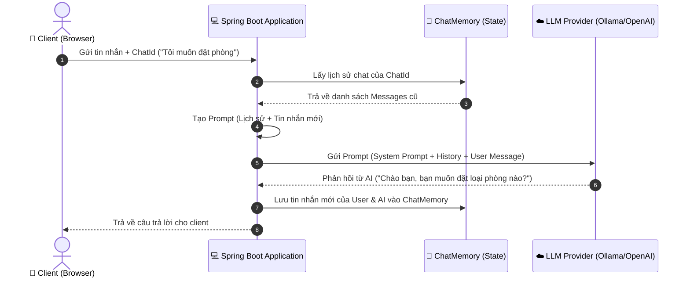
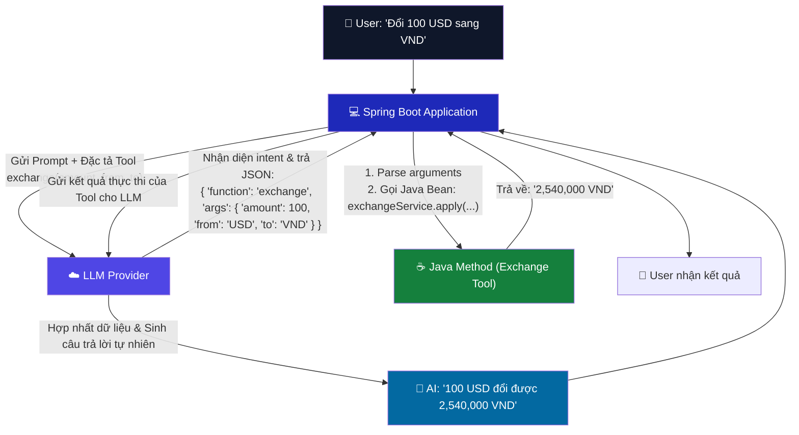
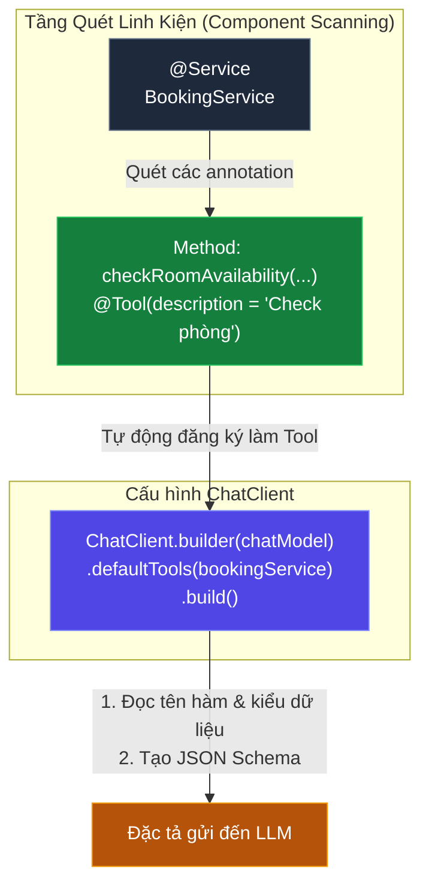
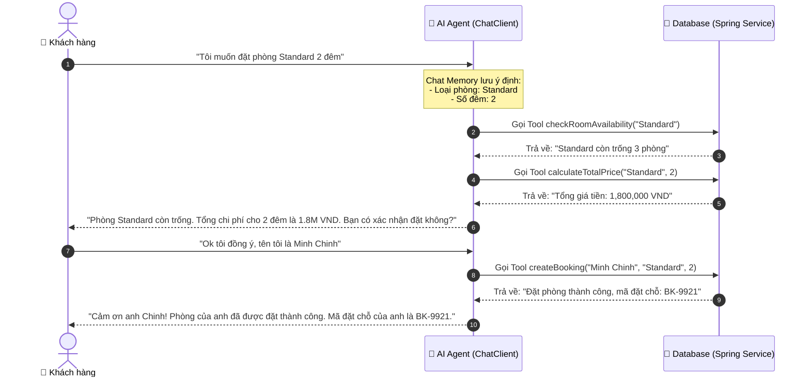

# 📚 SESSION 04: Xây dựng AI Agent & Function Calling
> **Môn học:** AI Integrated in Action | **Loại:** Lý thuyết + Demo  
> **Đối tượng:** Lập trình viên Java biết Spring Boot cơ bản  
> **Mục tiêu session:** Hiểu sâu về kiến trúc AI Agent, cơ chế lưu trữ lịch sử hội thoại (Chat Memory), cách hoạt động của cơ chế gọi hàm (Function Calling) và đóng gói các Spring Service hiện có thành các công cụ (Tools) để phát triển một AI Booking Agent đặt phòng khách sạn thực chiến.

---

# 🔵 LESSON 01 — Kiến trúc AI Agent & Chat Memory

## I. LÝ THUYẾT

### 1.1 AI Agent là gì?
Khác với mô hình ngôn ngữ (LLM) thông thường chỉ nhận Input và tạo ra Output (dạng Stateless), **AI Agent** là một hệ thống có khả năng tự động thực hiện các hành động phức tạp bằng cách lặp lại chu kỳ: **Reasoning (Tư duy) -> Acting (Hành động) -> Observing (Quan sát)**.

*   **Reasoning (Tư duy):** Đánh giá ý định của người dùng và quyết định hành động tiếp theo.
*   **Acting (Hành động):** Sử dụng các công cụ bên ngoài (Database, API, hệ thống thanh toán).
*   **Observing (Quan sát):** Đọc kết quả trả về từ hành động để lập kế hoạch cho bước tiếp theo.

> 💡 **So sánh:**
> *   **LLM thông thường:** Giống như một nhà thông thái chỉ biết trả lời câu hỏi dựa trên kiến thức có sẵn.
> *   **AI Agent:** Giống như một nhân viên có máy tính, có quyền truy cập Internet, database và có thể thay bạn xử lý công việc từ A-Z.

---

### 1.2 Mô hình ReAct (Reason + Act)
ReAct là một trong những framework phổ biến nhất giúp Agent hoạt động hiệu quả. Nó kết hợp khả năng lập luận của LLM với khả năng tương tác môi trường ngoài:

```
[User Request] ──> [Thought (LLM lập luận)] ──> [Action (Gọi Tool)] ──> [Observation (Kết quả từ Tool)] ──> [Thought...] ──> [Final Answer]
```

Nếu không có vòng lặp này, LLM sẽ cố gắng "đoán" kết quả và dẫn đến ảo tưởng (hallucination) khi gặp các câu hỏi yêu cầu dữ liệu thời gian thực.

---

### 1.3 Chat Memory — Trí nhớ hội thoại
LLM là **Stateless** (không nhớ gì giữa các lần gọi API độc lập). Để tạo ra trải nghiệm chat tự nhiên, chúng ta cần gửi kèm toàn bộ lịch sử trò chuyện trong mỗi request.

Spring AI cung cấp interface `ChatMemory` để lưu trữ và quản lý lịch sử này:

```
                    ┌─────────────────────────┐
                    │       ChatMemory        │
                    └────────────┬────────────┘
                                 │
         ┌───────────────────────┴───────────────────────┐
         ▼                                               ▼
[InMemoryChatMemory]                            [Persistent Chat Memory]
- Lưu trong RAM của JVM                         - Lưu vào Database (JDBC, Redis, VectorDB)
- Mất dữ liệu khi restart                       - Bền vững, phù hợp môi trường Production
- Phù hợp test/demo                             - Hỗ trợ lưu trữ hàng triệu session chat
```

#### Quản lý Context Window (Windowing Strategies):
Khi hội thoại kéo dài, số lượng token của lịch sử sẽ vượt quá giới hạn (Context Window) hoặc làm tăng chi phí API. Chúng ta cần các chiến lược cắt tỉa:
1.  **Sliding Window:** Chỉ giữ lại $N$ tin nhắn gần nhất.
2.  **Token-based Truncation:** Tự động cắt bỏ các tin nhắn cũ nhất khi tổng số token đạt ngưỡng cấu hình (ví dụ: 80% dung lượng tối đa).
3.  **Summarization:** Gọi một LLM phụ để tóm tắt các tin nhắn cũ thành 1 đoạn văn ngắn, giải phóng không gian cho tin nhắn mới.

---

## II. WORKFLOW DIAGRAM



### 📸 IMAGE PROMPT — Conversational AI Agent with Memory:
```
An isometric 3D illustration of an AI assistant workflow in Spring Boot.
A central glowing cube labeled "Spring AI Client" with neon lines connecting to a database cylinder labeled "Chat Memory (Redis)" on the left, and a cloud network labeled "Ollama / OpenAI Model" on the right. A computer terminal screen shows a dialogue between a user and the AI, with tiny digital scroll elements displaying text. Sleek high-tech corporate style, vibrant blue and purple neon colors, dark theme background, soft shadows, 8k resolution, volumetric lighting, presentation graphics.
```

---

## III. THỰC HÀNH

Chúng ta sẽ cấu hình `ChatMemory` sử dụng class `ChatClient` (API hướng đối tượng mới của Spring AI 1.1.5).

### 3.1 Cấu hình App & Bean (`AgentConfig.java`)
Đăng ký Bean `ChatMemory` toàn cục để quản lý lịch sử trò chuyện:

```java
package com.ai.function_calling.config;

import org.springframework.ai.chat.memory.ChatMemoryRepository;
import org.springframework.ai.chat.memory.InMemoryChatMemoryRepository;
import org.springframework.context.annotation.Bean;
import org.springframework.context.annotation.Configuration;

@Configuration
public class AgentConfig {

    // Sử dụng InMemoryChatMemoryRepository để quản lý lịch sử trò chuyện trong bộ nhớ
    @Bean
    public ChatMemoryRepository chatMemoryRepository() {
        return new InMemoryChatMemoryRepository();
    }
}
```

### 3.2 Service với Chat Memory (`AgentChatService.java`)
Sử dụng `ChatClient` cùng với `MessageChatMemoryAdvisor` để tự động hóa việc đọc/ghi lịch sử chat.

```java
package com.ai.function_calling.service;

import org.springframework.ai.chat.client.ChatClient;
import org.springframework.ai.chat.client.advisor.MessageChatMemoryAdvisor;
import org.springframework.ai.chat.memory.ChatMemory;
import org.springframework.beans.factory.annotation.Qualifier;
import org.springframework.stereotype.Service;

@Service
public class AgentChatService {

    private final ChatClient chatClient;

    public AgentChatService(@Qualifier("ollamaChatModel") org.springframework.ai.chat.model.ChatModel chatModel, ChatMemory chatMemory) {
        // Khởi tạo ChatClient fluent API
        this.chatClient = ChatClient.builder(chatModel)
                .defaultSystem("Bạn là trợ lý ảo lịch sự của khách sạn Rikkei Luxury Hotel. Hãy giúp khách hàng đặt phòng.")
                // Thêm Advisor bằng Builder để tự động xử lý Chat Memory
                .defaultAdvisors(MessageChatMemoryAdvisor.builder(chatMemory).build())
                .build();
    }

    public String chat(String chatId, String message) {
        return this.chatClient.prompt()
                .user(message)
                // Truyền ChatMemory.CONVERSATION_ID để phân biệt các phiên chat của các user khác nhau
                .advisors(advisorSpec -> advisorSpec.param(ChatMemory.CONVERSATION_ID, chatId))
                .call()
                .content();
    }
}
```

### 3.3 REST Controller (`AgentChatController.java`)
```java
package com.ai.function_calling.controller;

import com.ai.function_calling.service.AgentChatService;
import org.springframework.http.ResponseEntity;
import org.springframework.web.bind.annotation.*;

import java.util.Map;

@RestController
@RequestMapping("/api/v1/agent")
public class AgentChatController {

    private final AgentChatService agentChatService;

    public AgentChatController(AgentChatService agentChatService) {
        this.agentChatService = agentChatService;
    }

    /**
     * POST /api/v1/agent/chat
     * Body: { "chatId": "user-session-123", "message": "Tôi tên là Chinh" }
     */
    @PostMapping("/chat")
    public ResponseEntity<Map<String, String>> chat(@RequestBody Map<String, String> request) {
        String chatId = request.get("chatId");
        String message = request.get("message");

        if (chatId == null || message == null) {
            return ResponseEntity.badRequest().body(Map.of("error", "Thiếu tham số 'chatId' hoặc 'message'"));
        }

        String response = agentChatService.chat(chatId, message);
        return ResponseEntity.ok(Map.of("chatId", chatId, "response", response));
    }
}
```

### 🧪 Hướng dẫn kiểm thử (Testing Lab)
Sử dụng curl để kiểm chứng xem Agent có "nhớ" thông tin cũ không:

1.  **Lượt 1: Giới thiệu thông tin**
    ```bash
    curl -X POST http://localhost:8080/api/v1/agent/chat \
      -H "Content-Type: application/json" \
      -d '{"chatId": "session-1", "message": "Chào bạn, tôi tên là Minh Chinh, tôi muốn đặt một phòng Deluxe"}'
    ```
2.  **Lượt 2: Hỏi lại thông tin cũ để thử trí nhớ**
    ```bash
    curl -X POST http://localhost:8080/api/v1/agent/chat \
      -H "Content-Type: application/json" \
      -d '{"chatId": "session-1", "message": "Tôi vừa nói tôi tên là gì và muốn đặt loại phòng nào ấy nhỉ?"}'
    ```
    *Kết quả mong đợi:* AI sẽ trả lời chính xác tên "Minh Chinh" và loại phòng "Deluxe".

---

## IV. 🎬 NOTEBOOKLM VIDEO PROMPT — Lesson 01

```
=== STYLE PROMPT ===
Giọng thuyết trình: Chuyên nghiệp, trực quan, nhịp điệu hào hứng của một kỹ sư hệ thống.
Ngôn ngữ: Tiếng Việt, giữ nguyên các thuật ngữ kỹ thuật (Agent, Chat Memory, Stateful, Advisors).
Cách giải thích: Dùng ví dụ về sự khác nhau giữa "người phục vụ mất trí nhớ ngắn hạn" và "người có sổ ghi chép".

=== NỘI DUNG AUDIO ===
[00:00] Hook: "Tại sao chatbot của bạn luôn ngớ ngẩn và quên mất câu nói trước đó của khách hàng? Đó là vì mặc định, các LLM đều là Stateless. Hôm nay chúng ta sẽ giải quyết triệt để vấn đề này với Chat Memory trong Spring AI."
[02:00] Giải thích Agent: "Agent không chỉ trả lời văn bản, nó là một chu trình thông minh: Tư duy (Reason), Hành động (Act) và Quan sát (Observe). Để làm được điều này, nó cần một bộ nhớ đệm (Chat Memory)."
[04:30] Phân biệt InMemory vs Persistent Memory: "Với môi trường thực tế, InMemory sẽ làm mất hết lịch sử chat khi restart server. Chúng ta sẽ tìm hiểu về cách Spring AI hỗ trợ cắm các adapter Redis hoặc JDBC để lưu trữ bền vững."
[07:00] Phân tích code: "Nhìn vào cấu trúc của ChatClient. Chúng ta sử dụng MessageChatMemoryAdvisor để tự động đính kèm lịch sử vào prompt trước khi gửi đi và tự lưu kết quả mới mà không cần viết code thủ công."
[10:00] Chạy Demo: [Show màn hình curl] "Xem này, tôi hỏi lượt 1 nói tên Chinh. Lượt 2 tôi hỏi lại: 'Tôi là ai?' và Agent trả lời ngay lập tức. Bộ nhớ đã hoạt động hoàn hảo."
```

---

## V. 📊 GOOGLE SLIDES PROMPT — Lesson 01

```
=== PHONG CÁCH TỔNG THỂ ===
Theme: Tech Minimalist — nền #0f172a, font chữ Inter, màu nhấn tím sáng #a855f7 và cyan #06b6d4.

=== SLIDES ===
Slide 1: Tiêu đề lớn: "Kiến trúc AI Agent & Quản lý Bộ nhớ Chat Memory"
Slide 2: Đặt vấn đề: "Tại sao LLM mặc định lại bị mất trí nhớ?" -> So sánh Stateful vs Stateless.
Slide 3: Chu trình ReAct: Sơ đồ Reasoning -> Acting -> Observing bằng đồ họa hình tròn khép kín.
Slide 4: Các loại ChatMemory trong Spring AI: Bảng so sánh InMemoryChatMemoryRepository vs Database-backed ChatMemory (JDBC/Redis).
Slide 5: Vấn đề tràn Context Window: Các chiến lược cắt tỉa (Sliding Window, Token-based, Tóm tắt).
Slide 6: Cấu hình ChatMemoryRepository Bean: Code mẫu java khai báo Bean InMemoryChatMemoryRepository.
Slide 7: Khai báo ChatClient với Advisor: Phân tích dòng code `.defaultAdvisors(MessageChatMemoryAdvisor.builder(chatMemory).build())`.
Slide 8: Tham số Chat ID: Giải thích cơ chế cô lập lịch sử trò chuyện của các User thông qua khóa `ChatMemory.CONVERSATION_ID`.
Slide 9: Luồng HTTP Request/Response: Sơ đồ tuần tự (Sequence Diagram) luồng dữ liệu từ Client qua Spring Boot, lưu DB rồi đến LLM.
Slide 10: Tóm tắt bài học: 3 gạch đầu dòng then chốt để thiết lập thành công hệ thống Chatbot có trạng thái.
```

---
---

# 🔵 LESSON 02 — Cơ chế Function Calling trong Spring AI

## I. LÝ THUYẾT

### 2.1 Function Calling là gì?
**Function Calling (Gọi hàm)** là cơ chế cho phép các mô hình ngôn ngữ lớn (như GPT-4, Gemini, Qwen) kết nối trực tiếp với các API bên ngoài hoặc chạy các đoạn mã lập trình nội bộ.

LLM **không trực tiếp chạy code Java của bạn**. Thay vào đó:
1.  LLM nhận diện câu hỏi của người dùng có chứa ý định (intent) cần lấy dữ liệu ngoài.
2.  LLM quyết định gọi hàm nào và tự động sinh ra đối tượng JSON chứa tham số truyền vào phù hợp.
3.  Spring AI nhận kết quả JSON này, tìm và thực thi hàm Java tương ứng trên Server của bạn.
4.  Spring AI gửi trả kết quả thực thi của hàm (dạng văn bản/JSON) về cho LLM.
5.  LLM đọc kết quả và tổng hợp thành câu trả lời tự nhiên nhất gửi tới người dùng.

---

### 2.2 Sơ đồ luồng hoạt động chi tiết

```
 👤 User                💻 Spring Boot (Spring AI)             ☁️ LLM Provider
   │                               │                                │
   ├────── 1. Hỏi thời tiết ──────>│                                │
   │       "Thời tiết HN?"         ├─────── 2. Gửi Prompt ─────────>│
   │                               │        (Kèm danh sách Tool)    │
   │                               │                                ├─ Duyệt list tool:
   │                               │                                ├─ Thấy HNWeatherTool
   │                               │<────── 3. Yêu cầu gọi hàm ─────┤  khớp yêu cầu.
   │                               │        "HNWeatherTool(HN)"     │
   │                               │                                │
   │                               ├─ Tự động thực thi hàm Java:    │
   │                               │  getWeather("HN") -> "22°C"    │
   │                               │                                │
   │                               ├────── 4. Gửi kết quả hàm ─────>│
   │                               │        "Mưa nhẹ, 22°C"         │
   │                               │                                ├─ Đọc dữ liệu,
   │                               │<────── 5. Trả câu trả lời ─────┤  viết câu hoàn chỉnh.
   │                               │        "Hà Nội đang mưa 22°C"  │
   ├──── 6. Nhận câu trả lời ──────┤                                │
   ▼                               ▼                                ▼
```

---

### 2.3 Cơ chế định nghĩa Tool qua Functional Interface của Java
Spring AI sử dụng các functional interface tiêu chuẩn của Java để định nghĩa công cụ:
*   `java.util.function.Function<Request, Response>`: Nhận một Object Request và trả về Object Response.

Spring AI sẽ tự động đọc cấu trúc của lớp Request (dùng Jackson và JSON Schema generator) để tạo ra bản đặc tả JSON Schema gửi tới LLM. Do đó, việc đặt tên trường rõ ràng và ghi chú mô tả là cực kỳ quan trọng để LLM hiểu đúng.

---

## II. WORKFLOW DIAGRAM



### 📸 IMAGE PROMPT — Function Calling Mechanics:
```
A technical diagram demonstrating the sequence of Function Calling in Spring AI.
On the left, a Java code editor interface showing a method signature with `@Bean`. In the middle, a JSON data packet being sent to a brain-like AI node. On the right, a terminal interface showing step-by-step process: User query, Tool detection, Local Java execution, and final AI output. Clean vector style, flat modern design with purple and teal lines, dark blue background, technical presentation slide.
```

---

## III. THỰC HÀNH

Chúng ta sẽ tạo một chức năng đổi tiền tệ đơn giản và tích hợp nó thành công cụ cho AI gọi tự động khi người dùng yêu cầu quy đổi ngoại tệ.

### 3.1 Định nghĩa cấu trúc DTO Request & Response
```java
package com.ai.function_calling.model;

import com.fasterxml.jackson.annotation.JsonProperty;
import com.fasterxml.jackson.annotation.JsonPropertyDescription;

public class CurrencyModel {

    // JsonPropertyDescription rất quan trọng để LLM hiểu mục đích của các biến truyền vào
    public record Request(
            @JsonPropertyDescription("Số tiền cần chuyển đổi, ví dụ: 100")
            double amount,
            @JsonPropertyDescription("Mã tiền tệ gốc (3 ký tự viết hoa), ví dụ: USD, EUR, JPY")
            String from,
            @JsonPropertyDescription("Mã tiền tệ đích cần chuyển sang, ví dụ: VND, USD")
            String to
    ) {}

    public record Response(
            double resultAmount,
            String message
    ) {}
}
```

### 3.2 Khai báo Function Bean (`CurrencyExchangeFunction.java`)
Đăng ký Java class thành một Bean dạng `Function` để Spring AI có thể tìm thấy:

```java
package com.ai.function_calling.service;

import com.ai.function_calling.model.CurrencyModel;
import lombok.extern.slf4j.Slf4j;
import org.springframework.context.annotation.Bean;
import org.springframework.context.annotation.Configuration;
import org.springframework.context.annotation.Description;

import java.util.function.Function;

@Slf4j
@Configuration
public class CurrencyExchangeFunction {

    @Bean
    // Description cung cấp ngữ cảnh cho AI biết KHI NÀO nên kích hoạt hàm này
    @Description("Quy đổi tỷ giá tiền tệ thực tế giữa các quốc gia như USD, EUR, VND")
    public Function<CurrencyModel.Request, CurrencyModel.Response> exchangeCurrency() {
        return request -> {
            log.info("🎯 Java Tool [exchangeCurrency] được gọi bởi AI với tham số: {} từ {} sang {}", 
                    request.amount(), request.from(), request.to());
            
            double rate = 1.0;
            String from = request.from().toUpperCase();
            String to = request.to().toUpperCase();

            // Mock tỷ giá đơn giản để demo
            if (from.equals("USD") && to.equals("VND")) rate = 25450.0;
            else if (from.equals("EUR") && to.equals("VND")) rate = 27200.0;
            else if (from.equals("VND") && to.equals("USD")) rate = 1.0 / 25450.0;

            double result = request.amount() * rate;
            String msg = String.format("Đã chuyển đổi thành công %s %s thành %s %s với tỷ giá %s", 
                    request.amount(), from, result, to, rate);

            return new CurrencyModel.Response(result, msg);
        };
    }
}
```

### 3.3 Đăng ký Tool vào Chat Service (`CurrencyChatService.java`)
```java
package com.ai.function_calling.service;

import org.springframework.ai.chat.client.ChatClient;
import org.springframework.beans.factory.annotation.Qualifier;
import org.springframework.stereotype.Service;

@Service
public class CurrencyChatService {

    private final ChatClient chatClient;

    public CurrencyChatService(@Qualifier("ollamaChatModel") org.springframework.ai.chat.model.ChatModel chatModel) {
        this.chatClient = ChatClient.builder(chatModel)
                .defaultSystem("Bạn là trợ lý hỗ trợ chuyển đổi tiền tệ và tính toán tài chính.")
                .build();
    }

    public String askAi(String promptText) {
        return this.chatClient.prompt()
                .user(promptText)
                // Kích hoạt function bằng cách truyền tên Bean của Function vào đây
                .toolNames("exchangeCurrency")
                .call()
                .content();
    }
}
```

### 3.4 REST Controller & Kiểm thử
```java
package com.ai.function_calling.controller;

import com.ai.function_calling.service.CurrencyChatService;
import org.springframework.web.bind.annotation.GetMapping;
import org.springframework.web.bind.annotation.RequestParam;
import org.springframework.web.bind.annotation.RestController;

@RestController
public class CurrencyChatController {

    private final CurrencyChatService currencyChatService;

    public CurrencyChatController(CurrencyChatService currencyChatService) {
        this.currencyChatService = currencyChatService;
    }

    @GetMapping("/api/v1/currency/chat")
    public String chat(@RequestParam String message) {
        return currencyChatService.askAi(message);
    }
}
```

### 🧪 Hướng dẫn kiểm thử (Testing Lab)
Chạy ứng dụng và gọi API:
```bash
curl "http://localhost:8080/api/v1/currency/chat?message=Tôi+có+250+USD+muốn+đổi+sang+VND+thì+được+bao+nhiêu"
```
*Theo dõi Console Log:* Bạn sẽ thấy log `🎯 Java Tool [exchangeCurrency] được gọi bởi AI...` in ra trước khi AI trả về kết quả quy đổi chính xác.

---

## IV. 🎬 NOTEBOOKLM VIDEO PROMPT — Lesson 02

```
=== STYLE PROMPT ===
Giọng thuyết trình: Năng động, hấp dẫn, nhịp điệu nhanh nhưng rõ ràng.
Nội dung truyền tải: Làm rõ bí mật "LLM không tự chạy code Java, nó chỉ là một người ra quyết định".
Điểm nhấn: Sự phối hợp nhịp nhàng giữa Spring AI và LLM để che giấu sự phức tạp của JSON Schema.

=== NỘI DUNG AUDIO ===
[00:00] Hook: "Bạn có biết AI làm thế nào để lấy được thông tin thời tiết thời gian thực hay truy cập cơ sở dữ liệu của bạn không? Hôm nay chúng ta sẽ tìm hiểu về Function Calling — cánh cổng kết nối LLM với thế giới thực."
[02:15] Bản chất cơ chế: "Rất nhiều người lầm tưởng rằng AI sẽ chạy code của chúng ta. Không hề! AI chỉ đọc mô tả, sau đó xuất ra dữ liệu JSON chứa cấu trúc tham số. Phần thực thi hoàn toàn do máy chủ Java của bạn đảm nhận."
[05:00] Tầm quan trọng của `@Description` và `@JsonPropertyDescription`: "Nếu bạn đặt tên biến là x, y, z hay không viết mô tả, AI sẽ không biết truyền tham số gì vào và sinh ra lỗi. Do đó, hãy viết Javadoc và Description thật chi tiết."
[08:00] Phân tích luồng chạy: [Thực hiện chạy debug và dừng lại ở điểm Breakpoint trong Function exchangeCurrency] "Hãy quan sát cửa sổ console log. Khi tôi gửi prompt bằng tiếng Việt thông thường, Spring AI đã tự động ánh xạ và nhảy vào dòng code Java này để xử lý tỷ giá."
[11:00] Kết luận: "Bây giờ bạn đã biết cách biến một hàm Java thành một công cụ cho AI. Trong bài học tiếp theo, chúng ta sẽ xem cách đóng gói toàn bộ Service sẵn có thành các Tool thông qua Annotation mới của Spring AI."
```

---

## V. 📊 GOOGLE SLIDES PROMPT — Lesson 02

```
=== PHONG CÁCH TỔNG THỂ ===
Theme: Modern Tech Blue — nền #0b0f19, font chữ Space Grotesk, màu nhấn neon blue #3b82f6 và emerald green #10b981.

=== SLIDES ===
Slide 1: Tiêu đề lớn: "Cơ chế Function Calling trong Spring AI"
Slide 2: Tại sao cần Function Calling? (Khắc phục hạn chế dữ liệu cũ của LLM và hiện tượng ảo tưởng).
Slide 3: Sơ đồ tương tác 3 bên: Client <-> Spring Boot Application <-> LLM Provider.
Slide 4: Định nghĩa Request DTO: Tầm quan trọng của `@JsonPropertyDescription` trong việc tạo JSON Schema tự động.
Slide 5: Đăng ký Bean Function: Khai báo `@Bean` kế thừa `java.util.function.Function` cùng annotation `@Description`.
Slide 6: Phân tích luồng gửi: Đặc tả Tool được đính kèm vào payload gửi đến LLM như thế nào.
Slide 7: Tự động hóa của Spring AI: Spring AI parse JSON trả về từ LLM -> invoke Java method -> gửi lại kết quả tự động.
Slide 8: Cấu hình ChatClient: Cách chỉ định danh sách function bằng phương thức `.toolNames("beanName")`.
Slide 9: Xử lý lỗi & Timeout: Điều gì xảy ra khi Tool Java bị ném ra Exception (Cách AI phản hồi lại lỗi).
Slide 10: Tổng kết: Các lưu ý quan trọng về đặt tên biến và mô tả ngữ cảnh hoạt động của Tool.
```

---
---

# 🔵 LESSON 03 — Đóng gói Spring Boot Service thành Tool

## I. LÝ THUYẾT

### 3.1 Khái niệm Tool trong Spring AI 1.1.5
Trong các phiên bản Spring AI gần đây (phiên bản 1.1.5 trở đi, giới thiệu từ bản 1.0.0.M1), một cơ chế đóng gói mới đã được giới thiệu giúp đơn giản hóa việc chuyển đổi các Service hiện có thành công cụ cho AI, đó là sử dụng annotation **`@Tool`**.

Trước đây, chúng ta phải khai báo thủ công từng Bean `java.util.function.Function` gây rườm rà và khó tái sử dụng code. Với `@Tool`, ta có thể trực tiếp đánh dấu một method trong `@Service` hoặc `@Component` để biến nó thành Tool.

---

### 3.2 Ưu điểm của Annotation `@Tool`
1.  **Dễ tích hợp:** Không cần cấu hình lại các method dưới dạng Functional Interface. Một Service có thể chứa nhiều Tool.
2.  **Hỗ trợ `@ToolContext`:** Cho phép truyền dữ liệu trạng thái (state) hoặc thông tin bảo mật (như JWT token, User ID) xuyên suốt quá trình gọi hàm của Agent mà LLM không được phép nhìn thấy.
3.  **Tự động tạo Schema từ Javadoc:** Spring AI có khả năng tự động đọc Javadoc của phương thức và các tham số để sinh ra đặc tả cho LLM, giảm thiểu việc khai báo lặp đi lặp lại.

---

### 3.3 Cơ chế đăng ký Tool qua ChatClient

Chúng ta sử dụng class chứa các phương thức `@Tool` và đăng ký trực tiếp vào `ChatClient` thông qua cấu hình `defaultTools(Object...)` hoặc `tools(Object...)`.

```
[Spring Boot Service]
   └── Method A (@Tool)  ───┐
   └── Method B (@Tool)  ───┼─> Đăng ký vào [ChatClient] ──> Tự động phơi bày cho LLM
```

---

## II. WORKFLOW DIAGRAM



### 📸 IMAGE PROMPT — Bootstrapping Spring Services as Tools:
```
A visual representation of Spring Boot services decorated with `@Tool` annotations being converted into modular tool blocks.
Vibrant digital blocks representing "Service Methods" snap into a central engine labeled "Spring AI ChatClient". Lines of code with glowing neon annotations highlight `@Tool` and `@Service` keywords. Presentation slide graphics, blue and purple aesthetic, hyper-detailed clean tech styling, white background.
```

---

## III. THỰC HÀNH

Chúng sẽ tạo một service phục vụ tra cứu thông tin khách hàng và đóng gói các hàm nghiệp vụ này thành các công cụ cho AI Agent.

### 3.1 Viết Service chứa các `@Tool` (`CustomerSupportService.java`)
```java
package com.ai.function_calling.service;

import org.springframework.ai.tool.annotation.Tool;
import org.springframework.stereotype.Service;
import lombok.extern.slf4j.Slf4j;
import java.util.Map;

@Slf4j
@Service
public class CustomerSupportService {

    // Giả lập database khách hàng
    private final Map<String, String> customerDb = Map.of(
        "C001", "Nguyễn Minh Chinh - Hạng: VIP - Điểm tích lũy: 1200",
        "C002", "Trần Quốc Anh - Hạng: Gold - Điểm tích lũy: 450",
        "C003", "Lê Thu Thảo - Hạng: Member - Điểm tích lũy: 50"
    );

    @Tool(description = "Tra cứu thông tin chi tiết của khách hàng bao gồm hạng thành viên và điểm tích lũy bằng ID khách hàng")
    public String getCustomerDetails(String customerId) {
        log.info("🎯 Thực thi Tool [getCustomerDetails] cho ID: {}", customerId);
        return customerDb.getOrDefault(customerId, "Không tìm thấy thông tin khách hàng có ID: " + customerId);
    }

    @Tool(description = "Tính số điểm tích lũy cần thiết để nâng hạng thành viên tiếp theo")
    public String calculatePointsToUpgrade(String customerId) {
        log.info("🎯 Thực thi Tool [calculatePointsToUpgrade] cho ID: {}", customerId);
        if (!customerDb.containsKey(customerId)) {
            return "Không tìm thấy khách hàng";
        }
        
        String info = customerDb.get(customerId);
        if (info.contains("VIP")) {
            return "Khách hàng đã đạt hạng cao nhất (VIP)";
        } else if (info.contains("Gold")) {
            return "Cần thêm 550 điểm để nâng lên hạng VIP";
        } else {
            return "Cần thêm 400 điểm để nâng lên hạng Gold";
        }
    }
}
```

### 3.2 Tích hợp Service vào Chat Client (`CustomerAgentService.java`)
```java
package com.ai.function_calling.service;

import org.springframework.ai.chat.client.ChatClient;
import org.springframework.beans.factory.annotation.Qualifier;
import org.springframework.stereotype.Service;

@Service
public class CustomerAgentService {

    private final ChatClient chatClient;

    public CustomerAgentService(
            @Qualifier("ollamaChatModel") org.springframework.ai.chat.model.ChatModel chatModel,
            CustomerSupportService customerSupportService) {
        
        // Đăng ký trực tiếp instance Service vào ChatClient qua defaultTools
        this.chatClient = ChatClient.builder(chatModel)
                .defaultSystem("Bạn là trợ lý chăm sóc khách hàng chuyên nghiệp. Hãy tra cứu và trả lời các câu hỏi về thành viên.")
                .defaultTools(customerSupportService) // Spring AI tự quét các method đánh dấu @Tool trong service này
                .build();
    }

    public String handleCustomerQuery(String query) {
        return this.chatClient.prompt()
                .user(query)
                .call()
                .content();
    }
}
```

### 3.3 REST Controller & Hướng dẫn kiểm thử
```java
package com.ai.function_calling.controller;

import com.ai.function_calling.service.CustomerAgentService;
import org.springframework.web.bind.annotation.GetMapping;
import org.springframework.web.bind.annotation.RequestParam;
import org.springframework.web.bind.annotation.RestController;

@RestController
public class CustomerAgentController {

    private final CustomerAgentService customerAgentService;

    public CustomerAgentController(CustomerAgentService customerAgentService) {
        this.customerAgentService = customerAgentService;
    }

    @GetMapping("/api/v1/customer/chat")
    public String chat(@RequestParam String message) {
        return customerAgentService.handleCustomerQuery(message);
    }
}
```

### 🧪 Hướng dẫn kiểm thử (Testing Lab)
Gửi yêu cầu kiểm thử:
```bash
curl "http://localhost:8080/api/v1/customer/chat?message=Khách+hàng+C002+còn+thiếu+bao+nhiêu+điểm+để+lên+hạng"
```
*Kết quả mong đợi:* AI sẽ tự động phân tích và kích hoạt tool `calculatePointsToUpgrade` cho mã khách hàng `C002` và trả về: "Khách hàng C002 cần thêm 550 điểm để nâng lên hạng VIP".

---

## IV. 🎬 NOTEBOOKLM VIDEO PROMPT — Lesson 03

```
=== STYLE PROMPT ===
Giọng thuyết trình: Thực tế, tập trung vào lập trình, giọng điệu giải quyết vấn đề hiệu quả.
Ngôn ngữ: Tiếng Việt, sử dụng các từ kỹ thuật phù hợp.
Điểm nhấn: Sự gọn gàng và ưu việt khi chuyển từ Functional Interface sang annotation `@Tool`.

=== NỘI DUNG AUDIO ===
[00:00] Hook: "Việc khai báo hàng chục Class Function rườm rà cho mỗi công cụ AI làm dự án của bạn trở nên quá tải? Hôm nay chúng ta sẽ tìm hiểu về `@Tool` — một annotation mạnh mẽ giúp biến bất kỳ method Java nào thành công cụ AI trong nháy mắt."
[02:30] Phân tích sự cải tiến: "Thay vì viết interface Function phức tạp và chỉ nhận được một tham số đầu vào. Với `@Tool`, bạn viết code như một method Java bình thường, nhận nhiều tham số, và Spring AI sẽ tự động ánh xạ dữ liệu."
[05:30] Javadoc & Schema Generation: "Hãy nhìn cách Spring AI thông minh đọc trực tiếp mô tả trong annotation `@Tool(description = '...')`. Nó sẽ dịch chuỗi này thành schema hướng dẫn cho LLM biết mục đích sử dụng."
[08:00] Live Debugging: [Thực hiện chạy request lấy thông tin khách hàng C002] "Hãy quan sát cửa sổ console log. Khi tôi hỏi AI, Spring AI tự động kích hoạt Tool Java, lấy dữ liệu thật từ map và trả về câu trả lời. Quá trình diễn ra hoàn toàn tự động."
[11:00] Kết luận: "Sử dụng `@Tool` giúp kiến trúc dự án Spring Boot của bạn luôn sạch sẽ và dễ bảo trì. Hãy chuẩn bị bước vào bài thực chiến tiếp theo: Xây dựng một Booking Agent hoàn chỉnh sử dụng nhiều công cụ kết hợp."
```

---

## V. 📊 GOOGLE SLIDES PROMPT — Lesson 03

```
=== PHONG CÁCH TỔNG THỂ ===
Theme: Developer Dark — nền #0f172a, font chữ JetBrains Mono cho code và Inter cho text, màu nhấn neon purple #a855f7 và emerald green #10b981.

=== SLIDES ===
Slide 1: Tiêu đề lớn: "Đóng gói Spring Boot Service thành AI Tool"
Slide 2: Sự tiến hóa của Tool registry: So sánh cách khai báo cũ (Function Bean) vs cách khai báo mới (@Tool).
Slide 3: Khai báo `@Tool` trên Service Method: Ví dụ code thực tế và các tham số của annotation.
Slide 4: Cơ chế tự động quét Tool: Spring AI tự động phân tích chữ ký hàm (method signature) để sinh kiểu dữ liệu tương ứng.
Slide 5: Đăng ký Tool qua `ChatClient`: Sử dụng `.defaultTools(serviceInstance)` để nạp toàn bộ công cụ.
Slide 6: Ứng dụng của `@ToolContext`: Cách truyền dữ liệu bảo mật ẩn (Token/ID) mà LLM không thấy được.
Slide 7: Quản lý Ngoại lệ trong Tool: Cách Spring AI đóng gói và gửi thông báo lỗi ngược lại cho LLM tự sửa đổi tham số.
Slide 8: Best Practices khi viết Tool: Tầm quan trọng của việc đặt tên method và mô tả tham số rõ nghĩa.
Slide 9: Sơ đồ luồng quét component và đăng ký runtime của Spring AI.
Slide 10: Tóm tắt bài học và chuẩn bị cho dự án thực chiến AI Booking Agent.
```

---
---

# 🔵 LESSON 04 — AI Booking Agent thực chiến

## I. LÝ THUYẾT

### 4.1 Khái niệm Đa công cụ (Multi-Tool Agent)
Trong các ứng dụng thực tế, một yêu cầu của khách hàng thường không thể giải quyết bằng một công cụ đơn lẻ. Agent cần phải tự động lập kế hoạch và kết hợp nhiều công cụ theo chuỗi để hoàn thành nhiệm vụ.

**Ví dụ quy trình đặt phòng khách sạn:**
```
[User: "Tôi muốn đặt phòng Deluxe 3 đêm từ hôm nay"]
   │
   ▼
[Tool 1: getRoomAvailability] ──> (Kiểm tra còn phòng trống)
   │
   ▼
[Tool 2: calculateTotalPrice] ──> (Tính tổng chi phí dựa trên số đêm)
   │
   ▼
[Tool 3: createBooking]       ──> (Tạo bản ghi đặt phòng trong database)
   │
   ▼
[AI phản hồi: "Đã đặt thành công phòng Deluxe cho anh Chinh, tổng chi phí là..."]
```

---

### 4.2 Tầm quan trọng của Chat Memory kết hợp với Tool Calling
Để Agent hoạt động chính xác trong cuộc đối thoại dài, nó cần sự phối hợp nhịp nhàng giữa:
1.  **Chat Memory:** Nhớ các chi tiết người dùng đã cung cấp ở các câu trước (ví dụ: ngày nhận phòng, số đêm, tên khách hàng).
2.  **Tool Calling:** Lấy dữ liệu thực tế tại thời điểm gọi hàm để đưa ra quyết định hoặc thực hiện ghi nhận giao dịch.

Nếu thiếu Chat Memory, mỗi lần gọi Tool AI sẽ hỏi lại thông tin từ đầu, làm hỏng trải nghiệm người dùng.

---

### 4.3 Quản lý trạng thái và tính toàn vẹn dữ liệu
Khi Agent gọi các hàm làm thay đổi trạng thái hệ thống (như ghi dữ liệu đặt phòng vào database), chúng ta cần áp dụng các biện pháp bảo vệ:
*   **Idempotency (Tính khả định):** Đảm bảo việc gọi lại Tool đặt phòng không tạo ra các bản ghi trùng lặp (dùng ID giao dịch duy nhất hoặc kiểm tra trạng thái trước khi tạo).
*   **Xác nhận rõ ràng (Explicit Confirmation):** Yêu cầu Agent hỏi lại người dùng để xác nhận thông tin trước khi thực thi các hành động ghi/xóa dữ liệu quan trọng.

---

## II. WORKFLOW DIAGRAM



### 📸 IMAGE PROMPT — Hotel AI Booking Agent:
```
A visual representation of an AI Booking Agent process.
A digital hotel reception desk where a futuristic hologram receptionist (AI) is assisting a guest. Wireframe icons of database queries (checking rooms, calculating costs, inserting booking records) float around the desk. Modern flat design, gradient color transitions, neon accents, dark mode tech aesthetic, detailed infographic layout.
```

---

## III. THỰC HÀNH

Chúng ta sẽ xây dựng hệ thống AI Booking Agent hoàn chỉnh tích hợp cả Chat Memory và 3 Tool nghiệp vụ liên kết với nhau.

### 3.1 Khai báo Lớp Dữ liệu Đặt phòng (`Booking.java`)
```java
package com.ai.function_calling.model;

import java.time.LocalDate;

public record Booking(
    String bookingId,
    String customerName,
    String roomType,
    LocalDate checkInDate,
    int nights,
    double totalPrice,
    String status
) {}
```

### 3.2 Viết Service Nghiệp vụ Khách sạn chứa các `@Tool` (`HotelBookingService.java`)
Service này chứa các nghiệp vụ kiểm tra phòng trống, tính toán giá tiền và ghi nhận đặt phòng vào database giả lập.

```java
package com.ai.function_calling.service;

import com.ai.function_calling.model.Booking;
import lombok.extern.slf4j.Slf4j;
import org.springframework.ai.tool.annotation.Tool;
import org.springframework.stereotype.Service;

import java.time.LocalDate;
import java.util.*;
import java.util.concurrent.ConcurrentHashMap;

@Slf4j
@Service
public class HotelBookingService {

    // Database giả lập lưu trữ trạng thái phòng và thông tin đặt phòng
    private final Map<String, Integer> roomInventory = new ConcurrentHashMap<>();
    private final Map<String, Booking> bookingDb = new ConcurrentHashMap<>();

    public HotelBookingService() {
        // Cấu hình số phòng trống ban đầu
        roomInventory.put("STANDARD", 3);
        roomInventory.put("DELUXE", 2);
        roomInventory.put("SUITE", 1);
    }

    @Tool(description = "Kiểm tra số lượng phòng trống của một loại phòng cụ thể (STANDARD, DELUXE, SUITE)")
    public String checkRoomAvailability(String roomType) {
        String type = roomType.toUpperCase().trim();
        log.info("🎯 Tool [checkRoomAvailability] chạy cho loại phòng: {}", type);
        
        if (!roomInventory.containsKey(type)) {
            return "Loại phòng không hợp lệ. Chúng tôi chỉ có phòng STANDARD, DELUXE, SUITE.";
        }
        
        int available = roomInventory.get(type);
        return String.format("Phòng loại %s hiện còn trống %s phòng.", type, available);
    }

    @Tool(description = "Tính toán tổng chi phí đặt phòng dựa trên loại phòng (STANDARD: 900k/đêm, DELUXE: 1500k/đêm, SUITE: 3000k/đêm) và số đêm lưu trú")
    public String calculateTotalPrice(String roomType, int nights) {
        String type = roomType.toUpperCase().trim();
        log.info("🎯 Tool [calculateTotalPrice] chạy cho loại phòng: {}, số đêm: {}", type, nights);
        
        double pricePerNight;
        switch (type) {
            case "STANDARD" -> pricePerNight = 900000;
            case "DELUXE" -> pricePerNight = 1500000;
            case "SUITE" -> pricePerNight = 3000000;
            default -> {
                return "Không thể tính giá do loại phòng không hợp lệ.";
            }
        }
        
        double total = pricePerNight * nights;
        return String.format("Tổng chi phí cho %d đêm phòng %s là %,.0f VND.", nights, type, total);
    }

    @Tool(description = "Thực hiện đặt phòng và lưu thông tin vào hệ thống. Yêu cầu đầy đủ tên khách hàng, loại phòng, ngày nhận phòng (định dạng yyyy-MM-dd) và số đêm lưu trú.")
    public String createBooking(String customerName, String roomType, String checkInDateStr, int nights) {
        String type = roomType.toUpperCase().trim();
        log.info("🎯 Tool [createBooking] chạy cho: Khách hàng={}, Phòng={}, Ngày={}, Số đêm={}", 
                customerName, type, checkInDateStr, nights);

        // 1. Kiểm tra phòng trống
        int available = roomInventory.getOrDefault(type, 0);
        if (available <= 0) {
            return String.format("Rất tiếc, loại phòng %s đã hết phòng trống. Không thể tiến hành đặt phòng.", type);
        }

        // 2. Tính tiền đặt phòng
        double pricePerNight = type.equals("STANDARD") ? 900000 : (type.equals("DELUXE") ? 1500000 : 3000000);
        double total = pricePerNight * nights;

        // 3. Khởi tạo và ghi nhận Booking
        String bookingId = "BK-" + (1000 + new Random().nextInt(9000));
        LocalDate checkInDate = LocalDate.parse(checkInDateStr);
        
        Booking booking = new Booking(
                bookingId,
                customerName,
                type,
                checkInDate,
                nights,
                total,
                "CONFIRMED"
        );

        bookingDb.put(bookingId, booking);
        // Trừ bớt phòng trống trong kho
        roomInventory.put(type, available - 1);

        log.info("✅ Đặt phòng thành công! ID Đặt chỗ: {}", bookingId);

        return String.format("Đặt phòng thành công! Mã đặt chỗ của bạn là: %s. Khách hàng: %s, Loại phòng: %s, Nhận phòng ngày: %s, Số đêm: %d. Tổng số tiền phải thanh toán: %,.0f VND.",
                bookingId, customerName, type, checkInDateStr, nights, total);
    }
}
```

### 3.3 Thiết lập Booking Agent Service (`HotelAgentService.java`)
```java
package com.ai.function_calling.service;

import org.springframework.ai.chat.client.ChatClient;
import org.springframework.ai.chat.client.advisor.MessageChatMemoryAdvisor;
import org.springframework.ai.chat.memory.ChatMemory;
import org.springframework.beans.factory.annotation.Qualifier;
import org.springframework.stereotype.Service;

@Service
public class HotelAgentService {

    private final ChatClient chatClient;

    public HotelAgentService(
            @Qualifier("ollamaChatModel") org.springframework.ai.chat.model.ChatModel chatModel,
            ChatMemory chatMemory,
            HotelBookingService hotelBookingService) {

        this.chatClient = ChatClient.builder(chatModel)
                .defaultSystem("""
                    Bạn là Trợ lý ảo chuyên nghiệp đặt phòng tại khách sạn Rikkei Luxury Hotel.
                    Nhiệm vụ của bạn là hỗ trợ khách hàng kiểm tra thông tin phòng trống, tính toán giá tiền và hoàn tất việc đặt phòng.
                    
                    QUY TRÌNH HOẠT ĐỘNG:
                    1. Hỏi rõ loại phòng khách muốn đặt nếu họ chưa cung cấp (Chúng tôi có STANDARD, DELUXE, SUITE).
                    2. Kiểm tra phòng trống bằng công cụ checkRoomAvailability trước khi tiến hành bước tiếp theo.
                    3. Hỏi rõ số đêm lưu trú và ngày nhận phòng nếu chưa biết.
                    4. Sử dụng công cụ calculateTotalPrice để báo giá cho khách và yêu cầu khách hàng xác nhận rõ ràng trước khi đặt.
                    5. Khi khách hàng đồng ý và cung cấp đầy đủ tên, hãy gọi công cụ createBooking để tạo đặt phòng.
                    
                    Lưu ý: Luôn hành xử thân thiện, lịch sự và chuyên nghiệp.
                    """)
                .defaultAdvisors(MessageChatMemoryAdvisor.builder(chatMemory).build())
                .defaultTools(hotelBookingService) // Đăng ký các công cụ khách sạn cho Agent
                .build();
    }

    public String chatWithAgent(String chatId, String message) {
        return this.chatClient.prompt()
                .user(message)
                .advisors(advisorSpec -> advisorSpec.param(ChatMemory.CONVERSATION_ID, chatId))
                .call()
                .content();
    }
}
```

### 3.4 REST Controller (`HotelAgentController.java`)
```java
package com.ai.function_calling.controller;

import com.ai.function_calling.service.HotelAgentService;
import org.springframework.http.ResponseEntity;
import org.springframework.web.bind.annotation.*;

import java.util.Map;

@RestController
@RequestMapping("/api/v1/hotel")
public class HotelAgentController {

    private final HotelAgentService hotelAgentService;

    public HotelAgentController(HotelAgentService hotelAgentService) {
        this.hotelAgentService = hotelAgentService;
    }

    /**
     * POST /api/v1/hotel/chat
     * Body: { "chatId": "session-booking-1", "message": "Tôi muốn đặt phòng" }
     */
    @PostMapping("/chat")
    public ResponseEntity<Map<String, String>> chat(@RequestBody Map<String, String> request) {
        String chatId = request.get("chatId");
        String message = request.get("message");

        if (chatId == null || message == null) {
            return ResponseEntity.badRequest().body(Map.of("error", "Thiếu tham số 'chatId' hoặc 'message'"));
        }

        String response = hotelAgentService.chatWithAgent(chatId, message);
        return ResponseEntity.ok(Map.of("chatId", chatId, "response", response));
    }
}
```

### 🧪 Hướng dẫn kiểm thử (Testing Lab)
Thực hiện chuỗi hội thoại bằng Postman hoặc curl để trải nghiệm khả năng lập kế hoạch của Agent:

1.  **Lượt 1: Bày tỏ ý định đặt phòng**
    ```bash
    curl -X POST http://localhost:8080/api/v1/hotel/chat \
      -H "Content-Type: application/json" \
      -d '{"chatId": "booking-101", "message": "Chào bạn, tôi muốn đặt một phòng Deluxe 2 đêm từ ngày 2026-07-01"}'
    ```
    *Phản hồi mong đợi:* Agent sẽ tự động chạy tool `checkRoomAvailability` và `calculateTotalPrice` để thông báo phòng còn trống và báo giá tiền cho bạn, sau đó yêu cầu bạn cung cấp tên và xác nhận.

2.  **Lượt 2: Cung cấp tên và đồng ý thanh toán**
    ```bash
    curl -X POST http://localhost:8080/api/v1/hotel/chat \
      -H "Content-Type: application/json" \
      -d '{"chatId": "booking-101", "message": "Tôi đồng ý mức giá đó, tôi tên là Nguyễn Minh Chinh"}'
    ```
    *Phản hồi mong đợi:* Agent tự động thu thập các thông tin đã lưu trong bộ nhớ từ lượt trước (Deluxe, 2 đêm, ngày 2026-07-01) kết hợp với thông tin tên mới cung cấp để chạy tool `createBooking` và trả về mã đặt phòng `BK-XXXX` thành công cho bạn.

---

## IV. 🎬 NOTEBOOKLM VIDEO PROMPT — Lesson 04

```
=== STYLE PROMPT ===
Giọng thuyết trình: Sôi nổi, cuốn hút, mang tính thuyết phục cao.
Cách truyền tải: Tập trung làm nổi bật trải nghiệm người dùng tuyệt vời khi tương tác với một AI Agent hoạt động trơn tru.
Analogy: So sánh chuỗi hành động của Agent như một người thư ký thông minh tự liên hệ các phòng ban để hoàn thành công việc.

=== NỘI DUNG AUDIO ===
[00:00] Hook: "Tương lai của lập trình ứng dụng là đây: Không còn những form điền thông tin khô khan, người dùng chỉ cần chat tự nhiên và hệ thống tự động xử lý. Hôm nay chúng ta sẽ chạy thử một AI Booking Agent hoàn chỉnh đặt phòng khách sạn."
[02:00] Hoạt động của Multi-tool: "Khi khách hàng nói muốn đặt phòng, Agent không chỉ trả lời suông. Nó tự động gọi hàm check phòng trống trong DB, tự động gọi hàm tính tiền và trả về thông tin chi tiết. Sự phối hợp của nhiều công cụ diễn ra chỉ trong 1 request."
[04:45] Sức mạnh của sự kết hợp: "Hãy xem cách Chat Memory kết hợp với Tool. Agent nhớ được loại phòng và số ngày khách đã nói ở câu chat trước, nên ở câu chat sau khi khách nói tên, nó có đủ thông tin để tiến hành book phòng ngay lập tức mà không cần hỏi lại."
[07:30] Phân tích code nghiệp vụ: "Chúng ta xem qua class HotelBookingService. Code hoàn toàn là Java tiêu chuẩn tương tác với database giả lập. Nhưng nhờ Spring AI, nó trở thành siêu năng lực cho mô hình AI."
[10:30] Chạy thử và kết luận: [Thực hiện chuỗi 2 lượt chat trên terminal] "Mã đặt chỗ BK-5432 đã được trả về. Mọi thứ hoạt động mượt mà và chính xác. Đây chính là cách bạn xây dựng ứng dụng AI thế hệ mới bằng Java."
```

---

## V. 📊 GOOGLE SLIDES PROMPT — Lesson 04

```
=== PHONG CÁCH TỔNG THỂ ===
Theme: Elite Dark — nền #090d16, font chữ Outfit và JetBrains Mono, màu nhấn gold #eab308 và royal purple #8b5cf6.

=== SLIDES ===
Slide 1: Tiêu đề lớn: "Xây dựng AI Booking Agent thực chiến với Spring AI"
Slide 2: Thiết kế Đa công cụ (Multi-Tool Agent): Cách Agent phối hợp chuỗi các hành động liên hoàn.
Slide 3: Sơ đồ nghiệp vụ khách sạn: Luồng đi từ Kiểm tra phòng trống -> Tính tiền -> Đặt phòng chính thức.
Slide 4: Cấu trúc Class Booking Record: Khai báo các trường dữ liệu cần thiết của giao dịch đặt phòng.
Slide 5: Viết Service HotelBookingService: Khai báo các tool `@Tool` tương ứng với các bước nghiệp vụ.
Slide 6: Logic của Booking Agent trong ChatClient: Phân tích cấu trúc System Prompt hướng dẫn quy trình đặt phòng cho AI.
Slide 7: Kết hợp Lịch sử hội thoại (Memory) với Hành động (Tools): Giải pháp lưu trữ thông tin trung gian trong suốt phiên chat.
Slide 8: An toàn giao dịch: Cách thiết lập bước xác nhận của người dùng trước khi gọi tool ghi dữ liệu `createBooking`.
Slide 9: Demo tương tác thực tế: Minh họa nội dung input/output của 2 lượt chat liên tục.
Slide 10: Tóm tắt Session 04: Đánh giá khả năng tự động hóa của AI Agent và định hướng các session tiếp theo (RAG & Vector DB).
```
