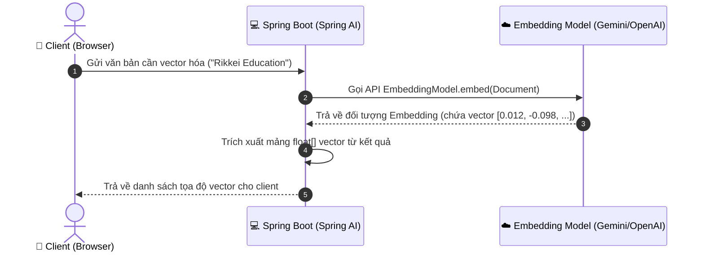
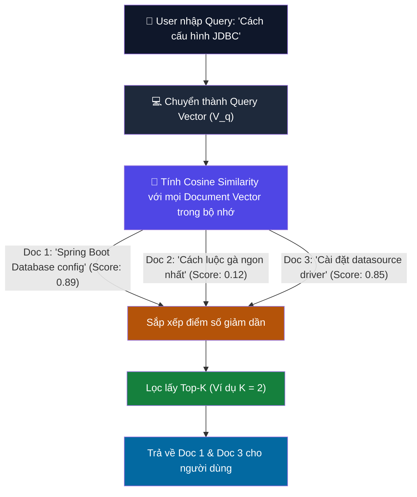
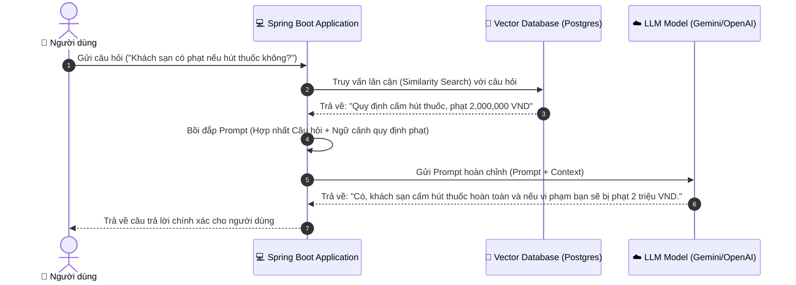

# 📚 SESSION 05: Vector Database & RAG (Retrieval-Augmented Generation)
> **Môn học:** AI Integrated in Action | **Loại:** Lý thuyết + Demo  
> **Đối tượng:** Lập trình viên Java biết Spring Boot cơ bản  
> **Mục tiêu session:** Hiểu rõ cơ chế hoạt động của kỹ thuật RAG, phương pháp số hóa văn bản thành Vector (Embeddings), cách đo độ tương đồng ngữ nghĩa (Cosine Similarity), cách lưu trữ và truy vấn hiệu năng cao bằng Vector Database (PGVector / Supabase), và phát triển một RAG Chatbot hoàn chỉnh từ tài liệu nội bộ sử dụng Spring AI 1.1.5.

---

# 🔵 LESSON 01 — Embeddings (Vector hóa văn bản)

## I. LÝ THUYẾT

### 1.1 Embeddings là gì?
Trong thế giới của các mô hình ngôn ngữ lớn (LLM), máy tính không thể hiểu trực tiếp các từ ngữ hoặc văn bản theo cách của con người. Để xử lý, chúng ta cần số hóa văn bản thành các chuỗi số thực có độ dài cố định, được gọi là **Vector Embeddings** (hoặc gọi ngắn là Vector).

Một **Embedding Vector** đại diện cho **ngữ nghĩa** của văn bản chứ không chỉ là các ký tự thô.
- Các văn bản có nội dung/ngữ nghĩa tương tự nhau (ví dụ: *"Hôm nay trời mưa to"* và *"Thời tiết hôm nay ẩm ướt do mưa lớn"*) sẽ có các vector nằm rất gần nhau trong không gian đa chiều.
- Các văn bản có nghĩa trái ngược hoặc khác biệt hoàn toàn (ví dụ: *"Báo cáo tài chính quý 1"* và *"Cách nấu phở bò Hà Nội"*) sẽ có các vector nằm xa nhau.

```
Văn bản thô ──[ Embedding Model ]──> Vector [ 0.12, -0.45, 0.89, ..., 0.03 ] (N-chiều)
```

> 💡 **Số chiều (Dimensions):**
> Mỗi mô hình embedding sẽ có một số chiều cố định cho vector đầu ra:
> - OpenAI `text-embedding-3-small`: 1536 chiều.
> - Google Gemini `text-embedding-004`: 768 chiều.
> - Cohere / Ollama (mô hình chạy local như `nomic-embed-text`): 768 chiều.

### 1.2 So sánh Tìm kiếm Từ khóa (Keyword Search) vs. Tìm kiếm Ngữ nghĩa (Semantic Search)

| Đặc điểm | Tìm kiếm Từ khóa truyền thống (SQL LIKE, Elasticsearch BM25) | Tìm kiếm Ngữ nghĩa sử dụng Vector Embeddings |
| :--- | :--- | :--- |
| **Cơ chế hoạt động** | Tìm kiếm chính xác các ký tự trùng khớp (Exact match). | Tìm kiếm dựa trên ý nghĩa ngữ cảnh và khái niệm (Semantic match). |
| **Xử lý từ đồng nghĩa** | Kém. Tìm "điện thoại" sẽ bỏ sót các tài liệu chỉ chứa từ "smartphone". | Tốt. Hiểu rằng "điện thoại" và "smartphone" biểu diễn cùng một khái niệm. |
| **Xử lý sai chính tả** | Rất khó khăn, cần các cấu hình fuzzy phức tạp. | Khá tốt do ngữ cảnh chung của câu vẫn được giữ lại. |
| **Chi phí tính toán** | Thấp, dễ dàng đánh chỉ mục (Index) dạng B-Tree truyền thống. | Cao hơn do cần tính toán khoảng cách vector đa chiều khi truy vấn. |

---

## II. WORKFLOW DIAGRAM



### 📸 IMAGE PROMPT — Text Vectorization and Embeddings:
```
An abstract 3D digital visualization of a text vectorization process.
On the left, floating holographic letters and sentences converge into a glowing funnel representing a neural network encoder. Emerging from the right side of the funnel is a perfectly straight, glowing laser beam made of thousands of tiny coordinates and floating decimal numbers, mapping onto a multi-dimensional spatial grid (coordinate axes). Futuristic tech aesthetic, dark navy background with neon blue and purple grid lines, volumetric light rays, 8k resolution, crisp detail.
```

---

## III. THỰC HÀNH

Chúng ta sẽ tích hợp `EmbeddingModel` của Spring AI 1.1.5 và viết một dịch vụ để chuyển đổi văn bản bất kỳ thành Vector.

### 3.1 Cấu hình Maven/Gradle Dependencies
Đảm bảo dự án sử dụng Spring Boot 3.5.15 và Spring AI 1.1.5. Trong file `build.gradle`, thêm starter phù hợp (ở đây demo sử dụng OpenAI/Gemini):

```groovy
dependencies {
    implementation 'org.springframework.boot:spring-boot-starter-web'
    implementation 'org.springframework.ai:spring-ai-starter-model-openai' // Hoặc google-ai
    compileOnly 'org.projectlombok:lombok'
    annotationProcessor 'org.projectlombok:lombok'
}
```

### 3.2 Viết Service Vector Hóa (`EmbeddingService.java`)
Sử dụng `EmbeddingModel` của Spring AI để thực hiện chuyển đổi văn bản sang vector:

```java
package com.ai.vector_rag.service;

import org.springframework.ai.embedding.EmbeddingModel;
import org.springframework.ai.embedding.EmbeddingResponse;
import org.springframework.stereotype.Service;
import lombok.extern.slf4j.Slf4j;
import java.util.List;

@Slf4j
@Service
public class EmbeddingService {

    private final EmbeddingModel embeddingModel;

    // Spring Boot tự động injection EmbeddingModel dựa trên cấu hình application.properties
    public EmbeddingService(EmbeddingModel embeddingModel) {
        this.embeddingModel = embeddingModel;
    }

    /**
     * Chuyển đổi một đoạn văn bản thô thành một mảng Vector (float[])
     */
    public float[] getEmbedding(String text) {
        log.info("🎯 Thực hiện tạo Embedding Vector cho đoạn văn bản dài: {} ký tự", text.length());
        
        // Gọi mô hình sinh embedding
        EmbeddingResponse response = this.embeddingModel.embedForResponse(List.of(text));
        
        // Trích xuất vector đầu ra của tài liệu đầu tiên
        return response.getResults().get(0).getOutput();
    }
}
```

### 3.3 REST Controller (`EmbeddingController.java`)
```java
package com.ai.vector_rag.controller;

import com.ai.vector_rag.service.EmbeddingService;
import org.springframework.http.ResponseEntity;
import org.springframework.web.bind.annotation.*;
import java.util.Map;

@RestController
@RequestMapping("/api/v1/embeddings")
public class EmbeddingController {

    private final EmbeddingService embeddingService;

    public EmbeddingController(EmbeddingService embeddingService) {
        this.embeddingService = embeddingService;
    }

    /**
     * POST /api/v1/embeddings/generate
     * Body: { "text": "Học lập trình Java cùng Rikkei" }
     */
    @PostMapping("/generate")
    public ResponseEntity<Map<String, Object>> generateEmbedding(@RequestBody Map<String, String> request) {
        String text = request.get("text");
        if (text == null || text.isBlank()) {
            return ResponseEntity.badRequest().body(Map.of("error", "Văn bản đầu vào không được để trống"));
        }

        float[] vector = embeddingService.getEmbedding(text);
        
        return ResponseEntity.ok(Map.of(
                "text", text,
                "dimension", vector.length,
                "vector", vector
        ));
    }
}
```

### 🧪 Hướng dẫn kiểm thử (Testing Lab)
Chạy ứng dụng Spring Boot và gọi API bằng curl:

```bash
curl -X POST http://localhost:8080/api/v1/embeddings/generate \
  -H "Content-Type: application/json" \
  -d '{"text": "Học lập trình Java cùng Rikkei"}'
```

*Kết quả mong đợi:* Nhận về đối tượng JSON chứa mảng `vector` có độ dài cố định (ví dụ 1536 đối với OpenAI hoặc 768 đối với Gemini).

---

## IV. 🎬 NOTEBOOKLM VIDEO PROMPT — Lesson 01

```
=== STYLE PROMPT ===
Giọng thuyết trình: Thực tế, cuốn hút, nhấn mạnh vào khía cạnh lập trình và cách tư duy logic.
Ngôn ngữ: Tiếng Việt, giữ nguyên các thuật ngữ kỹ thuật (Vector, Embedding, Dimensions, Semantic Search).
Cách giải thích: Trực quan, liên hệ việc máy tính đọc số với việc biến chữ thành tọa độ bản đồ.

=== NỘI DUNG AUDIO ===
[00:00] Hook: "Máy tính không biết đọc chữ, LLM thực chất cũng chỉ hoạt động trên các con số. Làm thế nào để dạy máy tính hiểu được ý nghĩa sâu xa của một câu nói? Chào mừng bạn đến với thế giới của Vector Embeddings."
[02:00] Bản chất Vector: "Hãy tưởng tượng mỗi từ ngữ là một điểm trên bản đồ. Thay vì bản đồ 2 chiều, chúng ta có bản đồ 1536 chiều. Các câu có nghĩa giống nhau sẽ nằm sát cạnh nhau. Đó chính là lý do tìm kiếm ngữ nghĩa vượt trội hơn tìm kiếm từ khóa thông thường."
[04:30] Phân tích Dimension: "Số chiều càng cao, khả năng biểu diễn ngữ nghĩa càng sâu, nhưng chi phí lưu trữ và tính toán cũng tăng theo. Chúng ta sẽ cân đối giữa mô hình 768 chiều của Gemini và 1536 chiều của OpenAI."
[07:15] Giải thích mã nguồn: "Trong Spring AI 1.1.5, việc gọi EmbeddingModel vô cùng đơn giản. Chỉ cần tiêm Bean và gọi hàm `.embedForResponse()`. Mọi chi tiết phức tạp của việc gọi HTTP API đã được Spring AI che giấu."
[10:00] Demo & Kết luận: "Nhìn vào kết quả curl trả về, văn bản của chúng ta đã được dịch thành một mảng số thực hoàn hảo. Trong bài tiếp theo, chúng ta sẽ học cách so sánh hai vector này để tìm ra sự trùng khớp ngữ nghĩa."
```

---

## V. 📊 GOOGLE SLIDES PROMPT — Lesson 01

```
=== PHONG CÁCH TỔNG THỂ ===
Theme: Dark Cyber — nền #0a0e17, font chữ Outfit và JetBrains Mono, màu nhấn neon purple #a855f7 và neon green #10b981.

=== SLIDES ===
Slide 1: Tiêu đề lớn: "Lý thuyết & Thực hành Vector Embeddings trong Spring AI"
Slide 2: Đặt vấn đề: "Tại sao tìm kiếm từ khóa SQL LIKE truyền thống thất bại trước từ đồng nghĩa?"
Slide 3: Định nghĩa Embeddings: Định nghĩa toán học và ý nghĩa lập trình của việc biểu diễn văn bản dưới dạng Vector N-chiều.
Slide 4: Sơ đồ không gian vector: Trực quan hóa khoảng cách địa lý giữa các cụm từ đồng nghĩa và trái nghĩa.
Slide 5: So sánh Keyword Search vs Semantic Search: Bảng phân tích ưu nhược điểm của hai trường phái.
Slide 6: Các mô hình Embedding thông dụng: So sánh OpenAI, Gemini, và các mô hình chạy local qua Ollama.
Slide 7: Cấu hình Maven/Gradle: Khai báo dependency starter cho Spring AI.
Slide 8: Viết EmbeddingService: Giải thích mã nguồn Java gọi mô hình sinh vector.
Slide 9: REST Controller API: Thiết kế API đầu vào nhận text, đầu ra trả về mảng float[] cùng số chiều kích thước.
Slide 10: Tóm tắt bài học: 3 quy tắc cốt lõi khi làm việc với Embeddings trong dự án thực tế.
```

---
---

# 🔵 LESSON 02 — Cosine Similarity (Đo độ tương đồng ngữ nghĩa)

## I. LÝ THUYẾT

### 2.1 Công thức toán học Cosine Similarity
Sau khi đã biến các văn bản thành các vector số thực, làm thế nào để biết hai văn bản có ý nghĩa giống nhau hay không? Chúng ta cần đo **khoảng cách** hoặc **độ tương đồng** giữa hai vector đó trong không gian đa chiều.

Phương pháp phổ biến nhất trong xử lý ngôn ngữ tự nhiên và tìm kiếm ngữ nghĩa là **Cosine Similarity (Độ tương đồng Cosine)**. Nó đo góc giữa hai vector bất chấp độ dài của chúng:

$$\text{Cosine Similarity}(A, B) = \frac{A \cdot B}{\|A\| \|B\|} = \frac{\sum_{i=1}^{n} A_i B_i}{\sqrt{\sum_{i=1}^{n} A_i^2} \sqrt{\sum_{i=1}^{n} B_i^2}}$$

```
         Vector A (Hôm nay trời mưa)
           ^
           │  \  Góc θ nhỏ -> Cosine gần 1 (Giống nhau)
           │    \
           │      \ 
           │        \
           └─────────> Vector B (Thời tiết ẩm ướt, có mưa lớn)
```

**Giá trị trả về nằm trong khoảng:**
- **1:** Hai vector hoàn toàn trùng hướng (Ngữ nghĩa giống hệt nhau).
- **0:** Hai vector vuông góc (Không có mối tương quan nào).
- **-1:** Hai vector ngược hướng hoàn toàn (Ngữ nghĩa hoàn toàn trái ngược).
*(Trong thực tế xử lý văn bản, giá trị cosine thường dao động từ 0 đến 1).*

### 2.2 Thuật toán Top-K Search
Khi người dùng nhập vào một câu hỏi (Query):
1. Chúng ta chuyển đổi câu hỏi đó thành **Query Vector** ($V_q$).
2. Chúng ta tính toán Cosine Similarity giữa $V_q$ với tất cả các **Document Vectors** ($V_{d1}, V_{d2}, ..., V_{dn}$) đang lưu trong hệ thống.
3. Sắp xếp kết quả theo thứ tự độ tương đồng giảm dần.
4. Lấy ra **$K$ kết quả** có điểm số cao nhất (ví dụ: Top-3, Top-5 tài liệu liên quan nhất). Đây được gọi là thuật toán **Top-K Search**.

---

## II. WORKFLOW DIAGRAM



### 📸 IMAGE PROMPT — Cosine Similarity and High-Dimensional Angles:
```
A sleek, geometric infographics demonstrating the mathematics of Cosine Similarity.
Two glowing neon vectors, one colored bright cyan and the other hot pink, originate from a single source point in a dark three-dimensional coordinate grid. The angle between them is highlighted by a soft golden arc containing the mathematical symbol theta. Mathematical equations float softly in the background. Minimalist presentation style, high contrast, clean vector render, professional education slide background.
```

---

## III. THỰC HÀNH

Chúng ta sẽ tự viết code Java thuần để tính toán Cosine Similarity giữa các vector và thực hiện một bộ lọc Top-K đơn giản trên danh sách tài liệu giả lập.

### 3.1 Hàm tính toán Cosine Similarity (`VectorUtils.java`)
```java
package com.ai.vector_rag.util;

public class VectorUtils {

    /**
     * Tính toán Cosine Similarity giữa hai vector A và B cùng kích thước
     */
    public static double cosineSimilarity(float[] vectorA, float[] vectorB) {
        if (vectorA.length != vectorB.length) {
            throw new IllegalArgumentException("Hai vector phải có cùng số chiều kích thước");
        }

        double dotProduct = 0.0;
        double normA = 0.0;
        double normB = 0.0;

        for (int i = 0; i < vectorA.length; i++) {
            dotProduct += vectorA[i] * vectorB[i];
            normA += Math.pow(vectorA[i], 2);
            normB += Math.pow(vectorB[i], 2);
        }

        if (normA == 0 || normB == 0) {
            return 0.0; // Tránh lỗi chia cho 0
        }

        return dotProduct / (Math.sqrt(normA) * Math.sqrt(normB));
    }
}
```

### 3.2 Dịch vụ Tìm kiếm Ngữ nghĩa nội bộ (`SemanticSearchService.java`)
Dịch vụ này lưu trữ danh sách tài liệu giả lập trong RAM và so sánh câu hỏi của người dùng để tìm ra tài liệu phù hợp nhất.

```java
package com.ai.vector_rag.service;

import com.ai.vector_rag.util.VectorUtils;
import org.springframework.stereotype.Service;
import java.util.*;
import java.util.stream.Collectors;

@Service
public class SemanticSearchService {

    private final EmbeddingService embeddingService;

    // Lớp nội bộ để lưu trữ văn bản gốc kèm vector của nó
    public record DocumentRecord(String text, float[] embedding) {}

    private final List<DocumentRecord> documentStorage = new ArrayList<>();

    public SemanticSearchService(EmbeddingService embeddingService) {
        this.embeddingService = embeddingService;
        
        // Giả lập nạp dữ liệu kiến thức cơ sở ban đầu vào bộ nhớ RAM
        nạpTàiLiệuMẫu();
    }

    private void nạpTàiLiệuMẫu() {
        List<String> rawTexts = List.of(
            "Khách sạn Rikkei có 3 loại phòng: Standard giá 900k, Deluxe giá 1.5M và Suite giá 3M mỗi đêm.",
            "Quy định nhận phòng của khách sạn là sau 14:00 và trả phòng trước 12:00 trưa ngày hôm sau.",
            "Món phở bò Hà Nội gia truyền được nấu từ nước dùng xương hầm 12 tiếng kèm thảo quả, quế, hồi.",
            "Để cấu hình kết nối Database trong Spring Boot, ta sử dụng file application.properties với tiền tố spring.datasource."
        );

        for (String text : rawTexts) {
            float[] embedding = embeddingService.getEmbedding(text);
            documentStorage.add(new DocumentRecord(text, embedding));
        }
    }

    public record SearchResult(String text, double score) {}

    /**
     * Tìm kiếm Top-K tài liệu liên quan nhất đến câu hỏi
     */
    public List<SearchResult> searchTopK(String query, int k) {
        // 1. Vector hóa câu hỏi của người dùng
        float[] queryEmbedding = embeddingService.getEmbedding(query);

        // 2. Tính điểm tương đồng với tất cả tài liệu và lưu lại điểm số
        List<SearchResult> results = new ArrayList<>();
        for (DocumentRecord doc : documentStorage) {
            double score = VectorUtils.cosineSimilarity(queryEmbedding, doc.embedding());
            results.add(new SearchResult(doc.text(), score));
        }

        // 3. Sắp xếp điểm số giảm dần và giới hạn lấy K bản ghi cao nhất
        return results.stream()
                .sorted(Comparator.comparingDouble(SearchResult::score).reversed())
                .limit(k)
                .collect(Collectors.toList());
    }
}
```

### 3.3 REST Controller (`SearchController.java`)
```java
package com.ai.vector_rag.controller;

import com.ai.vector_rag.service.SemanticSearchService;
import org.springframework.http.ResponseEntity;
import org.springframework.web.bind.annotation.*;
import java.util.List;

@RestController
@RequestMapping("/api/v1/search")
public class SearchController {

    private final SemanticSearchService semanticSearchService;

    public SearchController(SemanticSearchService semanticSearchService) {
        this.semanticSearchService = semanticSearchService;
    }

    /**
     * GET /api/v1/search/query?q=giá phòng deluxe&k=2
     */
    @GetMapping("/query")
    public ResponseEntity<List<SemanticSearchService.SearchResult>> query(
            @RequestParam String q,
            @RequestParam(defaultValue = "2") int k) {
        
        List<SemanticSearchService.SearchResult> results = semanticSearchService.searchTopK(q, k);
        return ResponseEntity.ok(results);
    }
}
```

### 🧪 Hướng dẫn kiểm thử (Testing Lab)
Gọi API tìm kiếm bằng câu hỏi sử dụng từ đồng nghĩa mà không có trong cơ sở dữ liệu mẫu:

```bash
curl "http://localhost:8080/api/v1/search/query?q=huong+dan+cai+dat+co+so+du+lieu+spring&k=1"
```

*Kết quả mong đợi:* Dù câu hỏi là *"huong dan cai dat co so du lieu spring"*, hệ thống vẫn tìm thấy chính xác tài liệu liên quan nhất là: *"Để cấu hình kết nối Database trong Spring Boot..."* với điểm số tương đồng cao (thường > 0.75), bỏ qua hoàn toàn các bài viết về phở bò hoặc giá phòng khách sạn.

---

## IV. 🎬 NOTEBOOKLM VIDEO PROMPT — Lesson 02

```
=== STYLE PROMPT ===
Giọng thuyết trình: Năng nổ, thực chiến, tập trung giải bài toán kỹ thuật thực tế.
Ngôn ngữ: Tiếng Việt, giữ các thuật ngữ (Cosine Similarity, Dot Product, Top-K, Semantic Score).
Cách giải thích: Trực quan hóa góc giữa hai vector thành độ khít của hai ý tưởng hội thoại.

=== NỘI DUNG AUDIO ===
[00:00] Hook: "Làm thế nào để chatbot tự động nhận biết câu hỏi của người dùng đang nói về chủ đề gì mà không cần viết hàng trăm câu lệnh IF-ELSE phức tạp? Câu trả lời chính là phép toán Cosine Similarity."
[02:00] Giải thích toán học đơn giản: "Đừng sợ hãi công thức toán học dài dòng. Bản chất của Cosine Similarity là đo góc giữa hai mũi tên chỉ hướng. Nếu hai mũi tên song song, góc bằng 0, giá trị cosine bằng 1 — nghĩa là câu hỏi trùng khớp ý nghĩa hoàn toàn."
[04:30] Thuật toán Top-K: "Top-K chỉ đơn giản là việc bạn sắp xếp điểm số từ cao xuống thấp và lấy ra K kết quả hàng đầu. Đây là trái tim của mọi hệ thống tìm kiếm thông minh ngày nay."
[07:00] Live Code Walkthrough: [Trình bày class VectorUtils và vòng lặp tính toán] "Hãy xem cách chúng ta lặp qua danh sách tài liệu trong RAM để tính toán điểm số. Rất tường minh và dễ hiểu đối với lập trình viên Java."
[09:45] Demo kết quả bất ngờ: [Show kết quả API tìm kiếm] "Tôi hỏi về việc cài đặt cơ sở dữ liệu, và kết quả trả về chính xác đoạn cấu hình file properties, mặc dù trong câu hỏi và câu trả lời không trùng nhau bất kỳ từ khóa chính nào. Đó chính là ma thuật của tìm kiếm ngữ nghĩa."
```

---

## V. 📊 GOOGLE SLIDES PROMPT — Lesson 02

```
=== PHONG CÁCH TỔNG THỂ ===
Theme: Tech Minimalist — nền #0b0f19, font chữ Space Grotesk, màu nhấn neon cyan #06b6d4 và amber #f59e0b.

=== SLIDES ===
Slide 1: Tiêu đề lớn: "Phép toán Cosine Similarity & Cơ chế tìm kiếm Top-K"
Slide 2: Cách so sánh ý nghĩa văn bản: Đặt ra yêu cầu tìm khoảng cách đo lường giữa các vector.
Slide 3: Công thức toán học Cosine Similarity: Trình bày chi tiết công thức và giải thích các thành phần (tích vô hướng, độ dài vector).
Slide 4: Ý nghĩa hình học: Sơ đồ trực quan góc θ nằm giữa các vector trong không gian đa chiều.
Slide 5: Phân tích thang điểm Cosine: Ý nghĩa của các mốc điểm 1, 0, và -1 trong ngữ cảnh ngôn ngữ.
Slide 6: Quy trình thuật toán Top-K Search: Sơ đồ 4 bước xử lý từ lúc nhận Query đến khi lọc ra kết quả tốt nhất.
Slide 7: Viết lớp tiện ích VectorUtils: Code mẫu Java thực thi phép toán cosine.
Slide 8: Triển khai SemanticSearchService: Cấu trúc lưu trữ RAM tạm thời và bộ lọc luồng Stream Java để xếp hạng.
Slide 9: Thử nghiệm thực tế: Bảng điểm số tương đồng giữa câu hỏi mẫu và các văn bản cơ sở dữ liệu khác nhau.
Slide 10: Tóm tắt bài học: Tầm quan trọng của việc tối ưu hóa tốc độ tính toán khi tập dữ liệu tăng lên hàng triệu bản ghi.
```

---
---

# 🔵 LESSON 03 — Vector Database & PGVector

## I. LÝ THUYẾT

### 3.1 Tại sao cần Vector Database chuyên dụng?
Trong bài học trước, chúng ta đã lưu trữ các vector trong bộ nhớ RAM tạm thời và duyệt qua từng phần tử để so sánh. Phương pháp này chỉ chạy được với tập dữ liệu nhỏ (vài chục đến vài trăm bản ghi). 

Khi tập dữ liệu tăng lên hàng triệu tài liệu, việc duyệt tuyến tính (Linear Scan - $O(N)$) sẽ làm sập hệ thống do chiếm dụng CPU quá lớn và độ trễ phản hồi quá cao. Chúng ta cần một hệ cơ sở dữ liệu tối ưu riêng cho việc lưu trữ và lập chỉ mục (Indexing) vector, được gọi là **Vector Database**.

Các Vector Database cung cấp thuật toán tìm kiếm lân cận gần nhất (Approximate Nearest Neighbor - ANN) để tìm kiếm trong thời gian thực với độ phức tạp chỉ ở mức $O(\log N)$.

```
   [ Cơ sở dữ liệu truyền thống ]                [ Vector Database chuyên dụng ]
   - Tìm kiếm: Chính xác tuyệt đối               - Tìm kiếm: Lân cận gần đúng (ANN)
   - Index: B-Tree / Hash                        - Index: HNSW / IVFFlat
   - Phù hợp: Text thô, Số, Ngày                 - Phù hợp: Mảng Vector đa chiều
```

### 3.2 Giới thiệu hệ sinh thái Vector DB
- **PGVector:** Một extension mã nguồn mở dành cho PostgreSQL. Đây là lựa chọn tuyệt vời nhất cho các lập trình viên Java/Spring Boot vì tận dụng luôn hệ cơ sở dữ liệu quan hệ sẵn có, không cần vận hành một hệ thống mới.
- **Supabase:** Nền tảng Cloud PostgreSQL tích hợp sẵn PGVector với gói miễn phí cực kỳ phù hợp để học tập và demo.
- **Pinecone / Milvus:** Các công cụ Vector DB chuyên biệt, tối ưu cực mạnh cho hiệu năng cao và dữ liệu khổng lồ.

### 3.3 Cơ chế Indexing phổ biến trong Vector DB
1. **IVFFlat (Inverted File Flat):** Chia không gian vector thành các cụm (cluster). Khi tìm kiếm, chỉ cần tìm trong cụm gần nhất. Tốc độ nhanh, dung lượng RAM ít, nhưng độ chính xác trung bình.
2. **HNSW (Hierarchical Navigable Small World):** Xây dựng mạng lưới liên kết đa tầng giữa các điểm vector (tương tự đồ thị mạng xã hội). Tốc độ tìm kiếm siêu nhanh, độ chính xác cực cao, nhưng tốn nhiều bộ nhớ RAM để lưu trữ cấu trúc đồ thị.

---

## II. WORKFLOW DIAGRAM



```mermaid
sequenceDiagram
    autonumber
    participant App as 💻 Spring Boot Application
    participant DB as 🐘 PostgreSQL + PGVector
    
    Note over DB: Khởi tạo bảng với cột kiểu vector(1536)
    App->>DB: Thực hiện câu lệnh SQL tạo HNSW Index
    App->>DB: INSERT INTO items (content, embedding) VALUES ('...', '[0.012, ...]')
    
    rect rgb(30, 41, 59)
        Note over App, DB: Quá trình tìm kiếm ngữ nghĩa
        App->>DB: SELECT content, 1 - (embedding <=> '[0.091, ...]') AS similarity FROM items ORDER BY similarity DESC LIMIT 2
        DB-->>App: Trả về các dòng dữ liệu khớp kèm điểm số tương đồng
    end
```

### 📸 IMAGE PROMPT — Vector Database Indexing and Clusters:
```
A highly technical schematic representation of a Hierarchical Navigable Small World (HNSW) graph in a database.
Dotted geometric layers sit stacked on top of each other. Bright neon green and orange nodes are scattered across these layers, connected by sharp, glowing fiber-optic-like lines showing paths of navigation. The background is a sleek, dark server rack environment with subtle binary code textures. High-tech corporate presentation slide style, clean layout, architectural blueprint aesthetic.
```

---

## III. THỰC HÀNH

Chúng ta sẽ thiết lập Spring Boot kết nối với Postgres tích hợp extension `pgvector` để lưu trữ và truy vấn vector ngữ nghĩa bằng interface `VectorStore` của Spring AI 1.1.5.

### 3.1 Cấu hình Gradle `build.gradle`
Thêm dependency của PGVector VectorStore từ thư viện Spring AI:

```groovy
dependencies {
    implementation 'org.springframework.boot:spring-boot-starter-web'
    implementation 'org.springframework.ai:spring-ai-starter-model-openai'
    // Dependency cho PGVector VectorStore
    implementation 'org.springframework.ai:spring-ai-pgvector-store-starter'
    // Driver kết nối PostgreSQL
    runtimeOnly 'org.postgresql:postgresql'
    compileOnly 'org.projectlombok:lombok'
    annotationProcessor 'org.projectlombok:lombok'
}
```

### 3.2 Cấu hình ứng dụng (`application.properties`)
```properties
spring.application.name=vector-db-demo

# Cấu hình kết nối cơ sở dữ liệu PostgreSQL (Ví dụ sử dụng Supabase hoặc Postgres cục bộ)
spring.datasource.url=jdbc:postgresql://localhost:5432/postgres
spring.datasource.username=postgres
spring.datasource.password=yourpassword

# Cấu hình OpenAI API Key để tự động sinh vector khi nạp dữ liệu vào VectorStore
spring.ai.openai.api-key=your-openai-api-key

# Cấu hình PGVector Store của Spring AI
# Tự động tạo bảng vector nếu bảng chưa tồn tại trong database
spring.ai.vectorstore.pgvector.initialize-schema=true
# Kích hoạt chiều kích thước vector phù hợp với mô hình OpenAI text-embedding-3-small
spring.ai.vectorstore.pgvector.dimensions=1536
```

### 3.3 Viết Dịch vụ Quản lý Cơ sở dữ liệu Vector (`VectorDbService.java`)
Sử dụng `VectorStore` để lưu trữ tài liệu dạng thực thể `Document` của Spring AI và thực hiện tìm kiếm lân cận.

```java
package com.ai.vector_rag.service;

import org.springframework.ai.document.Document;
import org.springframework.ai.vectorstore.SearchRequest;
import org.springframework.ai.vectorstore.VectorStore;
import org.springframework.stereotype.Service;
import lombok.extern.slf4j.Slf4j;
import java.util.List;
import java.util.Map;

@Slf4j
@Service
public class VectorDbService {

    private final VectorStore vectorStore;

    // Spring AI tự động cấu hình và tiêm Bean VectorStore (PgVectorVectorStore) dựa trên starter
    public VectorDbService(VectorStore vectorStore) {
        this.vectorStore = vectorStore;
    }

    /**
     * Thêm tài liệu mới vào Vector Database
     */
    public void addDocument(String id, String content, Map<String, Object> metadata) {
        log.info("💾 Lưu tài liệu mới vào DB. ID: {}", id);
        
        // Spring AI đóng gói văn bản thành lớp Document
        Document doc = new Document(id, content, metadata);
        
        // Gọi VectorStore để tự động: Gọi API Embedding để sinh vector -> Lưu vào bảng Postgres
        this.vectorStore.add(List.of(doc));
    }

    /**
     * Tìm kiếm tài liệu liên quan theo câu hỏi sử dụng VectorStore
     */
    public List<Document> searchRelated(String query, int topK) {
        log.info("🔎 Truy vấn tìm kiếm ngữ nghĩa với query: '{}'", query);
        
        // Cấu hình tham số tìm kiếm lân cận
        SearchRequest searchRequest = SearchRequest.defaults()
                .withQuery(query)
                .withTopK(topK)
                .withSimilarityThreshold(0.7); // Chỉ lấy kết quả có độ tương đồng lớn hơn 70%

        // Thực hiện truy vấn tìm kiếm vector dưới Database
        return this.vectorStore.similaritySearch(searchRequest);
    }
}
```

### 3.4 REST Controller (`VectorDbController.java`)
```java
package com.ai.vector_rag.controller;

import com.ai.vector_rag.service.VectorDbService;
import org.springframework.ai.document.Document;
import org.springframework.http.ResponseEntity;
import org.springframework.web.bind.annotation.*;
import java.util.*;

@RestController
@RequestMapping("/api/v1/vector-db")
public class VectorDbController {

    private final VectorDbService vectorDbService;

    public VectorDbController(VectorDbService vectorDbService) {
        this.vectorDbService = vectorDbService;
    }

    /**
     * POST /api/v1/vector-db/add
     * Body: { "id": "doc-01", "content": "Nội dung tài liệu...", "category": "it" }
     */
    @PostMapping("/add")
    public ResponseEntity<String> add(@RequestBody Map<String, String> request) {
        String id = request.get("id");
        String content = request.get("content");
        String category = request.getOrDefault("category", "general");

        if (id == null || content == null) {
            return ResponseEntity.badRequest().body("Thiếu ID hoặc nội dung tài liệu");
        }

        vectorDbService.addDocument(id, content, Map.of("category", category));
        return ResponseEntity.ok("Đã nạp tài liệu và vector hóa lưu trữ thành công");
    }

    /**
     * GET /api/v1/vector-db/search?q=câu hỏi&k=2
     */
    @GetMapping("/search")
    public ResponseEntity<List<Map<String, Object>>> search(
            @RequestParam String q,
            @RequestParam(defaultValue = "2") int k) {
        
        List<Document> documents = vectorDbService.searchRelated(q, k);
        
        List<Map<String, Object>> response = new ArrayList<>();
        for (Document doc : documents) {
            response.add(Map.of(
                "id", doc.getId(),
                "content", doc.getContent(),
                "metadata", doc.getMetadata()
            ));
        }
        
        return ResponseEntity.ok(response);
    }
}
```

### 🧪 Hướng dẫn kiểm thử (Testing Lab)
1. **Bước 1: Nạp tài liệu hướng dẫn vào DB**
   ```bash
   curl -X POST http://localhost:8080/api/v1/vector-db/add \
     -H "Content-Type: application/json" \
     -d '{"id": "policy-01", "content": "Khách sạn Rikkei cấm hút thuốc hoàn toàn trong phòng nghỉ. Nếu vi phạm sẽ bị phạt hành chính 2,000,000 VND.", "category": "policy"}'
   ```
2. **Bước 2: Tìm kiếm ngữ nghĩa**
   ```bash
   curl "http://localhost:8080/api/v1/vector-db/search?q=hút+thuốc+phạt+bao+nhiêu&k=1"
   ```
   *Kết quả mong đợi:* Trả về tài liệu có ID `policy-01` chứa nội dung quy định phạt tiền, dù câu hỏi dùng các ký tự không trùng lặp chính xác.

---

## IV. 🎬 NOTEBOOKLM VIDEO PROMPT — Lesson 03

```
=== STYLE PROMPT ===
Giọng thuyết trình: Thực tế, chi tiết, đi sâu vào cấu trúc kiến trúc hệ thống dữ liệu.
Ngôn ngữ: Tiếng Việt, sử dụng các từ ngữ (Vector Store, Indexing, HNSW, IVFFlat, ANN Search).
Cách giải thích: So sánh việc đọc sách tuần tự từng trang với việc mở đúng mục lục để tìm kiếm thông tin nhanh chóng.

=== NỘI DUNG AUDIO ===
[00:00] Hook: "Khi hệ thống của bạn có hàng triệu văn bản, việc quét tuyến tính để tính toán Cosine Similarity trong RAM sẽ làm sập máy chủ ngay lập tức. Đây là lúc chúng ta cần đến sự giải cứu của Vector Database chuyên dụng."
[02:15] Tại sao chọn PGVector: "Thay vì mua thêm các giải pháp lưu trữ tốn kém và khó vận hành. Với PGVector, chúng ta mở rộng ngay trên hệ cơ sở dữ liệu PostgreSQL quen thuộc. Vừa lưu trữ được quan hệ, vừa truy vấn được vector."
[04:45] So sánh IVFFlat và HNSW: "IVFFlat giống như việc chia sách vào các tủ đồ. HNSW lại liên kết các trang sách có nội dung tương đồng bằng những sợi dây phát sáng. HNSW sẽ là sự lựa chọn tối ưu cho hệ thống cần tốc độ phản hồi cực nhanh dưới 10 mili giây."
[07:30] Phân tích code Spring AI: "Interface VectorStore của Spring AI 1.1.5 là một thiết kế tuyệt đẹp. Nó tự động kết nối với mô hình Embedding để sinh vector, sau đó lưu trực tiếp vào cơ sở dữ liệu chỉ bằng một dòng lệnh `.add()`. Việc lập trình chưa bao giờ nhàn hạ đến thế."
[10:30] Thực nghiệm truy vấn: "Hãy xem cách chúng ta gọi API nạp tài liệu và tìm kiếm dưới cơ sở dữ liệu. Mọi thứ được đồng bộ mượt mà và thời gian phản hồi ở mức tức thì. Bạn đã sẵn sàng bước vào bài cuối cùng để hoàn thiện chatbot RAG của riêng mình?"
```

---

## V. 📊 GOOGLE SLIDES PROMPT — Lesson 03

```
=== PHONG CÁCH TỔNG THỂ ===
Theme: Modern Developer — nền #0f172a, font chữ Inter và Hack, màu nhấn violet #8b5cf6 và neon green #10b981.

=== SLIDES ===
Slide 1: Tiêu đề lớn: "Cấu hình & Sử dụng Vector Database với PGVector trong Spring AI"
Slide 2: Giới hạn của lưu trữ trong RAM: Phân tích độ phức tạp thời gian O(N) và lý do cần cơ sở dữ liệu vector chuyên dụng.
Slide 3: Các thuật toán tìm kiếm lân cận gần đúng (ANN): Giải thích cơ chế giảm thời gian tìm kiếm xuống O(log N).
Slide 4: Extension PGVector trên PostgreSQL: Sự kết hợp hoàn hảo giữa SQL truyền thống và tìm kiếm Vector.
Slide 5: So sánh các công nghệ Indexing: Phân tích chi tiết IVFFlat vs HNSW về hiệu năng, bộ nhớ RAM và độ chính xác.
Slide 6: Cấu hình dependencies: Hướng dẫn khai báo thư viện starter `spring-ai-pgvector-store-starter` trong Gradle.
Slide 7: Khai báo tệp cấu hình application.properties: Các thuộc tính kết nối cơ sở dữ liệu Postgres và cấu hình kích thước vector.
Slide 8: Triển khai lớp VectorDbService: Sử dụng interface VectorStore để nạp dữ liệu và tìm kiếm ngữ nghĩa tương đồng.
Slide 9: Thiết kế REST Controller: Xây dựng các API Endpoint phục vụ nạp tài liệu và tìm kiếm.
Slide 10: Tóm tắt bài học: Các lưu ý quan trọng về việc bảo trì chỉ mục và sao lưu dữ liệu Vector Database.
```

---
---

# 🔵 LESSON 04 — RAG Chatbot từ tài liệu nội bộ

## I. LÝ THUYẾT

### 4.1 Khái niệm RAG (Retrieval-Augmented Generation) là gì?
Mặc dù các mô hình ngôn ngữ lớn (LLM) có kiến thức khổng lồ về thế giới, chúng có hai điểm yếu cực lớn:
1. **Dữ liệu bị giới hạn (Knowledge Cutoff):** LLM không biết những thông tin mới cập nhật sau thời điểm huấn luyện của nó.
2. **Ảo tưởng (Hallucination):** Khi gặp các câu hỏi không có sẵn thông tin chính xác, LLM sẽ tự "bịa" ra câu trả lời có vẻ thuyết phục nhưng hoàn toàn sai sự thật.
3. **Không có kiến thức nội bộ:** LLM không thể truy cập tài liệu mật hoặc quy trình nghiệp vụ nội bộ của công ty bạn.

Để giải quyết vấn đề này mà không cần huấn luyện lại mô hình (Fine-tuning) rất tốn kém, chúng ta sử dụng kỹ thuật **RAG (Tạo câu trả lời tăng cường bằng truy xuất)**.

```
                  ┌──────────────────────┐
                  │ 1. Hỏi quy định phạt │
                  └──────────┬───────────┘
                             ▼
  👤 User ────────────────► [ App Java ]
    ▲                          │
    │ 5. Đọc câu trả lời       │ 2. Tìm tài liệu liên quan
    │    chính xác             ▼
    │                [ Vector Database ] ──► Có quy định phạt 2M
    │                          │
    │ 4. Trả câu trả lời       │ 3. Tạo Prompt: "Dựa vào quy định:
    │    hợp nhất              ▼                  [Quy định phạt 2M]. Hãy trả lời..."
    └─────────────── [ LLM Provider ]
```

### 4.2 Luồng xử lý chi tiết của quy trình RAG
Quy trình RAG bao gồm hai giai đoạn chính:

#### Giai đoạn Ingestion (Nạp dữ liệu - chạy offline hoặc khi thêm tài liệu mới):
1. **Đọc tài liệu:** Load các file tài liệu định dạng PDF, Word, Markdown, Webpage.
2. **Cắt nhỏ tài liệu (Chunking):** Chia văn bản lớn thành các đoạn nhỏ (ví dụ: mỗi đoạn 500 ký tự) để đảm bảo không vượt quá Context Window của LLM và tối ưu điểm số vector.
3. **Embedding:** Chuyển đổi từng đoạn văn bản thành vector.
4. **Lưu trữ:** Lưu cả đoạn văn bản thô kèm vector vào Vector Database.

#### Giai đoạn Retrieval & Generation (Truy vấn & Trả lời - chạy thời gian thực):
1. **Nhận câu hỏi:** Người dùng gửi câu hỏi (ví dụ: *"Hút thuốc phạt bao nhiêu?"*).
2. **Truy xuất ngữ cảnh (Retrieval):** Chuyển câu hỏi thành vector, truy vấn trong Vector Database để tìm ra Top-K đoạn văn bản liên quan nhất.
3. **Bồi đắp Prompt (Augment):** Lắp ráp Context (ngữ cảnh) tìm được vào cùng câu hỏi ban đầu để tạo ra một System Prompt mới:
   ```
   Bạn là trợ lý ảo hữu ích. Hãy trả lời câu hỏi của người dùng CHỈ dựa trên ngữ cảnh được cung cấp dưới đây. Nếu thông tin không có trong ngữ cảnh, hãy nói 'Tôi không biết'.
   
   NGỮ CẢNH:
   [Đoạn văn bản tìm được từ DB: Khách sạn cấm hút thuốc, vi phạm phạt 2 triệu]
   
   CÂU HỎI: Hút thuốc phạt bao nhiêu?
   ```
4. **Tạo câu trả lời (Generate):** Gửi Prompt bồi đắp này tới LLM. LLM đọc ngữ cảnh và trả về câu trả lời chính xác, tránh hoàn toàn hiện tượng ảo tưởng.

---

## II. WORKFLOW DIAGRAM



### 📸 IMAGE PROMPT — Complete RAG Chatbot Pipeline:
```
A highly detailed, beautiful technical infographic showing the end-to-end RAG (Retrieval-Augmented Generation) pipeline.
At the top, a document icon is split into blocks (chunks), which slide down glowing neon pipes into a cylinder labeled "Vector Database". At the bottom, a user sends a message through a chat bubble, which triggers a quick scan in the database, merges the found documents with the query inside a glowing processor node, and finally outputs a clean answer through a friendly AI avatar. Modern flat design, gradient blue, purple, and gold colors, dark mode backdrop.
```

---

## III. THỰC HÀNH

Chúng ta sẽ xây dựng một RAG Chatbot hoàn chỉnh tích hợp cả `VectorStore` và `ChatClient` sử dụng các API hướng đối tượng của Spring AI 1.1.5.

### 3.1 Cấu hình Service RAG Chatbot (`RagChatService.java`)
Chúng ta sẽ sử dụng class `QuestionAnswerAdvisor` - một Advisor mạnh mẽ của Spring AI giúp tự động hóa hoàn toàn giai đoạn **Retrieval & Augment** (tự tìm kiếm dưới DB, tự chèn vào Prompt trước khi gửi đi).

```java
package com.ai.vector_rag.service;

import org.springframework.ai.chat.client.ChatClient;
import org.springframework.ai.chat.client.advisor.QuestionAnswerAdvisor;
import org.springframework.ai.chat.model.ChatModel;
import org.springframework.ai.vectorstore.SearchRequest;
import org.springframework.ai.vectorstore.VectorStore;
import org.springframework.stereotype.Service;
import lombok.extern.slf4j.Slf4j;

@Slf4j
@Service
public class RagChatService {

    private final ChatClient chatClient;

    public RagChatService(ChatModel chatModel, VectorStore vectorStore) {
        // Khởi tạo ChatClient tích hợp sẵn cơ chế tự động truy vấn RAG qua Advisor
        this.chatClient = ChatClient.builder(chatModel)
                .defaultSystem("""
                    Bạn là Trợ lý ảo thông minh và trung thực của khách sạn Rikkei Luxury Hotel.
                    Nhiệm vụ của bạn là hỗ trợ khách hàng giải đáp thắc mắc dựa TRÊN thông tin quy định được cung cấp.
                    Lưu ý quan trọng: Chỉ trả lời dựa trên thông tin có trong phần NGỮ CẢNH.
                    Nếu thông tin không được đề cập trong ngữ cảnh, hãy lịch sự trả lời:
                    'Tôi rất tiếc, thông tin này nằm ngoài phạm vi hiểu biết hiện tại của tôi.' và tuyệt đối không tự bịa ra thông tin.
                    """)
                // Đăng ký QuestionAnswerAdvisor để tự động truy xuất dữ liệu từ VectorStore
                .defaultAdvisors(new QuestionAnswerAdvisor(vectorStore, SearchRequest.defaults().withTopK(2)))
                .build();
    }

    /**
     * Nhận câu hỏi từ người dùng và trả về câu trả lời đã được tăng cường dữ liệu
     */
    public String askWithContext(String userMessage) {
        log.info("🚀 Tiếp nhận câu hỏi RAG: '{}'", userMessage);
        
        return this.chatClient.prompt()
                .user(userMessage)
                .call()
                .content();
    }
}
```

### 3.2 REST Controller (`RagChatController.java`)
```java
package com.ai.vector_rag.controller;

import com.ai.vector_rag.service.RagChatService;
import org.springframework.http.ResponseEntity;
import org.springframework.web.bind.annotation.*;
import java.util.Map;

@RestController
@RequestMapping("/api/v1/rag")
public class RagChatController {

    private final RagChatService ragChatService;

    public RagChatController(RagChatService ragChatService) {
        this.ragChatService = ragChatService;
    }

    /**
     * POST /api/v1/rag/chat
     * Body: { "message": "Khách sạn có cấm hút thuốc không?" }
     */
    @PostMapping("/chat")
    public ResponseEntity<Map<String, String>> chat(@RequestBody Map<String, String> request) {
        String message = request.get("message");
        if (message == null || message.isBlank()) {
            return ResponseEntity.badRequest().body(Map.of("error", "Thiếu nội dung tin nhắn 'message'"));
        }

        String response = ragChatService.askWithContext(message);
        return ResponseEntity.ok(Map.of("response", response));
    }
}
```

### 🧪 Hướng dẫn kiểm thử (Testing Lab)
Thực hiện hai lượt kiểm thử để chứng minh khả năng chống ảo tưởng (Anti-Hallucination) của hệ thống RAG:

1. **Lượt 1: Hỏi câu hỏi có trong cơ sở dữ liệu nội bộ (Đã nạp ở bài thực hành 3)**
   ```bash
   curl -X POST http://localhost:8080/api/v1/rag/chat \
     -H "Content-Type: application/json" \
     -d '{"message": "Cho hỏi vi phạm quy định hút thuốc trong phòng thì phạt thế nào?"}'
   ```
   *Kết quả mong đợi:* AI sẽ dựa trên tài liệu nạp trước đó và trả lời chính xác: *"Nếu vi phạm quy định cấm hút thuốc hoàn toàn trong phòng nghỉ của khách sạn Rikkei, bạn sẽ bị phạt hành chính 2,000,000 VND."*

2. **Lượt 2: Hỏi câu hỏi nằm ngoài phạm vi tài liệu đã nạp (Ví dụ: hỏi về chính sách thú cưng chưa được định nghĩa)**
   ```bash
   curl -X POST http://localhost:8080/api/v1/rag/chat \
     -H "Content-Type: application/json" \
     -d '{"message": "Tôi có được mang mèo vào phòng không?"}'
   ```
   *Kết quả mong đợi:* Mặc dù các LLM thông thường (không có RAG) sẽ tự bịa ra chính sách thú cưng để làm hài lòng người dùng, chatbot RAG của chúng ta sẽ tuân thủ System Prompt nghiêm ngặt và trả lời: *"Tôi rất tiếc, thông tin này nằm ngoài phạm vi hiểu biết hiện tại của tôi."*

---

## IV. 🎬 NOTEBOOKLM VIDEO PROMPT — Lesson 04

```
=== STYLE PROMPT ===
Giọng thuyết trình: Hào hứng, tự tin, mang tinh thần truyền cảm hứng của một kiến trúc sư giải pháp AI.
Ngôn ngữ: Tiếng Việt, sử dụng các từ ngữ (RAG, Hallucination, Knowledge Base, QuestionAnswerAdvisor).
Cách giải thích: So sánh RAG như một thí sinh đi thi có quyền lật sách giáo khoa để trả lời câu hỏi thay vì cố gắng học vẹt toàn bộ thư viện.

=== NỘI DUNG AUDIO ===
[00:00] Hook: "Làm thế nào để chatbot của bạn không bao giờ nói dối và luôn trả lời chính xác dựa trên tài liệu quy định của công ty? Hôm nay, chúng ta sẽ lắp ráp mảnh ghép cuối cùng và cực kỳ quan trọng trong lập trình AI: Quy trình RAG chống ảo tưởng."
[02:15] Điểm yếu của LLM thông thường: "Các mô hình ngôn ngữ lớn rất giỏi ăn nói, nhưng lại hay ảo tưởng và bị giới hạn kiến thức. Thay vì chi hàng tỷ đồng để huấn luyện lại mô hình, RAG cung cấp giải pháp thông minh hơn: Cung cấp đúng trang sách chứa thông tin cho AI trước khi nó trả lời."
[05:00] Sức mạnh của QuestionAnswerAdvisor: "Trong Spring AI 1.1.5, bạn không cần viết code truy vấn thủ công, bồi đắp chuỗi prompt rườm rà. Class QuestionAnswerAdvisor tự động làm tất cả. Nó chặn yêu cầu của người dùng, tìm kiếm vector dưới DB, nhét context vào prompt và gửi đi."
[08:00] Chạy thử nghiệm thực tế: [Thực hiện gửi request hỏi về chính sách hút thuốc và mang thú cưng] "Xem này. Khi tôi hỏi đúng quy định, AI trả lời cực kỳ chính xác con số 2 triệu đồng. Nhưng khi tôi hỏi về thú cưng — một chính sách chúng ta chưa hề khai báo, AI lập tức từ chối lịch sự thay vì bịa chuyện. Đây là yếu tố cực kỳ quan trọng đối với các ứng dụng doanh nghiệp."
[11:00] Kết luận session: "Chúc mừng bạn đã làm chủ toàn bộ chu trình xử lý dữ liệu và xây dựng thành công giải pháp RAG Chatbot thực chiến trên nền Spring Boot và Spring AI."
```

---

## V. 📊 GOOGLE SLIDES PROMPT — Lesson 04

```
=== PHONG CÁCH TỔNG THỂ ===
Theme: Elite Cyberpunk — nền #0a0c16, font chữ Outfit và Fira Code, màu nhấn neon purple #c084fc và orange #f97316.

=== SLIDES ===
Slide 1: Tiêu đề lớn: "Xây dựng RAG Chatbot từ tài liệu nội bộ chống ảo tưởng"
Slide 2: Hạn chế của LLM trong doanh nghiệp: Phân tích 3 rào cản lớn (Knowledge Cutoff, Hallucination, Data Privacy).
Slide 3: RAG là gì?: Khái niệm bồi đắp ngữ cảnh thời gian thực để nâng cao chất lượng câu trả lời.
Slide 4: Quy trình 4 bước của RAG Pipeline: Ingest -> Retrieve -> Augment -> Generate bằng sơ đồ khối tuần tự.
Slide 5: Chiến lược chia nhỏ văn bản (Chunking Strategies): Tại sao việc chia nhỏ đoạn văn bản lại quyết định chất lượng tìm kiếm.
Slide 6: Phân tích cơ chế hoạt động của QuestionAnswerAdvisor trong Spring AI.
Slide 7: Khai báo lớp RagChatService: Chi tiết code Java cấu hình ChatClient tích hợp RAG Advisor.
Slide 8: Triển khai REST Controller và API Endpoint nhận câu hỏi và trả về phản hồi từ AI.
Slide 9: Thử nghiệm thực tế: So sánh kết quả phản hồi của AI khi có RAG và không có RAG đối với thông tin nội bộ.
Slide 10: Tổng kết Session 05: Đánh giá khả năng mở rộng hệ thống RAG và định hướng thực hành Session 06 tiếp theo.
```
