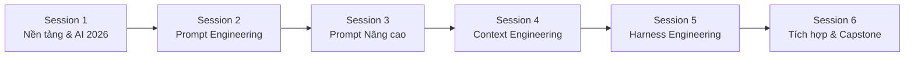

# 📚 CHƯƠNG TRÌNH HỌC TẬP CÁ NHÂN
# Prompt, Context & Harness Engineering
## 🔥 Phiên bản cập nhật: Tháng 06/2026

> **Giảng viên biên soạn** · Tổng thời lượng: **6 Sessions – 24 Lessons**
> Mỗi session ~2–3 giờ học · Bao gồm lý thuyết + thực hành + bài tập
> **Cập nhật lần cuối**: 26/06/2026 — Tích hợp các model, framework & kỹ thuật mới nhất

---

## 🗺️ Tổng Quan Chương Trình



| Session | Chủ đề | Số Lesson | Mục tiêu chính |
|---------|--------|-----------|-----------------|
| 1 | Nền tảng & Bối cảnh AI 2026 | 4 | Hiểu cách LLM hoạt động, landscape AI hiện tại |
| 2 | Prompt Engineering – Cơ bản | 4 | Nắm vững các kỹ thuật prompt cốt lõi |
| 3 | Prompt Engineering – Nâng cao | 4 | CoT, Reflexion, Tree-of-Thought, Automated Eval |
| 4 | Context Engineering | 4 | Quản lý context theo Karpathy, RAG, MCP, Memory |
| 5 | Harness Engineering | 4 | Pipelines, Tool Use, Guardrails, Multi-Agent |
| 6 | Tích hợp & Capstone Project | 4 | Kết hợp toàn bộ kiến thức vào dự án thực tế |

---

## 🤖 Bảng Tham Chiếu AI Models & Tools — Cập nhật 06/2026

> [!IMPORTANT]
> Bảng này sẽ được tham chiếu xuyên suốt chương trình. Hãy bookmark để tra cứu nhanh.

### Frontier Models (Tháng 6/2026)

| Provider | Model | Điểm mạnh | Context Window | Ghi chú |
|----------|-------|-----------|----------------|---------|
| **Anthropic** | **Claude Fable 5** | Reasoning, Software Engineering, Complex knowledge work | 200K+ | Mới nhất (09/06/2026). Top-tier cho long tasks |
| | **Claude Mythos 5** | Cybersecurity, Defensive infrastructure | — | Chỉ deploy cho select partners (Project Glasswing) |
| | **Claude Opus 4.8** | Coding, Agentic reliability | 200K | Cân bằng tốt nhất, widely available |
| **OpenAI** | **GPT-5.5** | Daily chat, Professional analysis, Synthesis | 128K+ | Flagship model, strongest all-around |
| | **GPT-5 Pro** | Maximum reasoning, Hardest-mode tasks | 128K+ | Max compute cho bài toán khó |
| **Google** | **Gemini 3.5 Flash** | Price-performance, Speed, Coding, Agentic | 1M+ | Launched 05/2026. Best cost efficiency |
| | **Gemini 3.5 Pro** | Reasoning-heavy workloads | 1M+ | Announced 06/2026 |

### Agentic AI Tools & Platforms (2026)

| Tool/Platform | Mục đích | Provider |
|---------------|----------|----------|
| **Claude Cowork** | Autonomous coding agent | Anthropic |
| **Gemini Spark** | Autonomous coding agent | Google |
| **OpenAI Codex** | Multi-role agent (coding, marketing, analysis) | OpenAI |
| **MCP (Model Context Protocol)** | Chuẩn kết nối AI ↔ Tools ("USB-C for AI") | Anthropic (open-source) |
| **A2A (Agent-to-Agent)** | Chuẩn giao tiếp giữa các agents | Google |
| **LangGraph** | Stateful multi-agent orchestration | LangChain |
| **CrewAI** | Role-based agent teams, rapid prototyping | CrewAI |
| **AutoGen (AG2)** | Multi-agent conversation framework | Microsoft |
| **Google ADK** | Enterprise-grade agent development kit | Google |
| **OpenAI Agents SDK** | Agent handoff patterns & orchestration | OpenAI |

---

## 📋 Quy ước ký hiệu

| Ký hiệu | Ý nghĩa |
|----------|----------|
| 📖 | Lý thuyết |
| 🛠️ | Thực hành |
| 📝 | Bài tập |
| 💡 | Insight quan trọng |
| ⚠️ | Pitfall thường gặp |
| 🎯 | Mục tiêu học tập |
| 🆕 | Kiến thức mới 2025-2026 |

---

---

# SESSION 1: NỀN TẢNG & BỐI CẢNH AI 2026

> 🎯 **Mục tiêu session**: Hiểu cách LLM xử lý ngôn ngữ, nắm bắt bối cảnh AI hiện tại (06/2026), phân biệt được 3 trụ cột: Prompt – Context – Harness, và hiểu tại sao ngành đang dịch chuyển từ Prompt Engineering sang Context Engineering.

---

### Lesson 1.1 — LLM hoạt động như thế nào? (Phiên bản 2026)

📖 **Lý thuyết**:
- Kiến trúc Transformer: Attention mechanism, tokenization
- Quá trình sinh text: next-token prediction, temperature, top-p
- Context window là gì? Giới hạn token và ảnh hưởng đến output
- 🆕 **Sự tiến hóa context window**: 4K (GPT-3.5) → 128K (GPT-5.5) → **1M+ (Gemini 3.5)**
- 🆕 **So sánh frontier models hiện tại**:

| Tiêu chí | Claude Fable 5 | GPT-5.5 | Gemini 3.5 Flash |
|----------|----------------|---------|-------------------|
| Reasoning | ⭐⭐⭐⭐⭐ | ⭐⭐⭐⭐⭐ | ⭐⭐⭐⭐ |
| Coding | ⭐⭐⭐⭐⭐ | ⭐⭐⭐⭐ | ⭐⭐⭐⭐⭐ |
| Speed | ⭐⭐⭐ | ⭐⭐⭐⭐ | ⭐⭐⭐⭐⭐ |
| Cost | $$ | $$$ | $ |
| Context Window | 200K+ | 128K+ | 1M+ |
| Agentic Reliability | ⭐⭐⭐⭐⭐ | ⭐⭐⭐⭐ | ⭐⭐⭐⭐ |

- 🆕 **Reasoning models vs. Standard models**: GPT-5 Pro, Gemini 3.5 Pro — khi nào dùng "thinking mode"?

🛠️ **Thực hành**:
- Thử nghiệm cùng 1 prompt trên **Claude Opus 4.8, GPT-5.5, Gemini 3.5 Flash** — so sánh output
- Đếm token với tokenizer tool — so sánh tokenization giữa các model
- 🆕 Thử 1 bài toán logic trên model thường vs. reasoning model (GPT-5 Pro) — quan sát khác biệt

📝 **Bài tập**:
- Viết 1 đoạn phân tích: "Tại sao cùng 1 câu hỏi nhưng model khác nhau cho kết quả khác nhau? So sánh ít nhất 2 model từ bảng tham chiếu"
- Lập bảng so sánh 3 model cho 3 task types (coding, analysis, creative writing)

---

### Lesson 1.2 — Prompt → Context → Harness: Ba trụ cột & Sự dịch chuyển 2025-2026

📖 **Lý thuyết**:
- **Prompt Engineering**: Nghệ thuật viết instruction để LLM hiểu đúng ý bạn
- **Context Engineering**: Khoa học quản lý thông tin đầu vào — quyết định LLM *biết gì* khi trả lời
- **Harness Engineering**: Thiết kế hệ thống bao bọc LLM — orchestration, guardrails, pipelines
- Mối quan hệ phụ thuộc: Prompt ⊂ Context ⊂ Harness

```
┌─────────────────────────────────────────┐
│            HARNESS ENGINEERING          │
│  ┌───────────────────────────────────┐  │
│  │       CONTEXT ENGINEERING         │  │
│  │  ┌─────────────────────────────┐  │  │
│  │  │    PROMPT ENGINEERING       │  │  │
│  │  │  "Viết câu hỏi thông minh" │  │  │
│  │  └─────────────────────────────┘  │  │
│  │  "Cung cấp đúng thông tin"       │  │
│  └───────────────────────────────────┘  │
│  "Xây dựng hệ thống điều phối"         │
└─────────────────────────────────────────┘
```

- 🆕 **Sự dịch chuyển quan trọng (Andrej Karpathy, mid-2025)**:
  > *"LLM là CPU, context window là RAM, và bạn là hệ điều hành."*
  
  — Prompt Engineering giờ chỉ là "table stakes" (kỹ năng cơ bản)
  — **Context Engineering** mới là kỹ năng quyết định trong thời đại Agentic AI
  — Agent failures phần lớn do **context failures** (lấy sai doc, quá tải context, thiếu tool definitions) — không phải do prompt dở

- 🆕 **Bảng so sánh paradigm cũ vs. mới**:

| Khía cạnh | 2023 (Cũ) | 2026 (Mới) |
|-----------|-----------|------------|
| **Focus** | Clever phrasing / personas | Context assembly & system architecture |
| **Verification** | Manual "vibe-check" | Quantitative evaluation on golden datasets |
| **Workflow** | Single long chat history | State management, tool schemas, orchestration |
| **Logic** | Nhồi rules vào prompt | Structured reasoning patterns (ReAct, Reflexion) |
| **Security** | Nhờ prompt "đừng làm điều xấu" | System-level guardrails + human-in-the-loop |

💡 **Insight**: Prompt Engineering giống viết email hay → Context Engineering giống chuẩn bị toàn bộ hồ sơ cuộc họp → Harness Engineering giống xây cả hệ thống workflow + approval.

📝 **Bài tập**:
- Vẽ sơ đồ tư duy phân biệt 3 khái niệm, kèm ví dụ thực tế sử dụng tools/models 2026
- Viết 1 đoạn phân tích: "Tại sao Karpathy nói Context Engineering thay thế Prompt Engineering?"

---

### Lesson 1.3 — Mental Model: LLM là CPU, Context là RAM

📖 **Lý thuyết**:
- LLM không "hiểu" — nó "dự đoán" token tiếp theo dựa trên pattern
- 🆕 **Mô hình Karpathy (2025-2026)**:

```
┌──────────────────────────────────────────────────────┐
│                  YOUR AI SYSTEM                       │
│                                                       │
│   ┌──────────┐                                        │
│   │   YOU     │ ← Hệ điều hành (OS)                  │
│   │ (Engineer)│   Quản lý memory, schedule tasks      │
│   └────┬─────┘                                        │
│        │ loads context into                           │
│        ▼                                              │
│   ┌──────────────────────────────────────┐            │
│   │        CONTEXT WINDOW (RAM)           │           │
│   │  ┌──────────┐ ┌──────────┐ ┌──────┐ │           │
│   │  │System    │ │Retrieved │ │User  │  │           │
│   │  │Prompt    │ │Documents │ │Query │  │           │
│   │  └──────────┘ └──────────┘ └──────┘ │           │
│   │  ┌──────────┐ ┌──────────┐           │           │
│   │  │Tool      │ │Chat      │           │           │
│   │  │Schemas   │ │History   │           │           │
│   │  └──────────┘ └──────────┘           │           │
│   └──────────────────────────────────────┘            │
│        │ processes                                     │
│        ▼                                              │
│   ┌──────────┐                                        │
│   │   LLM    │ ← CPU (xử lý dựa trên context)       │
│   │ (Model)  │                                        │
│   └──────────┘                                        │
│                                                       │
└──────────────────────────────────────────────────────┘
```

- Tại sao instruction rõ ràng = output tốt hơn (giảm entropy)
- 🆕 Concept: **"Steerability"** — với reasoning models (GPT-5 Pro, Gemini 3.5 Pro), ít cần "think step by step" hơn — model tự reasoning
- Garbage In, Garbage Out → 🆕 **Context In, Quality Out**

🛠️ **Thực hành**:
- Thử prompt mơ hồ vs. prompt rõ ràng trên **Claude Fable 5** và **GPT-5.5**, so sánh kết quả
- 🆕 Thử "think step by step" trên reasoning model vs. standard model — khi nào nó giúp, khi nào nó hại?
- Ví dụ: "Viết code" vs. "Viết hàm Python sắp xếp danh sách số nguyên bằng thuật toán merge sort, có docstring và type hints"

📝 **Bài tập**:
- Cho 5 prompt mơ hồ → viết lại thành 5 prompt rõ ràng, test trên 2 models khác nhau, giải thích sự cải thiện
- Viết 1 đoạn so sánh: "Standard model vs. Reasoning model — khi nào chọn cái nào?"

---

### Lesson 1.4 — Taxonomy of AI Tasks, Output Formats & 🆕 Agentic Workflows

📖 **Lý thuyết**:
- Phân loại task: Generation, Classification, Extraction, Transformation, Summarization, Reasoning, Code Generation
- Output formats: Plain text, JSON, XML, Markdown, Code, Table, CSV
- Matching task type → prompting strategy → 🆕 **model selection** tối ưu

- 🆕 **Agentic Workflows — Xu hướng #1 của 2026**:
  - **Background Agents**: Tasks chạy hàng phút/giờ, webhook thông báo khi xong (Claude Cowork, Gemini Spark)
  - **Workspace Agents**: Shared agents trong tổ chức, quản lý workflow độc lập (OpenAI Enterprise)
  - **Coding Agents**: AI tự viết, test, chạy code autonomously

```
Agentic Workflow 2026:
┌──────────────┐
│  User Intent  │
└──────┬───────┘
       ▼
┌──────────────┐     ┌────────────────┐
│ Agent Router  │────▶│ Background     │
│ (Orchestrator)│     │ Agent (async)  │
└──────┬───────┘     └───────┬────────┘
       │                      │
       ▼                      ▼
┌──────────────┐     ┌────────────────┐
│ Tool Calls   │     │ Webhook        │
│ via MCP      │     │ Notification   │
└──────────────┘     └────────────────┘
```

- 🆕 **Chọn model theo task type** (Best practices 06/2026):

| Task Type | Recommended Model | Lý do |
|-----------|-------------------|-------|
| Daily chat / Knowledge work | GPT-5.5 | Strongest all-around |
| Coding / Software Engineering | Claude Fable 5 / Claude Opus 4.8 | Top coding performance |
| Reasoning-heavy / Math | Gemini 3.5 Pro / GPT-5 Pro | Deep reasoning capability |
| High-volume / Cost-sensitive | Gemini 3.5 Flash | Best price-performance |
| Long document analysis | Gemini 3.5 Flash (1M ctx) | Largest context window |
| Agentic workflows | Claude Opus 4.8 / Gemini Spark | Best agentic reliability |

🛠️ **Thực hành**:
- Với 1 đoạn văn bản cho trước, viết prompt cho mỗi loại task, chọn model phù hợp
- 🆕 Thử agentic workflow: dùng Claude Cowork hoặc Gemini Spark để tự động hoàn thành 1 coding task

📝 **Bài tập**:
- Tạo bảng mapping: 10 use-case thực tế → task type → model phù hợp (2026) → output format → lý do chọn model

---

---

# SESSION 2: PROMPT ENGINEERING – CƠ BẢN

> 🎯 **Mục tiêu session**: Thành thạo các kỹ thuật prompt cơ bản, biết khi nào dùng kỹ thuật nào, tránh các lỗi phổ biến, và hiểu rằng prompt giờ là 1 phần của system architecture lớn hơn.

---

### Lesson 2.1 — Anatomy of a Good Prompt (Giải phẫu Prompt — Phiên bản 2026)

📖 **Lý thuyết**:
- 6 thành phần của prompt hiệu quả:

```
┌──────────────────────────────────────────┐
│  1. ROLE        — "Bạn là ai"            │
│  2. CONTEXT     — "Tình huống là gì"     │
│  3. TASK        — "Làm gì"              │
│  4. FORMAT      — "Trả lời dạng gì"     │
│  5. CONSTRAINTS — "Giới hạn / Quy tắc"  │
│  6. EXAMPLES    — "Ví dụ mẫu"           │
└──────────────────────────────────────────┘
```

- Framework: **R-C-T-F-C-E** (Role – Context – Task – Format – Constraints – Examples)

- 🆕 **2026 Update — Prompt là thành phần của System, không phải standalone**:
  - System Prompt ≠ User Prompt — chúng có priority và mục đích khác nhau
  - **Structured System Prompt** thay vì "đoạn văn dài":

```
❌ Cách cũ (2023):
"Bạn là chuyên gia Python, hãy giúp tôi viết code tốt,
đừng dùng eval(), luôn kiểm tra input..."

✅ Cách mới (2026) — Structured System Prompt:
<role>
  Senior Backend Engineer, 10 năm kinh nghiệm Python/Django
</role>
<communication_style>
  Giải thích ngắn gọn, đưa code example, đề cập edge cases
</communication_style>
<constraints>
  - KHÔNG dùng eval() hoặc exec()
  - PHẢI có type hints và docstring
  - Ưu tiên: performance > readability > cleverness
</constraints>
<output_format>
  JSON với schema: {"code": "...", "explanation": "...", "edge_cases": [...]}
</output_format>
```

💡 **Insight 2026**: Clarity và constraints giờ được handle qua structured system prompts — không còn phải "dỗ dành" model bằng lời lẽ khéo léo.

🛠️ **Thực hành**:
- Phân tích 5 prompt thực tế: xác định đâu là Role, Context, Task...
- Viết 1 structured system prompt cho **Claude Fable 5** vs. 1 cho **GPT-5.5** — so sánh format preference
- Viết lại prompt thiếu thành phần → thêm đủ 6 phần → so sánh output

📝 **Bài tập**:
- Viết 3 prompt hoàn chỉnh (đủ 6 thành phần) cho 3 ngữ cảnh: coding (Claude), analysis (GPT-5.5), creative (Gemini)

---

### Lesson 2.2 — Zero-Shot, One-Shot & Few-Shot Prompting

📖 **Lý thuyết**:
- **Zero-shot**: Chỉ có instruction, không có ví dụ
  - Khi nào dùng: Task đơn giản, phổ biến. 🆕 **Frontier models 2026 xử lý zero-shot rất tốt**
- **One-shot**: 1 ví dụ minh họa
  - Khi nào dùng: Cần clarify format hoặc style
- **Few-shot**: 2–5 ví dụ minh họa
  - Khi nào dùng: Task phức tạp, cần pattern matching chính xác

```
Zero-shot:  "Phân loại sentiment: 'Sản phẩm rất tốt' → ?"
One-shot:   "Ví dụ: 'Tuyệt vời' → Positive. Phân loại: 'Sản phẩm rất tốt' → ?"
Few-shot:   "VD1: 'Tuyệt vời' → Positive. VD2: 'Tệ quá' → Negative.
             VD3: 'Bình thường' → Neutral. Phân loại: 'Sản phẩm rất tốt' → ?"
```

- 🆕 **2026 Update**: Với Claude Fable 5 và GPT-5.5, zero-shot đã đủ tốt cho nhiều task mà trước đây cần few-shot. **Chỉ dùng few-shot khi**:
  - Output format phức tạp / custom
  - Domain-specific task (medical, legal, financial)
  - Consistency giữa nhiều lần chạy cần cao

⚠️ **Pitfall**: Quá nhiều ví dụ → chiếm token → ít chỗ cho output. Với 1M context (Gemini) ít lo, nhưng với 128K (GPT-5.5) vẫn cần cân bằng!

🛠️ **Thực hành**:
- Cho 1 task phân loại email → thử zero/one/few-shot trên **Claude Fable 5** → đo accuracy
- 🆕 So sánh: zero-shot trên Claude Fable 5 vs. few-shot trên Gemini 3.5 Flash — chi phí vs. chất lượng

📝 **Bài tập**:
- Tạo bộ few-shot prompt cho 3 bài toán, test trên 2 models khác nhau
- Lập bảng: khi nào zero-shot đủ tốt vs. khi nào cần few-shot (theo model 2026)

---

### Lesson 2.3 — Role Prompting, Persona Engineering & 🆕 System Prompt Architecture

📖 **Lý thuyết**:
- Tại sao gán vai trò cải thiện output: Kích hoạt "knowledge cluster" liên quan
- **System prompt vs. User prompt**: Vai trò và ưu tiên
- 🆕 **Multi-layer System Prompt Architecture (2026)**:

```
┌───────────────────────────────────────────────┐
│             SYSTEM PROMPT LAYERS              │
│                                               │
│  Layer 1: IDENTITY & ROLE                     │
│  "Bạn là Senior Data Engineer tại fintech"    │
│                                               │
│  Layer 2: BEHAVIORAL CONSTRAINTS              │
│  "KHÔNG đưa financial advice"                 │
│  "PHẢI cite source cho mọi claim"             │
│                                               │
│  Layer 3: TOOL DEFINITIONS                    │
│  Available tools: search_db, send_email...    │
│                                               │
│  Layer 4: OUTPUT SPECIFICATIONS               │
│  Format: JSON, language: Vietnamese           │
│                                               │
│  Layer 5: DYNAMIC CONTEXT SLOTS               │
│  {user_profile}, {retrieved_docs}             │
│                                               │
└───────────────────────────────────────────────┘
```

- 🆕 **Provider-specific best practices**:
  - **Claude Fable 5**: Hỗ trợ XML tags tốt (`<role>`, `<instructions>`, `<constraints>`)
  - **GPT-5.5**: Hỗ trợ markdown headers tốt (`## Role`, `## Instructions`)
  - **Gemini 3.5**: Flexible, hỗ trợ cả 2 styles

```
❌ "Bạn là chuyên gia"
✅ Claude Fable 5 style:
<role>
  Senior Backend Engineer, 10 năm Python/Django
</role>
<style>ngắn gọn, đưa code example, đề cập edge cases</style>
<priorities>performance > readability > cleverness</priorities>
<never>đưa code chưa test được</never>
```

🛠️ **Thực hành**:
- Tạo 3 persona khác nhau cho cùng 1 task (review code) trên Claude Fable 5
- 🆕 Viết system prompt theo đúng format tối ưu cho từng model (Claude XML vs. GPT Markdown)
- 🆕 Thử "role stacking": kết hợp nhiều chuyên môn trong 1 persona

📝 **Bài tập**:
- Thiết kế 1 system prompt hoàn chỉnh (multi-layer) cho AI assistant phục vụ 1 nghề cụ thể
- Viết 2 phiên bản: 1 cho Claude, 1 cho GPT — giải thích sự khác biệt format

---

### Lesson 2.4 — Output Formatting, Structured Output & 🆕 Schema Enforcement

📖 **Lý thuyết**:
- Tại sao structured output quan trọng: Dễ parse, consistent, tích hợp được
- Các kỹ thuật format output: JSON schema, Markdown table, XML tags, delimiters
- 🆕 **Native Structured Output (2026)**: Các model mới hỗ trợ **native JSON mode** & **schema enforcement**:
  - **OpenAI GPT-5.5**: `response_format={"type": "json_schema", "schema": {...}}`
  - **Claude Fable 5**: Tool use as structured output — define tool với output schema
  - **Gemini 3.5**: `response_mime_type="application/json"` + `response_schema`

```python
# 🆕 Ví dụ: Native structured output với GPT-5.5
response = client.chat.completions.create(
    model="gpt-5.5",
    messages=[{"role": "user", "content": "Phân tích email này..."}],
    response_format={
        "type": "json_schema",
        "json_schema": {
            "name": "email_analysis",
            "schema": {
                "type": "object",
                "properties": {
                    "sender_intent": {"type": "string", "enum": ["complaint", "inquiry", "praise"]},
                    "urgency": {"type": "string", "enum": ["low", "medium", "high"]},
                    "action_items": {"type": "array", "items": {"type": "string"}},
                    "summary": {"type": "string"}
                },
                "required": ["sender_intent", "urgency", "action_items", "summary"]
            }
        }
    }
)
```

- 🆕 **Output priming**: Bắt đầu assistant message để guide format (hỗ trợ tốt trên Claude)

⚠️ **Pitfall 2026**: Dù có native JSON mode, schema quá phức tạp (nested >3 levels) vẫn có thể gây lỗi. Test kỹ!

🛠️ **Thực hành**:
- 🆕 Thử native JSON mode trên GPT-5.5 vs. prompt-based JSON trên Claude — so sánh reliability
- So sánh: prompt-based formatting vs. native schema enforcement → đo consistency

📝 **Bài tập**:
- Thiết kế prompt extraction pipeline: Input = email → Output = structured JSON
- Test trên 2 models, 1 dùng native JSON mode, 1 dùng prompt-based → viết báo cáo so sánh

---

---

# SESSION 3: PROMPT ENGINEERING – NÂNG CAO

> 🎯 **Mục tiêu session**: Master các kỹ thuật reasoning nâng cao, hiểu Reflexion pattern (mới 2025), biết cách automated evaluation thay vì "vibe-check", và xử lý task phức tạp.

---

### Lesson 3.1 — Chain-of-Thought (CoT) & 🆕 Khi nào KHÔNG cần CoT

📖 **Lý thuyết**:
- **Chain-of-Thought**: Yêu cầu model "suy nghĩ từng bước" trước khi đưa kết luận
- Các biến thể:
  - **Zero-shot CoT**: "Hãy suy nghĩ từng bước" (Let's think step by step)
  - **Manual CoT**: Cung cấp ví dụ reasoning path
  - **Auto-CoT**: Để model tự sinh reasoning steps

- 🆕 **QUAN TRỌNG — 2026 Update**: Với **reasoning models** (GPT-5 Pro, Gemini 3.5 Pro):
  > Explicit "think step by step" có thể **KHÔNG CẦN THIẾT hoặc thậm chí CÓ HẠI** — vì model đã tự reasoning bên trong (internal chain-of-thought). Thêm instruction CoT có thể gây "double-reasoning" và tăng latency không cần thiết.

- 🆕 **Quy tắc chọn CoT (2026)**:

| Model Type | Task Complexity | Dùng CoT? |
|-----------|----------------|-----------|
| Standard (GPT-5.5, Claude Opus 4.8) | Đơn giản | ❌ Không cần |
| Standard | Phức tạp (math, logic) | ✅ Nên dùng |
| Reasoning (GPT-5 Pro, Gemini 3.5 Pro) | Bất kỳ | ❌ Model tự reasoning |
| Standard | Cần audit trail | ✅ Dùng để có reasoning path |

🛠️ **Thực hành**:
- Cho 5 bài toán logic/math → so sánh: standard model + CoT vs. reasoning model (không CoT)
- 🆕 Đo latency & accuracy: CoT trên GPT-5.5 vs. GPT-5 Pro (no CoT) → kết luận khi nào nào hiệu quả hơn

📝 **Bài tập**:
- Thiết kế "CoT Decision Tree": Flowchart chọn khi nào dùng CoT, khi nào không, dựa trên model + task type

---

### Lesson 3.2 — Self-Consistency, Verification & 🆕 Reflexion Pattern

📖 **Lý thuyết**:
- **Self-Consistency**: Chạy cùng prompt nhiều lần → chọn đáp án phổ biến nhất
- **Self-Verification**: Yêu cầu model kiểm tra lại output của chính nó
- 🆕 **Reflexion Pattern (2025-2026)**: Agent tự **review → học từ lỗi → retry cải thiện**
  - Khác Self-Verification ở chỗ: có memory — agent nhớ lỗi trước đó và tránh lặp lại
  - Rất phù hợp cho coding tasks (chạy code → thấy lỗi → sửa → chạy lại)

```
🆕 Reflexion Flow:
┌──────────┐     ┌───────────────┐     ┌──────────────┐
│  Attempt  │ ──▶ │  Execute &    │ ──▶ │  Reflect &   │
│  (Draft)  │     │  Observe      │     │  Learn       │
└──────────┘     └───────────────┘     └──────┬───────┘
                                              │
                                              │ memory of failures
                                              ▼
                                       ┌──────────────┐
                                       │  Improved    │
                                       │  Attempt     │
                                       └──────────────┘
```

- 🆕 **Constitutional AI / Principle-based Review**: Đưa "nguyên tắc" để model tự đánh giá output theo criteria cụ thể

🛠️ **Thực hành**:
- Viết prompt 2 bước: Bước 1 trả lời → Bước 2 review & correct
- 🆕 Implement Reflexion: cho Claude Fable 5 viết code → chạy test → nếu fail → feed error + previous code → retry
- Thử self-consistency: chạy 5 lần cùng prompt trên GPT-5.5, đánh giá variance

📝 **Bài tập**:
- Xây dựng Reflexion workflow cho 1 coding task: write → test → reflect → improve (tối đa 3 iterations)

---

### Lesson 3.3 — Tree-of-Thought, ReAct & 🆕 Advanced Reasoning Patterns 2026

📖 **Lý thuyết**:
- **Tree-of-Thought (ToT)**: Khám phá nhiều nhánh reasoning → đánh giá → chọn nhánh tốt nhất
- 🆕 **ReAct (Reason + Act)** — Pattern chính cho Agentic AI 2026:
  - Xen kẽ **Thought** (suy luận) → **Action** (tool call/code execution) → **Observation** (kết quả)
  - Là nền tảng của mọi agentic framework (LangGraph, OpenAI Agents SDK, Claude Cowork)

```
🆕 ReAct Loop (Production Pattern 2026):

User: "Tìm doanh thu Q1 2026 của VinGroup"
  │
  ▼
Thought: "Tôi cần search database cho dữ liệu financial"
  │
  ▼
Action: search_financial_db(company="VinGroup", period="Q1-2026")
  │
  ▼
Observation: {"revenue": "45.2T VND", "growth": "+12.5%", "source": "HOSE"}
  │
  ▼
Thought: "Đã có data, cần format theo yêu cầu user"
  │
  ▼
Action: format_response(data=..., format="summary_table")
  │
  ▼
Final Answer: [Formatted response with citation]
```

- **Least-to-Most**: Phân tách bài toán lớn → giải từng phần nhỏ → tổng hợp
- **Analogical Reasoning**: Dùng ví dụ tương tự để giải quyết vấn đề mới
- 🆕 **Divide and Conquer (2026 Best Practice)**: Tránh "giant prompt" — chia task phức tạp thành sub-tasks có output rõ ràng, verifiable

🛠️ **Thực hành**:
- 🆕 Implement ReAct loop thủ công: query → Claude Fable 5 reasoning → tool call → feed result → final answer
- Áp dụng ToT cho bài toán architecture design: khám phá 3 approaches → đánh giá

📝 **Bài tập**:
- Thiết kế ReAct agent prompt cho: "AI Research Assistant" — có khả năng search, read docs, synthesize

---

### Lesson 3.4 — 🆕 Automated Prompt Evaluation & Systematic Iteration

📖 **Lý thuyết**:
- 🆕 **2026 Paradigm Shift**: Không "vibe-check" prompt nữa — phải có **Evaluation Pipeline**:

```
Prompt Iteration Cycle (2026):
┌────────┐    ┌────────┐    ┌──────────┐    ┌────────┐    ┌────────┐
│ Draft  │──▶│  Run    │──▶│ Auto-    │──▶│ Analyze│──▶│ Refine │
│ Prompt │    │ on Test │    │ Evaluate │    │ Results│    │ Prompt │
└────────┘    │ Dataset │    │ (LLM-as- │    │        │    └───┬────┘
              │ (100+)  │    │  Judge)  │    │        │        │
              └────────┘    └──────────┘    └────────┘        │
                  ▲                                            │
                  └────────────────────────────────────────────┘
```

- 🆕 **Evaluation Metrics cho 2026**:

| Metric | Mô tả | Tool/Method |
|--------|--------|-------------|
| Task Accuracy | Output đúng không? | Golden dataset comparison |
| Format Compliance | Đúng schema? | JSON schema validation |
| Groundedness | Có dựa trên source? | RAGAS, LLM-as-Judge |
| Consistency | Ổn định giữa các lần chạy? | Multiple trials (n=10+) |
| Latency | Nhanh không? | APM monitoring |
| Cost per Query | Tốn bao nhiêu? | Token counting |
| Safety | Toxic/PII leak? | Content filter models |

- 🆕 **LLM-as-Judge**: Dùng Claude Fable 5 đánh giá output của GPT-5.5 (hoặc ngược lại)
- 🆕 **Automated Prompt Optimization**: Tools tự optimize prompt dựa trên eval results (DSPy, OPRO)

- Các lỗi prompt phổ biến vẫn cần biết:
  - Ambiguity, Instruction conflict, Context overload, Format drift, Hallucination triggers

🛠️ **Thực hành**:
- 🆕 Tạo golden dataset 20 test cases → chạy prompt → auto-score bằng LLM-as-Judge
- 🆕 Implement A/B test: Prompt v1 vs. v2 trên cùng test set → so sánh metrics
- Cho 1 prompt có vấn đề → debug → iterate qua 3-5 vòng → document cải thiện

📝 **Bài tập**:
- Xây eval pipeline hoàn chỉnh: test set → run prompt → score → report → iterate
- Tạo "Prompt Evaluation Report" với bảng metrics cho 3 prompt variants

---

---

# SESSION 4: CONTEXT ENGINEERING

> 🎯 **Mục tiêu session**: Master discipline mới nhất (2025-2026) theo Andrej Karpathy. Hiểu 4 failure modes, 4 pillars, RAG, MCP Protocol, Memory Management, và Context Design Patterns.

---

### Lesson 4.1 — Context Window: Hiểu, Tối Ưu & 🆕 4 Failure Modes

📖 **Lý thuyết**:
- Context window size evolution: 4K → 32K → 128K → 200K → **1M+ tokens (Gemini 3.5)**
- **"Lost in the middle" problem**: LLM chú ý đầu và cuối context hơn phần giữa
- Token budget allocation:

```
┌─────────────────────────────────────────────┐
│              CONTEXT WINDOW                 │
│                                             │
│  [System Prompt]     ~5-10% tokens          │
│  [Tool Schemas]      ~5-10% tokens    🆕    │
│  [Retrieved Context] ~40-50% tokens         │
│  [Conversation History] ~15-25% tokens      │
│  [User Query]        ~5% tokens             │
│  [Reserved for Output] ~10-20% tokens       │
│                                             │
└─────────────────────────────────────────────┘
```

- 🆕 **4 Context Failure Modes (Karpathy Framework, 2025-2026)**:

| Failure Mode | Mô tả | Ví dụ | Giải pháp |
|-------------|--------|-------|-----------|
| **Context Poisoning** | Hallucination lặp lại trong agentic loop | Agent tạo sai fact → feed lại → khuếch đại sai | Validate output trước khi feed back |
| **Context Distraction** | History overload làm mất focus | Chat 50 lượt, model quên task chính | Summarize history, sliding window |
| **Context Confusion** | Noise khiến model chọn sai tool/action | Quá nhiều tool definitions → chọn sai | Curate tools, dynamic tool loading |
| **Context Clash** | Thông tin mâu thuẫn giữa sources | FAQ nói "free trial 14 days", policy nói "7 days" | Priority layers, source authority |

- 🆕 **Nguyên tắc vàng**: **Relevant > Volume**. Không phải nhét nhiều context = tốt hơn.

💡 **Insight 2026**: Hầu hết agent failures = context failures. Fix context trước, rồi mới fix prompt.

🛠️ **Thực hành**:
- Thử nghiệm "lost in the middle": đặt thông tin quan trọng ở đầu vs. giữa vs. cuối → so sánh
- 🆕 Tạo scenario cho mỗi failure mode → reproduce lỗi → áp dụng giải pháp

📝 **Bài tập**:
- Thiết kế "Context Budget Plan" cho 1 chatbot, phân bổ token cho từng phần
- Viết case study phân tích 4 failure modes với ví dụ cụ thể

---

### Lesson 4.2 — RAG, 🆕 MCP Protocol & Dynamic Context

📖 **Lý thuyết**:
- **RAG pipeline**: Query → Retrieve → Augment → Generate

```
User Query
    │
    ▼
┌──────────┐     ┌──────────────┐     ┌───────────┐
│ Embedding │ ──▶ │ Vector Search │ ──▶ │ Reranking │
└──────────┘     └──────────────┘     └───────────┘
                                            │
                                            ▼
                                    ┌───────────────┐
                                    │ LLM + Context  │
                                    │   = Answer     │
                                    └───────────────┘
```

- Chunking strategies: Fixed-size, sentence-based, semantic, recursive
- RAG evaluation: Faithfulness, Answer Relevancy, Context Precision, Context Recall

- 🆕 **MCP (Model Context Protocol) — "USB-C for AI" (Anthropic, 2025-2026)**:
  - Chuẩn open-source kết nối AI agents ↔ tools, data sources, services
  - **Trước MCP**: Mỗi tool cần custom integration code riêng
  - **Sau MCP**: Build MCP server 1 lần → mọi MCP-compliant client đều dùng được

```
🆕 MCP Architecture:
┌─────────────────────────────────────────────┐
│              AI APPLICATION                  │
│                                              │
│  ┌──────────────┐  ┌──────────────────────┐ │
│  │  LLM Agent   │  │  MCP Client          │ │
│  │  (Brain)     │──│  (discovers tools)   │ │
│  └──────────────┘  └──────────┬───────────┘ │
│                               │              │
└───────────────────────────────┼──────────────┘
                                │ standardized protocol
           ┌────────────────────┼────────────────────┐
           ▼                    ▼                    ▼
    ┌─────────────┐     ┌─────────────┐     ┌─────────────┐
    │ MCP Server  │     │ MCP Server  │     │ MCP Server  │
    │ (Database)  │     │ (File Sys)  │     │ (APIs)      │
    └─────────────┘     └─────────────┘     └─────────────┘
```

  - 🆕 **LangGraph + MCP**: LangGraph = Brain (orchestration), MCP Servers = Hands (tools)
  - Dùng `langchain-mcp-adapters` hoặc `FastMCP` (Python) để build MCP server

- 🆕 **A2A (Agent-to-Agent Protocol) — Google, 2026**:
  - Chuẩn giao tiếp giữa các agents (bổ sung cho MCP — agent ↔ agent, thay vì agent ↔ tool)

⚠️ **Pitfall**: Retrieve sai document = context poisoning = LLM trả lời sai tự tin (confident hallucination)

🛠️ **Thực hành**:
- Xây mini RAG pipeline: Upload tài liệu → Chunk → Embed → Query → Generate
- 🆕 Tạo 1 MCP server đơn giản bằng FastMCP → kết nối với LLM agent
- So sánh: trả lời không RAG vs. có RAG cho câu hỏi domain-specific

📝 **Bài tập**:
- Thiết kế RAG + MCP architecture cho 1 use case: document Q&A bot
- Vẽ architecture diagram thể hiện MCP servers + LLM agent + RAG pipeline

---

### Lesson 4.3 — Conversation Memory, State Management & 🆕 4 Pillars of Context Engineering

📖 **Lý thuyết**:
- 🆕 **4 Pillars of Context Engineering (2025-2026 Framework)**:

| Pillar | Hành động | Mô tả | Ví dụ |
|--------|-----------|-------|-------|
| **Write (Externalize)** | Ghi ra bên ngoài | Di chuyển info ra persistent storage thay vì giữ trong context | Save user preferences vào DB |
| **Select (Retrieve)** | Chọn lọc đưa vào | Dùng RAG inject đúng data vào đúng lúc | Retrieve relevant FAQ khi user hỏi |
| **Compress** | Nén thông tin | Summarize, extract entities, JSON format → tăng signal density | Tóm tắt chat history dài |
| **Isolate** | Cách ly môi trường | Partition agents để tránh crosstalk | Mỗi sub-agent có context riêng |

- Các loại memory:
  - **Short-term memory**: Conversation history trong context window
  - **Long-term memory**: Persistent storage (database, vector store)
  - **Working memory**: Scratchpad cho task hiện tại
  - 🆕 **Episodic memory**: Nhớ các interaction cụ thể (quan trọng cho long-running agents)
  - 🆕 **Semantic memory**: Kiến thức tổng quát đã học (RAG-based)

- Memory management strategies:
  - **Sliding window**: Giữ N messages gần nhất
  - **Summarization**: Tóm tắt conversation cũ
  - **Selective retention**: Chỉ giữ thông tin quan trọng
  - 🆕 **Context compaction**: Compress tự động khi gần hết context window

```
🆕 Memory Architecture cho Long-Running Agent (2026):
┌────────────────────────────────────────────────┐
│              AGENT MEMORY SYSTEM               │
│                                                │
│  ┌─────────────────────────────────────────┐   │
│  │ Working Memory (Context Window)          │   │
│  │ • Current task + recent messages         │   │
│  │ • Active tool schemas                    │   │
│  │ • Injected context (from retrieval)      │   │
│  └─────────────────────────────────────────┘   │
│         ▲ select/retrieve    │ write/externalize│
│         │                    ▼                 │
│  ┌─────────────┐    ┌─────────────────┐        │
│  │ Semantic     │    │ Episodic        │        │
│  │ Memory       │    │ Memory          │        │
│  │ (Vector DB)  │    │ (Event Store)   │        │
│  └─────────────┘    └─────────────────┘        │
│                                                │
└────────────────────────────────────────────────┘
```

🛠️ **Thực hành**:
- Implement 4 pillars: Write (save to DB), Select (RAG retrieve), Compress (summarize), Isolate (separate contexts)
- 🆕 Implement context compaction: khi chat dài → auto-summarize old messages

📝 **Bài tập**:
- Thiết kế memory architecture cho AI tutor dùng 4 pillars
- Áp dụng Isolate pattern: 2 sub-agents với context riêng biệt, không bị crosstalk

---

### Lesson 4.4 — Context Design Patterns & 🆕 Production Architecture

📖 **Lý thuyết**:
- **Pattern 1: Layered Context** — Sắp xếp context theo layers ưu tiên
- **Pattern 2: Dynamic Context Injection** — Inject context on-demand dựa trên user intent
- **Pattern 3: Context Routing** — Route query đến context source phù hợp
- **Pattern 4: Grounding** — Gắn output với source cụ thể (citation, reference)
- 🆕 **Pattern 5: Context Caching (2026)** — Cache processed context để tái sử dụng:
  - **Anthropic**: prompt caching API (cache system prompt + frequent context)
  - **Google**: context caching cho Gemini (cache large documents)
  - Giảm cost 50-90% cho repeated context

```
🆕 Production Context Architecture (2026):
┌──────────────────────────────────────────────────┐
│               CONTEXT ORCHESTRATOR               │
│                                                  │
│  ┌──────────┐  ┌──────────────┐  ┌───────────┐  │
│  │ Intent   │  │ Context      │  │ Context   │  │
│  │ Detector │→ │ Router       │→ │ Assembler │  │
│  └──────────┘  └──────┬───────┘  └─────┬─────┘  │
│                       │                │         │
│              ┌────────┼────────┐       │         │
│              ▼        ▼        ▼       ▼         │
│         ┌────────┐ ┌──────┐ ┌──────┐ ┌──────┐   │
│         │ RAG    │ │ MCP  │ │Cache │ │Memory│   │
│         │ Store  │ │Server│ │Layer │ │ Store│   │
│         └────────┘ └──────┘ └──────┘ └──────┘   │
│                                                  │
│  Output: Assembled Context → LLM                 │
└──────────────────────────────────────────────────┘
```

💡 **Insight 2026**: Context Engineering tốt = LLM không cần prompt phức tạp vì đã có đủ thông tin. "The best prompt is no prompt — just great context."

🛠️ **Thực hành**:
- Implement Layered Context cho 1 chatbot: thiết kế 5 layers
- 🆕 Implement Context Caching: cache system prompt → đo cost savings
- Thử Dynamic Context Injection: detect intent → fetch relevant context → inject

📝 **Bài tập**:
- Thiết kế Context Architecture Document hoàn chỉnh cho 1 AI application (bao gồm RAG + MCP + Memory + Caching)

---

---

# SESSION 5: HARNESS ENGINEERING

> 🎯 **Mục tiêu session**: Xây dựng hệ thống bao bọc LLM — sử dụng frameworks mới nhất (LangGraph, MCP, A2A), pipeline patterns, guardrails, và multi-agent orchestration theo best practices 2026.
>
> 🆕 **"Harness thường quan trọng hơn model"** — Consensus của industry 2026

---

### Lesson 5.1 — LLM Pipelines, Chaining & 🆕 Graph-Based Orchestration

📖 **Lý thuyết**:
- **Pipeline**: Chuỗi các bước xử lý liên tiếp
- **Chaining patterns** (cơ bản):
  - **Sequential Chain**: A → B → C → Output
  - **Parallel Chain**: Nhiều LLM calls đồng thời → aggregate
  - **Conditional Chain**: Route dựa trên output
  - **Map-Reduce Chain**: Chia → xử lý song song → tổng hợp

- 🆕 **2026 Evolution: From DAGs to Cyclic Graphs**:
  - **DAG (Directed Acyclic Graph)**: Pipeline truyền thống — đi 1 chiều, không quay lại
  - **Cyclic Graph**: Agent có thể iterate, self-critique, retry — **đây là standard 2026**

```
🆕 Cyclic Graph (LangGraph Pattern):

    ┌──────────────────────────────────────┐
    │                                      │
    ▼                                      │
┌──────────┐     ┌──────────┐     ┌───────┴────┐
│  Plan    │ ──▶ │ Execute  │ ──▶ │ Evaluate   │
│  (Think) │     │ (Act)    │     │ (Critique) │
└──────────┘     └──────────┘     └───────┬────┘
                                          │
                                     Pass? ─── Yes ──▶ Output
```

- 🆕 **Framework Landscape 2026**:

| Category | Framework | Mô tả | Khi nào dùng |
|----------|-----------|-------|-------------|
| Low-Level | **LangGraph** | Stateful graph-based orchestration | Custom, complex control planes |
| Low-Level | **LlamaIndex Workflows** | Data-centric agent pipelines | RAG-heavy applications |
| Low-Level | **Pydantic AI** | Type-safe agent framework | Python-first, strict typing |
| Mid-Level | **CrewAI** | Role-based agent teams | Rapid prototyping |
| Mid-Level | **AutoGen (AG2)** | Multi-agent conversations | Research, brainstorming |
| Enterprise | **Google ADK** | Governance + observability | Production, audit-ready |
| Enterprise | **OpenAI Agents SDK** | Handoff patterns | OpenAI ecosystem |

🛠️ **Thực hành**:
- Xây Sequential Chain: Extract info → Classify → Generate response
- 🆕 Xây Cyclic graph: Plan → Execute → Evaluate → (retry if needed) → Output
- 🆕 Implement bằng LangGraph: define nodes, edges, conditional routing

📝 **Bài tập**:
- Thiết kế pipeline architecture cho "Phân tích CV ứng viên":
  extract skills → match JD → generate assessment → self-evaluate → score
- Chọn framework phù hợp và giải thích lý do

---

### Lesson 5.2 — Tool Use, Function Calling & 🆕 MCP Integration

📖 **Lý thuyết**:
- **Tool Use / Function Calling**: LLM quyết định khi nào cần gọi tool bên ngoài
- 🆕 **Tool Description Best Practices (2026)**:
  - **One-sentence purpose**: Clear, concise
  - **Exact parameter types**: JSON Schema
  - **When to use / NOT use**: Crucial for tool selection accuracy
  - Tool description mơ hồ → model gọi sai tool

```json
{
  "name": "search_financial_db",
  "description": "Tìm kiếm dữ liệu tài chính. Dùng khi user hỏi về revenue, profit, stock. KHÔNG dùng cho tin tức chung.",
  "parameters": {
    "type": "object",
    "properties": {
      "company": {"type": "string", "description": "Tên công ty hoặc mã CK"},
      "metric": {"type": "string", "enum": ["revenue", "profit", "stock_price", "market_cap"]},
      "period": {"type": "string", "description": "Thời kỳ, vd: Q1-2026, FY2025"}
    },
    "required": ["company", "metric"]
  }
}
```

- 🆕 **MCP Integration cho Tool Use**:
  - Build MCP server bằng **FastMCP** (Python) hoặc TypeScript SDK
  - Agent auto-discovers tools từ MCP server — không cần hardcode

```python
# 🆕 Ví dụ: FastMCP Server (2026)
from fastmcp import FastMCP

mcp = FastMCP("financial-tools")

@mcp.tool()
def search_financial_db(company: str, metric: str, period: str = "latest") -> dict:
    """Tìm dữ liệu tài chính. Dùng khi user hỏi về revenue, profit, stock."""
    # ... implementation
    return {"company": company, "metric": metric, "value": "...", "source": "HOSE"}

mcp.run()
```

- 🆕 **Handoff Pattern (OpenAI Agents SDK, 2026)**: Agent-to-agent handoff với preserved context
  - Agent A hoàn thành phần mình → handoff state cho Agent B → Agent B tiếp tục

🛠️ **Thực hành**:
- Thiết kế 3-5 tools cho 1 AI assistant → test tool selection accuracy
- 🆕 Build 1 MCP server đơn giản → kết nối với LangGraph agent
- Xây ReAct loop: query → model chọn tool → execute → feed result → final answer

📝 **Bài tập**:
- Thiết kế tool ecosystem cho AI project manager: create_task, list_tasks, update_status, search_docs
- Build bằng MCP pattern: 1 MCP server cho mỗi domain (task management, document search, notifications)

---

### Lesson 5.3 — Guardrails, Safety & 🆕 Production-Grade Validation

📖 **Lý thuyết**:
- 🆕 **2026 Security Principle**: "Treat ALL external inputs as untrusted. Never embed security logic solely in the prompt."

- **Input Guardrails**:
  - Prompt injection detection (🆕 ngày càng tinh vi — "indirect prompt injection" qua documents)
  - Content filtering (toxic, harmful, PII)
  - Intent classification: is this query within scope?
  - 🆕 **Sandbox execution**: Code do agent sinh ra chạy trong isolated containers (OpenAI Sandbox Agent SDK)

- **Output Guardrails**:
  - Schema validation (JSON hợp lệ?)
  - Fact-checking against source (groundedness)
  - Hallucination detection
  - PII redaction
  - 🆕 **Sensitive action approval**: Human-in-the-loop cho actions có impact lớn

```
🆕 Production Guardrail Architecture (2026):

User Input
    │
    ▼
┌──────────────────────┐
│  INPUT GUARDRAILS     │── Reject ──▶ "Xin lỗi..."
│  • Injection detect   │
│  • Scope check        │
│  • PII detection      │
│  • Rate limiting      │    🆕
└──────────────────────┘
    │ Pass
    ▼
┌──────────────────────┐
│    LLM CALL          │
└──────────────────────┘
    │
    ▼
┌──────────────────────┐
│ OUTPUT GUARDRAILS     │── Fail ──▶ Retry (max 3) ──▶ Fallback
│  • Schema validation  │
│  • Groundedness check │
│  • Safety filter      │
│  • PII redaction      │
└──────────────────────┘
    │ Pass
    ▼
┌──────────────────────┐    🆕
│ ACTION GUARDRAILS     │── Sensitive? ──▶ Human Approval
│  • Permission check   │
│  • Sandbox execution  │
│  • Audit logging      │
└──────────────────────┘
    │ Pass
    ▼
  Response / Action Executed
```

- 🆕 **Observability (2026 Must-Have)**:
  - Full trace: input → orchestration → tool calls → branching → output
  - Tools: LangSmith, Weights & Biases, Arize, custom OpenTelemetry

🛠️ **Thực hành**:
- Implement input guardrail: detect prompt injection (direct + 🆕 indirect)
- Implement output guardrail: validate JSON + groundedness check
- 🆕 Implement action guardrail: flag sensitive actions → require human approval

📝 **Bài tập**:
- Thiết kế 3-layer guardrail system cho chatbot ngân hàng (input + output + action guardrails)
- Include: PII handling, financial regulation compliance, audit trail

---

### Lesson 5.4 — Multi-Agent Systems & 🆕 A2A Protocol

📖 **Lý thuyết**:
- 🆕 **2026 Consensus**: "Start with a single agent. Only introduce multi-agent when tasks clearly decompose."

- **Multi-Agent Architecture**:
  - **Orchestrator/Router**: Phân phối task
  - **Specialist Agent**: Chuyên gia 1 domain (isolated context → tránh Context Confusion)
  - **Critic/Reviewer**: Đánh giá output
  - **Summarizer**: Tổng hợp kết quả

- Communication patterns:
  - **Hub-Spoke**: Central orchestrator ↔ specialist agents
  - 🆕 **Handoff Pattern** (OpenAI Agents SDK): Explicit agent-to-agent handoff + preserved context
  - **Debate**: Agents tranh luận → Moderator chọn
  - **Hierarchical**: Manager → Team leads → Workers

```
🆕 Multi-Agent + MCP + A2A Architecture (2026):

┌─────────────────────────────────────────────────────┐
│                   ORCHESTRATOR                       │
│            (LangGraph / Google ADK)                  │
│                                                      │
│    ┌─────────────┬───────────────┬───────────────┐   │
│    ▼             ▼               ▼               │   │
│ ┌──────────┐ ┌──────────┐ ┌──────────┐          │   │
│ │ Research │ │ Writer   │ │ Reviewer │          │   │
│ │ Agent    │ │ Agent    │ │ Agent    │          │   │
│ │          │ │          │ │          │          │   │
│ │ MCP:     │ │ MCP:     │ │ A2A:    │   🆕     │   │
│ │ •search  │ │ •docs    │ │ •review │          │   │
│ │ •database│ │ •template│ │ •score  │          │   │
│ └──────────┘ └──────────┘ └──────────┘          │   │
│         │           │            │               │   │
│         └───────────┼────────────┘               │   │
│                     ▼                            │   │
│              ┌──────────────┐                    │   │
│              │ Final Output │                    │   │
│              └──────────────┘                    │   │
└─────────────────────────────────────────────────────┘
```

- 🆕 **A2A (Agent-to-Agent Protocol, Google 2026)**:
  - Cho phép agents discover nhau, share state, delegate tasks
  - Bổ sung cho MCP: MCP = agent ↔ tool, A2A = agent ↔ agent
  - Standard hóa cách agents từ different frameworks giao tiếp

- **Challenges**: Coordination cost, error propagation, latency multiplication, 🆕 context isolation

💡 **Insight 2026**: Multi-agent system giống 1 team thực sự — mỗi agent có "workspace" riêng (Isolate principle), giao tiếp qua protocol chuẩn (MCP/A2A).

🛠️ **Thực hành**:
- Xây 2-agent system: Research Agent + Writer Agent với MCP tools riêng
- 🆕 Implement Handoff pattern: Agent A hoàn thành → handoff context cho Agent B
- 🆕 Implement Debate pattern: 2 agents đưa đáp án → Moderator agent chọn

📝 **Bài tập**:
- Thiết kế multi-agent architecture cho "AI Content Pipeline":
  Research (MCP: web search, database) → Draft (MCP: templates, style guide) → Review (A2A: critic agent) → Publish
- Vẽ architecture diagram kèm protocol (MCP/A2A) cho mỗi connection

---

---

# SESSION 6: TÍCH HỢP & CAPSTONE PROJECT

> 🎯 **Mục tiêu session**: Kết hợp mọi kiến thức, xây dựng dự án end-to-end với tech stack 2026, và develop kỹ năng production-ready.

---

### Lesson 6.1 — 🆕 Evaluation Framework & Automated Benchmarking (2026)

📖 **Lý thuyết**:
- 🆕 **"If you can't measure it, you can't improve it"** — Evaluation là ROI cao nhất

| Dimension | Metrics | Tools (2026) |
|-----------|---------|--------------|
| Accuracy | Exact match, F1, BLEU, ROUGE | Custom eval scripts |
| Faithfulness | Hallucination rate, source attribution | **RAGAS**, **DeepEval** |
| Relevance | Answer relevancy, context precision | LLM-as-Judge (Claude Fable 5) |
| Safety | Toxicity, PII leakage, bias | Content filter models |
| Latency | Time-to-first-token, total latency | **LangSmith**, **Arize** |
| Cost | Cost per query, token efficiency | Token counting APIs |
| Consistency | Variance across runs (n=10+) | Multiple trials + stats |
| Agent Quality | Tool selection accuracy, task completion rate | **LangSmith Traces** |

- 🆕 **Golden Dataset**: 100-500 curated examples = foundation cho mọi evaluation
- 🆕 **LLM-as-Judge**: Dùng Claude Fable 5 judge GPT-5.5 output (hoặc ngược lại) — cần clear rubric
- 🆕 **Automated Regression Testing**: CI/CD cho prompts — mỗi lần thay đổi prompt → auto-run eval suite

🛠️ **Thực hành**:
- 🆕 Xây eval pipeline: golden dataset → run system → auto-score → generate report
- 🆕 Implement LLM-as-Judge với detailed rubric

📝 **Bài tập**:
- Tạo evaluation report hoàn chỉnh cho hệ thống đã xây ở sessions trước

---

### Lesson 6.2 — 🆕 Production Architecture & Cost Optimization (2026)

📖 **Lý thuyết**:
- 🆕 **Model Routing (Cost Optimization #1)**:
  - Không phải mọi query cần frontier model
  - Route simple queries → Gemini 3.5 Flash ($)
  - Route complex queries → Claude Fable 5 / GPT-5 Pro ($$$)

```
🆕 Intelligent Model Routing:

User Query
    │
    ▼
┌──────────────────┐
│  Complexity       │
│  Classifier       │
│  (lightweight)    │
└──────┬───────────┘
       │
  ┌────┼────────────────┐
  ▼    ▼                ▼
Simple  Medium          Complex
  │      │                │
  ▼      ▼                ▼
Gemini  Claude           GPT-5 Pro /
3.5     Opus 4.8         Claude Fable 5
Flash
($)     ($$)             ($$$)
```

- 🆕 **Caching strategies (2026)**:
  - **Exact match cache**: Cache identical queries
  - **Semantic cache**: Cache similar queries (embedding similarity)
  - **Prompt caching** (Anthropic/Google API feature): Cache system prompt + static context
  - Cost savings: 50-90%

- **Reliability**:
  - 🆕 **Fallback chain**: Primary model → Fallback model → Cached response → Graceful error
  - 🆕 **Circuit breaker**: Tự động switch model khi error rate cao
  - Rate limiting & queue management

- 🆕 **Security (2026 Enterprise)**:
  - **Workload Identity Federation (WIF)**: Short-lived tokens thay vì static API keys
  - **Sandbox execution**: Agent code chạy trong isolated containers
  - **Audit logging**: Full trace cho compliance

```
🆕 Production Architecture (2026):
┌──────────────────────────────────────────────────┐
│                 API Gateway                       │
│  (Rate limit, Auth via WIF, Input guardrails)     │
├──────────────────────────────────────────────────┤
│              Orchestration Layer                  │
│  (LangGraph / Google ADK)                        │
│  ┌──────────┐  ┌──────────┐  ┌──────────┐       │
│  │ Router   │  │ Cache    │  │ Queue    │        │
│  │ (Model)  │  │ (Semantic│  │ Manager  │        │
│  │          │  │ + Prompt)│  │          │        │
│  └──────────┘  └──────────┘  └──────────┘       │
├──────────────────────────────────────────────────┤
│              LLM Service Layer                   │
│  ┌──────────┐  ┌──────────┐  ┌──────────┐       │
│  │Gemini 3.5│  │Claude    │  │GPT-5     │       │
│  │Flash     │  │Fable 5   │  │Pro       │       │
│  │(fast/$)  │  │(balanced)│  │(max rea.)|       │
│  └──────────┘  └──────────┘  └──────────┘       │
├──────────────────────────────────────────────────┤
│   MCP Servers (Tools) + A2A (Agent-to-Agent)     │
├──────────────────────────────────────────────────┤
│        Monitoring & Observability                │
│  (LangSmith / Arize / Custom OpenTelemetry)      │
│  Tracks: Cost, Latency, Quality, Errors, Traces  │
└──────────────────────────────────────────────────┘
```

🛠️ **Thực hành**:
- 🆕 Implement model routing: complexity classifier → route to appropriate model
- 🆕 Implement semantic caching: hash-based + embedding similarity
- Setup monitoring: track cost, latency, error rate per model

📝 **Bài tập**:
- Viết "Production Readiness Checklist" cho 1 LLM application (2026 version)

---

### Lesson 6.3 — Case Studies & 🆕 2026 Architecture Patterns

📖 **Lý thuyết** — Phân tích 4 case studies với tech stack 2026:

**Case 1: AI Customer Support Bot (2026)**
- Context: RAG (vector store) + MCP (CRM, ticket system)
- Prompt: Structured system prompt + dynamic context injection
- Harness: Intent classification → MCP tool calls → guardrails → human escalation
- Models: Gemini 3.5 Flash (simple queries) + Claude Opus 4.8 (complex issues)

**Case 2: AI Code Assistant (à la Claude Cowork / Gemini Spark)**
- Context: MCP servers (file system, LSP, terminal, git)
- Prompt: Role + code context + project structure
- Harness: ReAct loop + Reflexion (write → test → fix) + sandbox execution
- Model: Claude Fable 5 (top coding performance)

**Case 3: Multi-Agent Research Assistant**
- Context: RAG (paper database) + MCP (search APIs) + episodic memory
- Prompt: Specialist prompts per agent
- Harness: LangGraph orchestration + A2A agent communication
- Architecture: Searcher → Reader → Synthesizer → Critic (multi-agent)
- Models: Mixed (Gemini Flash for search, Claude for synthesis, GPT-5 Pro for reasoning)

**Case 4: Data Analysis Pipeline (2026)**
- Context: MCP (BigQuery, Looker) + schema + business rules
- Prompt: NL-to-SQL + visualization spec + insight generation
- Harness: SQL validation + sandbox execution + automated eval
- Model: Gemini 3.5 Pro (1M context for large schemas)

🛠️ **Thực hành**:
- Chọn 1 case study → thiết kế full architecture (prompt + context + harness + model selection)
- Peer review architecture

📝 **Bài tập**:
- Viết "Architecture Decision Record" cho case study đã chọn, bao gồm model selection rationale

---

### Lesson 6.4 — Capstone Project

🎯 **Mục tiêu**: Xây dựng 1 AI application end-to-end, áp dụng toàn bộ kiến thức đã học, sử dụng tech stack 2026.

📋 **Yêu cầu Capstone**:

```
┌─────────────────────────────────────────────────────────────────┐
│                    CAPSTONE PROJECT 2026                         │
│                                                                  │
│  Chọn 1 trong các đề tài (hoặc đề xuất riêng):                 │
│                                                                  │
│  A. AI Study Buddy — Gia sư AI cá nhân hóa                      │
│     Tech: Claude Fable 5 + RAG + Episodic Memory                │
│                                                                  │
│  B. Smart Document Q&A — RAG + MCP Integration                  │
│     Tech: Gemini 3.5 (1M ctx) + MCP + Vector DB                 │
│                                                                  │
│  C. AI Content Pipeline — Multi-Agent + A2A                      │
│     Tech: LangGraph + CrewAI + MCP + Multiple Models             │
│                                                                  │
│  D. Code Review Assistant — Reflexion + Sandbox                  │
│     Tech: Claude Fable 5 + MCP (git, LSP) + Guardrails          │
│                                                                  │
│  E. Đề tài tự chọn (phải sử dụng cả 3 trụ cột + MCP/A2A)      │
│                                                                  │
│  ──────────────────────────────────────────────────────────────  │
│                                                                  │
│  Deliverables:                                                   │
│  ✅ System Architecture Document (incl. model selection)         │
│  ✅ Prompt Library (system prompts + task prompts)               │
│  ✅ Context Architecture (RAG + MCP + Memory + Caching)          │
│  ✅ Harness Design (pipeline + tools + guardrails)               │
│  ✅ Evaluation Report (golden dataset + metrics + LLM-as-Judge)  │
│  ✅ Cost Analysis (model routing + caching strategy)       🆕    │
│  ✅ Demo / Presentation                                          │
│  ✅ Lessons Learned & Reflection                                 │
│                                                                  │
│  ──────────────────────────────────────────────────────────────  │
│                                                                  │
│  Evaluation Criteria:                                            │
│  • Prompt quality & sophistication              (20%)            │
│  • Context engineering effectiveness            (20%)            │
│  • Harness architecture & robustness            (20%)            │
│  • Use of 2026 tech (MCP, A2A, model routing)   (15%)     🆕    │
│  • Evaluation & metrics rigor                   (10%)     🆕    │
│  • Documentation & presentation                (10%)            │
│  • Innovation & creativity                      (5%)             │
│                                                                  │
└─────────────────────────────────────────────────────────────────┘
```

---

---

# 📊 LỘ TRÌNH HỌC TẬP ĐỀ XUẤT

| Tuần | Nội dung | Thời lượng/tuần | Output |
|------|----------|------------------|--------|
| 1 | Session 1: Nền tảng & AI 2026 | 3-4 giờ | Mindmap + Model comparison table |
| 2 | Session 2: Prompt cơ bản | 3-4 giờ | Prompt library v1 (structured format) |
| 3 | Session 3: Prompt nâng cao | 4-5 giờ | CoT Decision Tree + Eval pipeline |
| 4 | Session 4: Context Engineering | 4-5 giờ | RAG + MCP prototype + Context Architecture |
| 5 | Session 5: Harness Engineering | 4-5 giờ | Multi-agent pipeline (LangGraph + MCP) |
| 6-7 | Session 6: Tích hợp + Capstone | 6-8 giờ | Capstone project hoàn chỉnh |

---

## 📚 Tài Liệu Tham Khảo (Cập nhật 06/2026)

### Core References
| Tài liệu | Link / Nguồn | Ghi chú |
|-----------|-------------|---------|
| Anthropic Docs | docs.anthropic.com | Claude Fable 5, prompt caching, tool use |
| OpenAI Docs | platform.openai.com/docs | GPT-5.5, structured output, Agents SDK |
| Google AI | ai.google.dev | Gemini 3.5, context caching, ADK |
| MCP Specification | modelcontextprotocol.io | 🆕 Chuẩn kết nối tools |
| A2A Protocol | google.github.io/a2a | 🆕 Chuẩn agent-to-agent |

### Frameworks & Tools
| Tài liệu | Link / Nguồn | Ghi chú |
|-----------|-------------|---------|
| LangGraph | langchain-ai.github.io/langgraph | Stateful orchestration |
| LangSmith | smith.langchain.com | Observability & evaluation |
| RAGAS | docs.ragas.io | RAG evaluation framework |
| CrewAI | docs.crewai.com | Multi-agent teams |
| FastMCP | github.com/jlowin/fastmcp | Python MCP server builder |

### Key People & Blogs
| Nguồn | Ghi chú |
|-------|---------|
| Andrej Karpathy | "Context Engineering" originator, YouTube talks |
| Simon Willison | simonwillison.net — LLM practical insights |
| Prompt Engineering Guide | promptingguide.ai |
| OpenAI Cookbook | github.com/openai/openai-cookbook |

---

> [!IMPORTANT]
> **Lời khuyên từ giảng viên**: AI thay đổi cực nhanh. Chương trình này cập nhật đến **06/2026** nhưng có thể sẽ có models/tools mới trước khi bạn hoàn thành. **Tập trung xây tư duy engineering** (phân tích → thiết kế → đánh giá → iterate) — tư duy này không bao giờ lỗi thời, dù model nào thay thế.

> [!TIP]
> **Prompt Journal**: Duy trì 1 notebook ghi lại mọi prompt bạn viết, model đã dùng, kết quả, và bài học rút ra. Đây là tài sản quý giá nhất của bạn. Sau 100 entries, bạn sẽ có intuition rất tốt.
